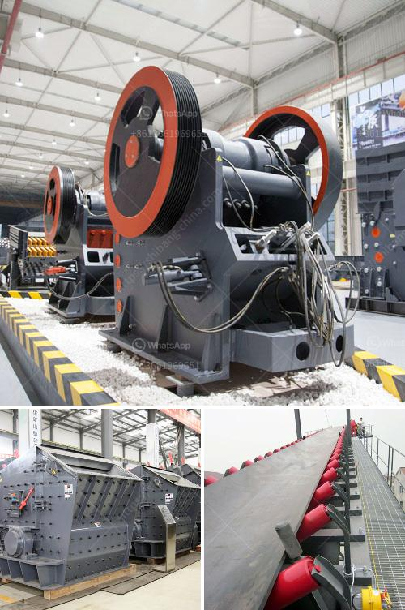

<h3>شركة تصنيع معدات التكسير</h3>
تعتبر شركة تصنيع معدات التكسير من الشركات الرائدة في صناعة المعدات الثقيلة المستخدمة في عمليات تكسير الصخور والمواد الصلبة. تعمل هذه الشركات على تصنيع وتوريد مجموعة واسعة من المعدات التي تستخدم في العديد من الصناعات مثل صناعة البناء والتشييد، وصناعة التعدين، وصناعة الطاقة، وصناعة الأسمنت.

تتمتع شركات تصنيع معدات التكسير بخبرة وتقنية عالية في تصميم وتطوير هذه المعدات لتلبية احتياجات السوق. تتميز هذه المعدات بقوتها ومتانتها، مما يجعلها قادرة على تحمل ظروف العمل الصعبة. وتتضمن هذه المعدات المطارق الهيدروليكية الثقيلة والكسارات الفكية والكسارات التصادمية والمطاحن وغيرها من المعدات المساعدة.

تعتبر شركات تصنيع معدات التكسير مهمة جداً في تلبية الطلب المتزايد على مواد البناء والتشييد، حيث تقوم بتوريد المعدات ذات الكفاءة العالية لتحسين عمليات الإنتاج وتقليل التكاليف وزيادة الإنتاجية. فهذه المعدات تعمل على تحطيم المواد الصلبة بفعالية وسرعة فائقة مما يعزز عمليات التكسير ويساهم في تحسين جودة المنتج النهائي.

من أهم مميزات شركات تصنيع معدات التكسير هو التزامها بتقديم حلول مختلفة للعملاء. فهي تتطلع دائماً إلى تلبية متطلبات العملاء وتوفير المعدات اللازمة التي تناسب احتياجاتهم الفريدة. وبفضل توجيهات العملاء، يتم تحسين تصاميم المعدات لضمان أداء ممتاز وتلبية الاحتياجات الفعلية للعملاء.

بالإضافة إلى ذلك، تتوفر خدمة ما بعد البيع المتفوقة من قبل شركات تصنيع معدات التكسير. فهي تقدم خدمات الدعم الفني والصيانة وتوفير قطع الغيار اللازمة للحفاظ على أداء المعدات بأعلى مستوياته. وبفضل هذه الخدمات المتكاملة، يمكن للعملاء التعامل مع التحديات المختلفة وضمان استمرارية عملياتهم بكفاءة عالية.

باختصار، تعتبر شركات تصنيع معدات التكسير من الشركات الحيوية لصناعة البناء والتشييد والتعدين والطاقة. تتمتع هذه الشركات بالخبرة والتكنولوجيا اللازمة لتوريد المعدات ذات الكفاءة العالية وتقديم الدعم الفني المطلوب. ومن خلال توفير هذه الحلول المتكاملة، تساهم في تطوير الصناعات المختلفة وتعزز النمو الاقتصادي.
<h3>Contact us</h3><ul><li><strong>Whatsapp:&nbsp;<a href="https://wa.me/8613661969651">+8613661969651</a></strong></li><li><a href="https://swt.shibang-china.com/?git&amp;zhl&amp;شركة تصنيع معدات التكسير"><strong>Online Service(chat now)</strong></a></li></ul><h3>Related</h3><ul><li><a href='قائمة الشركات المحاجر في نيجيريا.md'>قائمة الشركات المحاجر في نيجيريا</a></li><li><a href='سعر كسارة حجر متنقلة صغيرة في روسيا.md'>سعر كسارة حجر متنقلة صغيرة في روسيا</a></li><li><a href='مطحنة تكسير فائقة الدقة لخام الذهب.md'>مطحنة تكسير فائقة الدقة لخام الذهب</a></li><li><a href='مطحنة أسطوانية بسعة 15 طن.md'>مطحنة أسطوانية بسعة 15 طن</a></li><li><a href='عملية كولمان للطحن.md'>عملية كولمان للطحن</a></li></ul>