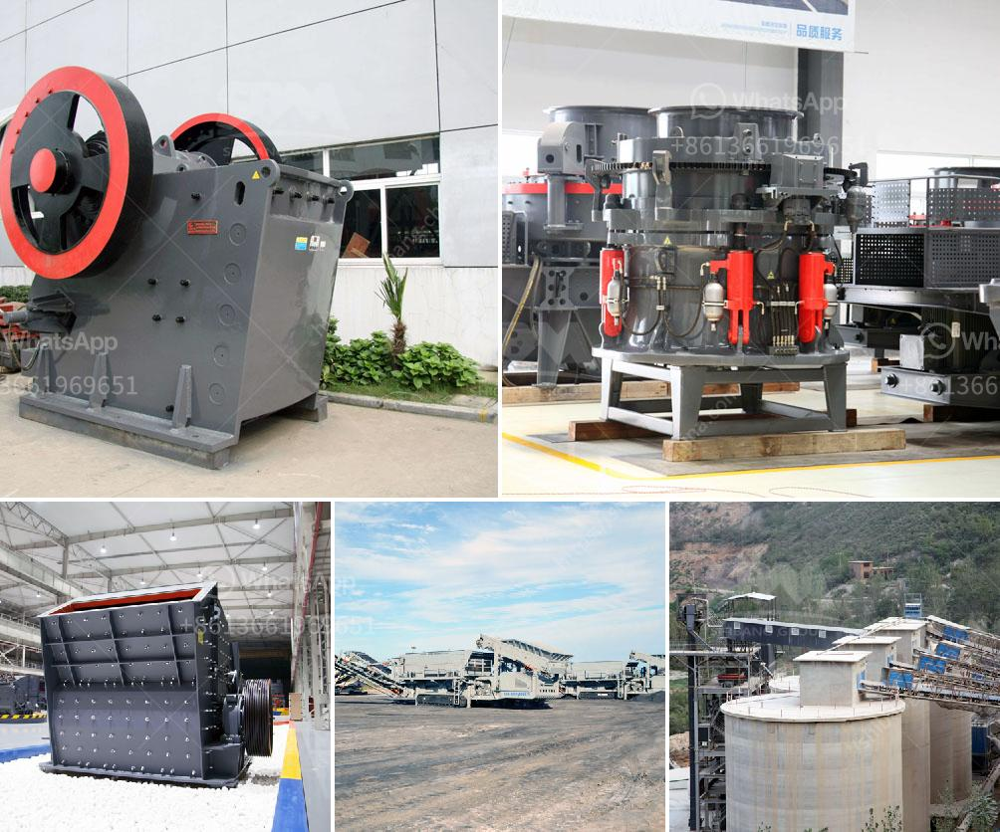

<h3>شركة تصنيع معدات كسارة الحجر في ألمانيا</h3>
تعد ألمانيا واحدة من الدول الرائدة في صناعة معدات كسارة الحجر عالميًا. تتمتع هذه الصناعة بتاريخ طويل وتراث قوي في الابتكار والجودة. تستخدم معدات كسارة الحجر في العديد من الصناعات مثل صناعة البناء والرمال والأسمنت والمعادن.

إحدى الشركات البارزة في هذا القطاع هي شركة "فولف"، وهي شركة تصنيع معدات كسارة الحجر مقرها في ألمانيا. تأسست الشركة في عام 1835، ومنذ ذلك الحين أصبحت أحد رواد هذه الصناعة. توفر شركة فولف مجموعة واسعة من المعدات المبتكرة وعالية الجودة للعملاء في جميع أنحاء العالم.

تشمل منتجات شركة فولف العديد من النماذج والأحجام المختلفة من معدات كسارة الحجر، بما في ذلك الكسارات الفكية والكسارات الصدمية والكسارات المخروطية وغيرها. تتميز هذه المعدات بالكفاءة العالية والأداء الموثوق به. كما تتميز شركة فولف بابتكارها المستمر وتطويرها لتقنيات جديدة في هذا المجال.

تهدف شركة فولف إلى تلبية احتياجات العملاء وتقديم الحلول المبتكرة لتحقيق أقصى استفادة من معداتها. فهي تقدم خدماتها الفنية المتخصصة والتدريب المهني لفرق العمل الخاصة بالعملاء. بالإضافة إلى ذلك، تؤمن الشركة قطع الغيار الأصلية وتقدم خدمة ما بعد البيع لضمان رضا العملاء.

تزخر صناعة معدات كسارة الحجر في ألمانيا بالخبرة والمعرفة التقنية العالية. فهناك تركيز كبير على البحث والتطوير لتحسين الأداء وتقديم التكنولوجيا الحديثة في هذا القطاع. تعكس شركة فولف هذه الروح الريادية في صناعتها وتسعى إلى أن تظل في المقدمة في هذا المجال.

باختصار، تعد شركة تصنيع معدات كسارة الحجر في ألمانيا من بين اللاعبين الرئيسيين في هذه الصناعة. تتميز بتاريخ طويل من الابتكار والجودة، وتقدم معدات متنوعة ومبتكرة للعملاء في جميع أنحاء العالم. تعتبر هذه الشركة رمزًا للتفاني في تقديم حلول متكاملة وموثوقة لعملائها وتسعى دائمًا لتحقيق رضاهم.
<h3>Contact us</h3><ul><li><strong>Whatsapp:&nbsp;<a href="https://wa.me/8613661969651">+8613661969651</a></strong></li><li><a href="https://swt.shibang-china.com/?git&amp;zhl&amp;شركة تصنيع معدات كسارة الحجر في ألمانيا"><strong>Online Service(chat now)</strong></a></li></ul><h3>Related</h3><ul><li><a href='جهات اتصال ووكلاء شاشات الرمل والغرابيل.md'>جهات اتصال ووكلاء شاشات الرمل والغرابيل</a></li><li><a href='غربال الحصى للبيع كريغزليست.md'>غربال الحصى للبيع كريغزليست</a></li><li><a href='سعر آلة طحن الرخام.md'>سعر آلة طحن الرخام</a></li><li><a href='مورد كسارة النحاس.md'>مورد كسارة النحاس</a></li><li><a href='إجراء التعدين في محجر الحجر الجيري.md'>إجراء التعدين في محجر الحجر الجيري</a></li></ul>