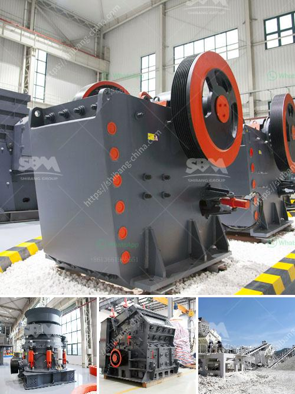

<h3>شركة تصنيع وحدة طحن الأسمنت</h3>
تعتبر وحدة طحن الأسمنت من الشركات المهمة في صناعة البناء والانشاءات. تعد هذه الوحدة أحد المكونات الأساسية لعملية إنتاج الأسمنت وتساهم في تحويل المواد الخام الأولية إلى الأسمنت النهائي الذي يستخدم في إنشاء الهياكل المختلفة.

تتمثل أهمية شركات تصنيع وحدات طحن الأسمنت في قدرتها على تحويل المواد الخام إلى مادة متينة تمتلك خواص معينة تساهم في زيادة جودة وقوة الهياكل المبنية. تعمل هذه الشركات على توفير طحن الأسمنت بأحجام ونسب محددة لتلبية احتياجات مصانع الخرسانة والبناء.

تنقسم وحدات طحن الأسمنت عموماً إلى عدة أجزاء رئيسية تشمل الكسارة الفكية والمطحنة العمودية والفرن الدوار ومعدات التكسير والطحن الإضافية. تقوم الكسارة الفكية بسحق المواد الخام الأولية وتحويلها إلى جزيئات صغيرة بحجم معين. بعدها، تتم إرسال المواد إلى المطحنة العمودية الخاصة بالطحن الأولي حيث تحتك وتطحن لتتحول إلى مسحوق الأسمنت النهائي.

تعمل معدات التكسير والطحن الإضافية على تعديل أو تحسين خواص الأسمنت النهائي عن طريق إضافة بعض المواد المساعدة والمضافات الأخرى. وعملية الطحن هي عملية متعددة المراحل تساهم في تجفيف وطحن المواد الأولية ومعالجتها لتنتج أسمنت ذو جودة عالية.

تعتبر شركات تصنيع وحدات طحن الأسمنت قطاعاً صناعياً حيوياً ومهماً في توفير الموارد الأسمنتية اللازمة لمشاريع البناء والتشييد. فهي تسهم في تطوير وتحسين عمليات تصنيع الأسمنت وتلبية متطلبات العملاء في مختلف المجالات الهندسية. كما أن هذه الشركات تحرص على توفير وحدات طحن الأسمنت ذات التقنيات الحديثة والمتقدمة لضمان جودة تصنيع الأسمنت واستدامة سلامة عملياته.
<h3>Contact us</h3><ul><li><strong>Whatsapp:&nbsp;<a href="https://wa.me/8613661969651">+8613661969651</a></strong></li><li><a href="https://swt.shibang-china.com/?git&amp;zhl&amp;شركة تصنيع وحدة طحن الأسمنت"><strong>Online Service(chat now)</strong></a></li></ul><h3>Related</h3><ul><li><a href='كسارة الحجر بسعة 200 طن في الساعة.md'>كسارة الحجر بسعة 200 طن في الساعة</a></li><li><a href='خط إنتاج خاص لتعدين مسحوق الكوارتز.md'>خط إنتاج خاص لتعدين مسحوق الكوارتز</a></li><li><a href='أفضل كسارة مخروط.md'>أفضل كسارة مخروط</a></li><li><a href='صناعة الحجر الجيري في الفلبين.md'>صناعة الحجر الجيري في الفلبين</a></li><li><a href='عملية غسيل الرمل.md'>عملية غسيل الرمل</a></li></ul>