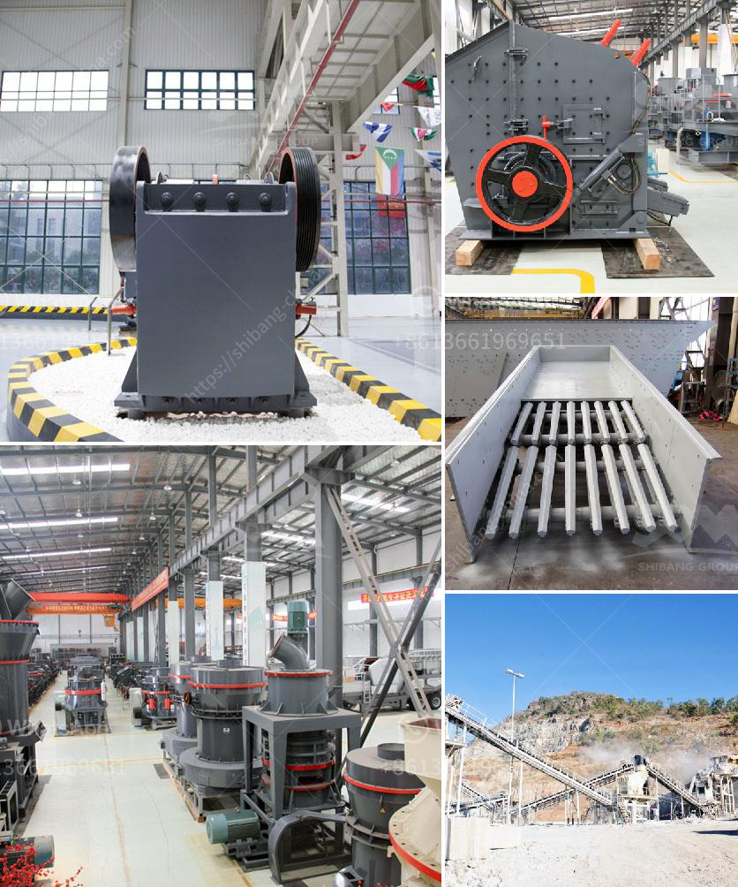

<h3>صانع كسارة في مدينة سيبو</h3>
تعد مدينة سيبو واحدة من أكبر المدن في الفلبين وتطورها الصناعي المستدام قد أدى إلى وجود صناعات مختلفة تلبي احتياجات المدينة والمناطق المحيطة بها. واحدة من هذه الصناعات الهامة هي صناعة كسارات الصخور.

يعمل صانعو الكسارات في مدينة سيبو على تصميم وتصنيع الكسارات التي تعمل على كسر الصخور الكبيرة إلى قطع صغيرة من الحجم المطلوب. يعتبر هذا النوع من المعدات ضروريًا في عدة صناعات مثل صناعة البناء والطرق والتعدين والتصنيع.

تلعب صناعة الكسارات دوراً حيوياً في تحسين البنية التحتية لمدينة سيبو وتلبية احتياجات البناء المتنامية. تستخدم الكسارات في كسر الصخور الكبيرة لاستخراج المواد الخام مثل الحصى والرمل والصخور المسحوقة، وتستخدم في إنتاج مجموعات مختلفة من مواد البناء والأسفلت والخرسانة.

تتعاون شركات تصنيع الكسارات مع مهندسي البناء والمعماريين لتصميم وتطوير الكسارات المتطورة التي تلبي متطلبات المشاريع المتنوعة. تعتبر صناعة الكسارات في مدينة سيبو قطاعًا مهمًا يعمل على تعزيز التطور الاقتصادي وتوفير فرص العمل.

كما أن صناعة الكسارات في مدينة سيبو تلتزم بالمعايير البيئية وتسعى للحد من التأثير البيئي السلبي. يتم اتباع إجراءات صارمة للحفاظ على الموارد الطبيعية والحفاظ على البيئة المحيطة. تعمل الشركات المصنعة على تطوير تقنيات جديدة لتحسين كفاءة الكسارات وتقليل استهلاك الطاقة وانبعاثات الغازات الضارة للبيئة.

علاوة على ذلك، تقدم صناعة الكسارات في مدينة سيبو فرص عمل للمهندسين والفنيين والعمال المهرة وتساهم في تنمية المهارات وتحسين مستوى المعيشة في المدينة والمناطق المحيطة بها.

في النهاية، يمكن القول إن صانعي الكسارات في مدينة سيبو يلعبون دوراً حيوياً في تنمية الصناعة وتحسين البنية التحتية، ويساهمون في تحسين جودة الحياة وتوفير فرص العمل المحلية. تعمل هذه الصناعة على تلبية الاحتياجات الحاضرة والمستقبلية للمدينة وتعزيز استدامة التنمية الاقتصادية والبيئية في سيبو.
<h3>Contact us</h3><ul><li><strong>Whatsapp:&nbsp;<a href="https://wa.me/8613661969651">+8613661969651</a></strong></li><li><a href="https://swt.shibang-china.com/?git&amp;zhl&amp;صانع كسارة في مدينة سيبو"><strong>Online Service(chat now)</strong></a></li></ul><h3>Related</h3><ul><li><a href='تم بناء مطحنة رايموند كسارة حجر في كينيا.md'>تم بناء مطحنة رايموند كسارة حجر في كينيا</a></li><li><a href='مستعملة vsi كسارة للبيع في الهند.md'>مستعملة vsi كسارة للبيع في الهند</a></li><li><a href='الرمل المصنع مقابل الرمل الطبيعي.md'>الرمل المصنع مقابل الرمل الطبيعي</a></li><li><a href='محطة سحق تينوفا.md'>محطة سحق تينوفا</a></li><li><a href='إنتاج الإسمنت الأبيض من مسحوق الرخام.md'>إنتاج الإسمنت الأبيض من مسحوق الرخام</a></li></ul>