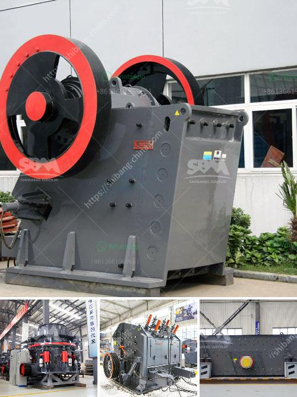

<h3>صناعة الحجر الجيري في الفلبين</h3>
تعد صناعة الحجر الجيري واحدة من الصناعات الحيوية في الفلبين وتسهم بشكل كبير في الاقتصاد الوطني. تعتبر الفلبين من بين أكبر المنتجين للحجر الجيري في جنوب شرق آسيا، حيث تحتوي على موارد ضخمة من هذا المعدن القيم.

يتم استخراج الحجر الجيري في الفلبين من مصادر طبيعية مثل المحاجر والكهوف. يتم استخدام معدات حديثة وتكنولوجيا متقدمة لاستخراج الحجر الجيري بطريقة فعالة وآمنة للبيئة. يتم تكسير الحجر الجيري ونقله إلى المصانع لمعالجته واستخدامه في العديد من الصناعات المختلفة.

تُستخدم الحجر الجيري في الفلبين بشكل رئيسي في صناعة الأسمنت، حيث يشكل المكون الأساسي لإنتاج الأسمنت. يتم طحن الحجر الجيري إلى مسحوق ناعم ودمجه مع الطين والغراء لصناعة الأسمنت. يعتبر الأسمنت من المنتجات الأساسية في البناء والتشييد وتعمل الحكومة الفلبينية على تعزيز الصناعة العقارية وبناء البنية التحتية، مما يزيد الطلب على الأسمنت وبالتالي يعزز صناعة الحجر الجيري في البلاد. 

بالإضافة إلى صناعة الأسمنت، يستخدم الحجر الجيري في الفلبين في صناعة الحديد والصلب، حيث يعتبر مادة خام أساسية لإنتاج الحديد والصلب. كما يستخدم الحجر الجيري في صناعة الزجاج والسيراميك والسماد وغيرها من الصناعات.

تعمل الحكومة الفلبينية على دعم صناعة الحجر الجيري وتعزيز الصادرات، مما يعزز النمو الاقتصادي ويوفر فرص عمل للسكان المحليين. تعد صناعة الحجر الجيري مهمة جداً للاقتصاد الفلبيني، حيث تساهم في تحقيق التنمية المستدامة وتعزيز الصناعات الأخرى في البلاد.

باختصار، صناعة الحجر الجيري في الفلبين تعتبر مصدرًا رئيسيًا للثروة الطبيعية وتساهم بشكل كبير في الاقتصاد الوطني. تستخدم في العديد من الصناعات المختلفة وتوفر فرص عمل للسكان المحليين. يعمل الحكومة على دعم هذه الصناعة وتعزيز صادراتها لتعزيز النمو الاقتصادي وتحقيق التنمية المستدامة.
<h3>Contact us</h3><ul><li><strong>Whatsapp:&nbsp;<a href="https://wa.me/8613661969651">+8613661969651</a></strong></li><li><a href="https://swt.shibang-china.com/?git&amp;zhl&amp;صناعة الحجر الجيري في الفلبين"><strong>Online Service(chat now)</strong></a></li></ul><h3>Related</h3><ul><li><a href='آلة مطحنة الأسطوانة في فرنسا.md'>آلة مطحنة الأسطوانة في فرنسا</a></li><li><a href='تكلفة كسارة الحصى.md'>تكلفة كسارة الحصى</a></li><li><a href='مطحنة الهامر من إيديبيسا.md'>مطحنة الهامر من إيديبيسا</a></li><li><a href='صنع الحجر الجيري.md'>صنع الحجر الجيري</a></li><li><a href='خطة المشروع حول آلة تحطيم الحجر.md'>خطة المشروع حول آلة تحطيم الحجر</a></li></ul>