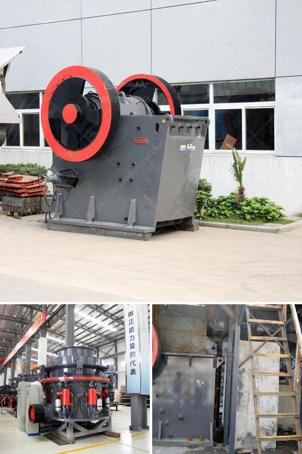

<h3>صناعة تكسير الحجر</h3>
تعد صناعة تكسير الحجر من الصناعات الهامة في مجال البناء والتشييد والاستخراج المعدني. يتم تكسير الصخور ذات الصلابة العالية باستخدام معدات خاصة تعمل على تفتيتها إلى قطع صغيرة قابلة للاستخدام في العديد من التطبيقات.

تستخدم عملية تكسير الحجر المختلفة لإنتاج مواد بناء متنوعة مثل الحصى والرمل والسن والزلط. يجب أن يتم اختيار الطريقة المثلى لتكسير الحجر بناءً على صلابته وطبيعته، حيث تحتاج الصخور الرخوة إلى معدات تكسير أقل قوة مقارنةً بالصخور القوية والمتماسكة.

تتضمن عملية تكسير الحجر الأساسية استخدام المطارق الهيدروليكية والكسارات الفكية والكسارات المخروطية والكسارات المطرقية. تعتبر المطارق الهيدروليكية أحد أبرز وسائل تكسير الحجر حيث تعمل بقوة هيدروليكية على تحطيم الصخور بواسطة ضربات متكررة وقوية. الكسارات الفكية تستخدم قوة الضغط لتكسير الحجر عن طريق خفض الصخور بين فكين ثابتين ومتحركين. الكسارات المخروطية تعمل على ضغط الصخور وتفتيتها بواسطة كسرها بين جدارين ثابتين ومتحركين. وأخيرًا، الكسارات المطرقية تستخدم المطاقي الدوارة على شكل مطارق لتكسير الصخور بواسطة الطاقة الصاعدة من محرك الكهربائي.

يعتبر تكسير الحجر عملية ضرورية للعديد من مشاريع البناء والبنية التحتية، حيث يتم استخدام مواد التكسير في الطرق والجسور والمباني والأساسات. بالإضافة إلى ذلك، يستخدم التكسير لاستخراج المواد المعدنية من الصخور مثل الفحم والذهب والنحاس والفوسفات.

من الجدير بالذكر أن صناعة تكسير الحجر تساهم في التنمية الاقتصادية وتوفير فرص العمل في القطاع البنائي. تساعد هذه الصناعة في توفير المواد الأولية اللازمة للمشاريع الكبيرة والصغيرة، مما يسهم في تحسين البنية التحتية والرفاهية العامة للمجتمع.

باختصار، صناعة تكسير الحجر تلعب دورًا حيويًا في قطاع البناء والتشييد. توفر هذه الصناعة المواد الأساسية للكثير من المشاريع وتساهم في التنمية الاقتصادية وتوفير فرص العمل. يجب أن تستخدم تكنولوجيا التكسير المناسبة لضمان الحصول على مواد بناء عالية الجودة وبأداء ممتاز.
<h3>Contact us</h3><ul><li><strong>Whatsapp:&nbsp;<a href="https://wa.me/8613661969651">+8613661969651</a></strong></li><li><a href="https://swt.shibang-china.com/?git&amp;zhl&amp;صناعة تكسير الحجر"><strong>Online Service(chat now)</strong></a></li></ul><h3>Related</h3><ul><li><a href='مصنع كسارة المطرقة.md'>مصنع كسارة المطرقة</a></li><li><a href='سعر مصنع تعدين الذهب في الصين.md'>سعر مصنع تعدين الذهب في الصين</a></li><li><a href='ما هو مطحنة الكرة.md'>ما هو مطحنة الكرة</a></li><li><a href='تخطيط منشأة تعدين الماس.md'>تخطيط منشأة تعدين الماس</a></li><li><a href='كسارة محمولة للشراء.md'>كسارة محمولة للشراء</a></li></ul>