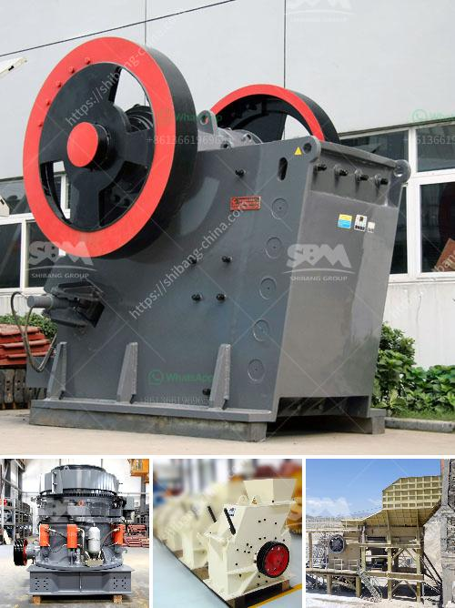

<h3>صناعة تكسير ومعالجة الرخام على نطاق صغير</h3>
تُعد صناعة تكسير ومعالجة الرخام على نطاق صغير من الصناعات الناشئة والمتنامية بسرعة في السنوات الأخيرة. إنها صناعة تهدف إلى استخراج الرخام الخام وتحويله إلى قطع مصقولة وجاهزة للاستخدام في الأغراض المختلفة، مثل الأرضيات والجدران والأسطح الزخرفية.

يعتبر الرخام واحدًا من أجود وأجمل الأحجار الطبيعية، والتي تتميز بقوامها الصلب وتصاميمها الجميلة والمتنوعة. تتواجد مصادر الرخام في العديد من البلدان، مما يتيح فرصًا كبيرة لتطوير صناعة تكسير ومعالجة الرخام.

عملية تكسير الرخام تتطلب استخدام أدوات ومعدات متخصصة. يتم تقطيع الصخور الرخامية إلى قطع صغيرة باستخدام أدوات قوية مثل المناشير الكهربائية وقطع الأسلاك الماسية. بعد التقطيع، تتم معالجة القطع بواسطة آلات طحن وتلميع متخصصة لإزالة الشوائب والعيوب والحصول على سطح ملساء ولامع.

تكسير ومعالجة الرخام يشتمل على عدة خطوات رئيسية. أولاً، يتم استخراج الرخام من المحاجر باستخدام معدات ثقيلة، مثل الحفارات والشاحنات. ثم يتم نقل الرخام الخام إلى ورشة العمل لتكسيره ومعالجته، حيث يتم فرز القطع وتصنيفها حسب الحجم والجودة. بعد ذلك، يتم تقطيع القطع إلى أحجام محددة وتلميعها للحصول على النهاية المطلوبة.

تعتبر صناعة تكسير ومعالجة الرخام على نطاق صغير مجالًا مثيرًا للاستثمار. فهي توفر فرص عمل للكثير من العمال المهرة، وتشجع على الابتكار في تحسين عمليات الإنتاج وجودة المنتج النهائي. كما أنها تساهم في التنمية المحلية وتعزز الاقتصاد من خلال زيادة الصادرات وتقليل الاعتماد على المستوردين.

من الجوانب الإيجابية الأخرى لصناعة تكسير ومعالجة الرخام على نطاق صغير أنها تهتم بالحفاظ على البيئة والاستدامة. يتم استخدام تقنيات صديقة للبيئة في عملية الإنتاج وتلبية معايير الجودة والسلامة.

في الختام، صناعة تكسير ومعالجة الرخام على نطاق صغير هي صناعة مهمة ومثيرة للاهتمام. إنها توفر منتجات عالية الجودة وجميلة المظهر وتعزز الاقتصاد المحلي. إذا كنت ترغب في استثمار أو العمل في هذا المجال، فإن صناعة تكسير ومعالجة الرخام على نطاق صغير قد تكون خيارًا مثيرًا ومجزيًا لك.
<h3>Contact us</h3><ul><li><strong>Whatsapp:&nbsp;<a href="https://wa.me/8613661969651">+8613661969651</a></strong></li><li><a href="https://swt.shibang-china.com/?git&amp;zhl&amp;صناعة تكسير ومعالجة الرخام على نطاق صغير"><strong>Online Service(chat now)</strong></a></li></ul><h3>Related</h3><ul><li><a href='آلة معالجة الرماد الطائر.md'>آلة معالجة الرماد الطائر</a></li><li><a href='قائمة الأسعار في زيمبابوي لمطاحن الكرة.md'>قائمة الأسعار في زيمبابوي لمطاحن الكرة</a></li><li><a href='سعر آلة صنع الرمل الاصطناعي.md'>سعر آلة صنع الرمل الاصطناعي</a></li><li><a href='قائمة جهات الاتصال لشركات التعدين في ألمانيا.md'>قائمة جهات الاتصال لشركات التعدين في ألمانيا</a></li><li><a href='مصنع سحق محمول بدائرة مغلقة.md'>مصنع سحق محمول بدائرة مغلقة</a></li></ul>