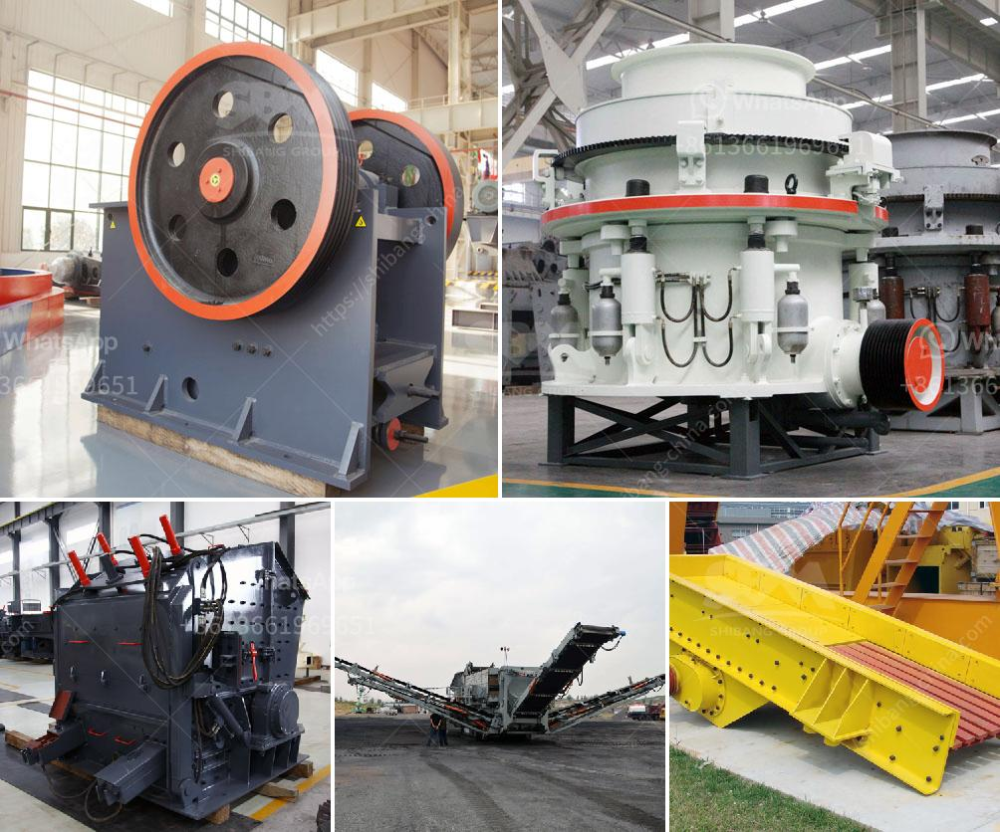

<h3>صناعة سحق الركام في تنزانيا</h3>
تعد صناعة سحق الركام من الصناعات الرئيسية في تنزانيا، حيث تعتبر من أهم الصناعات الداعمة لقطاع البناء والتشييد في البلاد. يتم استخدام الركام المكسور في تنزانيا في مجموعة واسعة من المشاريع الإنشائية مثل بناء الطرق والجسور والمباني التجارية والسكنية، ويعتبر عاملاً مهمًا في تعزيز التنمية الاقتصادية والبنية التحتية.

تعتبر تنزانيا من بين الدول التي تشهد نموًا اقتصاديًا سريعًا، وهذا التوسع في الاقتصاد يؤدي إلى زيادة الحاجة إلى البنى التحتية الحديثة والمستدامة. يعد استخدام الركام المكسور في تلبية احتياجات هذه المشاريع أمرًا حيويًا، لأنه يسهم في توفير التكلفة والوقت والجهد.

تتوفر مصانع السحق والغربلة في جميع أنحاء تنزانيا، حيث تقوم هذه المصانع بتكسير الصخور الكبيرة إلى ركام صغير يمكن استخدامه في مشاريع البناء المختلفة. يتم استخدام معدات سحق الركام مثل الكسارات الفكية والكسارات المخروطية والكسارات الصدمية والغرابيل للحصول على الحجم المطلوب المطلوب من الركام.

توفر صناعة سحق الركام في تنزانيا فرص عمل كبيرة، حيث يعمل العديد من الأشخاص في المصانع وبالقطاعات المتعلقة بها، مثل النقل والتوزيع. بالإضافة إلى ذلك، فإن صناعة سحق الركام تدعم أيضًا صناعات أخرى مثل صناعة الأسمنت وصناعة البناء وصناعة الطرق.

مع زيادة عدد المشاريع الإنشائية في تنزانيا، يتزايد الطلب على الركام المكسور. تعمل الحكومة على تطوير سياسات واضحة لدعم وتنظيم صناعة سحق الركام، وذلك من خلال تشجيع الاستثمارات في هذا القطاع وتعزيز الجودة وتوفير التدريب المهني.

في الختام، يمكن القول إن صناعة سحق الركام لديها دور هام في تنزانيا في دعم قطاع البناء والتشييد وتعزيز التنمية الاقتصادية. توفر هذه الصناعة فرص العمل وتعمل على تلبية الاحتياجات المتزايدة للمشاريع الإنشائية الحديثة في البلاد.
<h3>Contact us</h3><ul><li><strong>Whatsapp:&nbsp;<a href="https://wa.me/8613661969651">+8613661969651</a></strong></li><li><a href="https://swt.shibang-china.com/?git&amp;zhl&amp;صناعة سحق الركام في تنزانيا"><strong>Online Service(chat now)</strong></a></li></ul><h3>Related</h3><ul><li><a href='مصنع معالجة الحجر الجيري في الفلبين.md'>مصنع معالجة الحجر الجيري في الفلبين</a></li><li><a href='تكلفة معدات سحق الجرانيت.md'>تكلفة معدات سحق الجرانيت</a></li><li><a href='تكلفة عمليات مصنع الرمل والحصى.md'>تكلفة عمليات مصنع الرمل والحصى</a></li><li><a href='مطحنة الأسطوانة الجبس.md'>مطحنة الأسطوانة الجبس</a></li><li><a href='كسارة صخور مصنوعة يدوياً.md'>كسارة صخور مصنوعة يدوياً</a></li></ul>