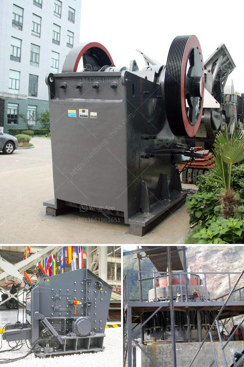

<h3>صنع الحجر الجيري</h3>
يُعد الحجر الجيري من أهم المواد الصخرية في العالم، ويستخدم في العديد من الصناعات مثل صناعة الإسمنت والزجاج والفولاذ ومواد البناء. يتم لصق الحجر الجيري في الصخور الرسوبية وتراكمه على ملايين السنين من الحياة البحرية والمرجانية الميتة. وبالتالي، يُعد الحجر الجيري نتاجًا لعملية طبيعية طويلة ومعقدة.

أولاً، يتم تعريض صخرة الحجر الجيري لعوامل طبيعية مثل الرياح والمياه على مر ملايين السنين، وبفضل تأثير هذه العوامل، يبدأ الحجر الجيري في التآكل والتفتت. على سبيل المثال، تتسبب قطرات الماء الحمضية في جوانب الجبال في تفتيت الصخور وتآكلها بطريقة تدعى التجوية الكيماوية.

بعد ذلك، يتم تقسيم الحجر الجيري إلى كتل وقطع صغيرة، ويتم استخدام المطارق والمطارق الضخمة لكسره إلى قطع صغيرة. تُستخدَم هذه القطع في الصناعات المختلفة، كما أنها تستخدم أحيانًا كمدخل إلى عملية تكسير أخرى تهدف إلى الحصول على حجم الجسيمات المطلوب.

بعد ذلك، يتم وضع القطع الصغيرة في مسدسات التنفيخ، حيث يطلق عليها اسم الحجر المشروش، وتستخدم لتصقل الحجر الجيري وإعطائه مظهره النهائي. عملية الشد تتضمن إطلاق مسدس التنفيخ على الأرض، وتحريكه بطريقة يطحن بها الحجر الجيري بشكل مناسب.

أخيرًا، يتم تكوين الحجر الجيري في صخور حجرية وألواح وقواعد وغيرها من الأشكال حسب طلب المشتري. تتم عملية التشكيل عن طريق الضغط والحرارة لجعل الصخرة تلتصق وتتجمع وتتصلب.

باختصار، صنع الحجر الجيري يشتمل على عدة خطوات أساسية مثل التآكل، والتكسير، والتصقل، والتشكيل. يُعد الحجر الجيري مادة أساسية للعديد من الصناعات، ويتم استخراجه في مناطق مختلفة حول العالم يدويًا أو باستخدام معدات ثقيلة.  يُعرَف الحجر الجيري بكونه مادة بناء قوية ومتينة، وهذا يعزز طلبه واستخدامه في الصناعات المختلفة بصورة مستمرة.
<h3>Contact us</h3><ul><li><strong>Whatsapp:&nbsp;<a href="https://wa.me/8613661969651">+8613661969651</a></strong></li><li><a href="https://swt.shibang-china.com/?git&amp;zhl&amp;صنع الحجر الجيري"><strong>Online Service(chat now)</strong></a></li></ul><h3>Related</h3><ul><li><a href='مورد مصنع التكسير والفرز في الصين.md'>مورد مصنع التكسير والفرز في الصين</a></li><li><a href='كسارة فك الحجر الجيري للبيع.md'>كسارة فك الحجر الجيري للبيع</a></li><li><a href='آخر خط إنتاج مسحوق الجبس.md'>آخر خط إنتاج مسحوق الجبس</a></li><li><a href='آلات التكسير والفحص.md'>آلات التكسير والفحص</a></li><li><a href='سعر آلة طحن الرخام.md'>سعر آلة طحن الرخام</a></li></ul>