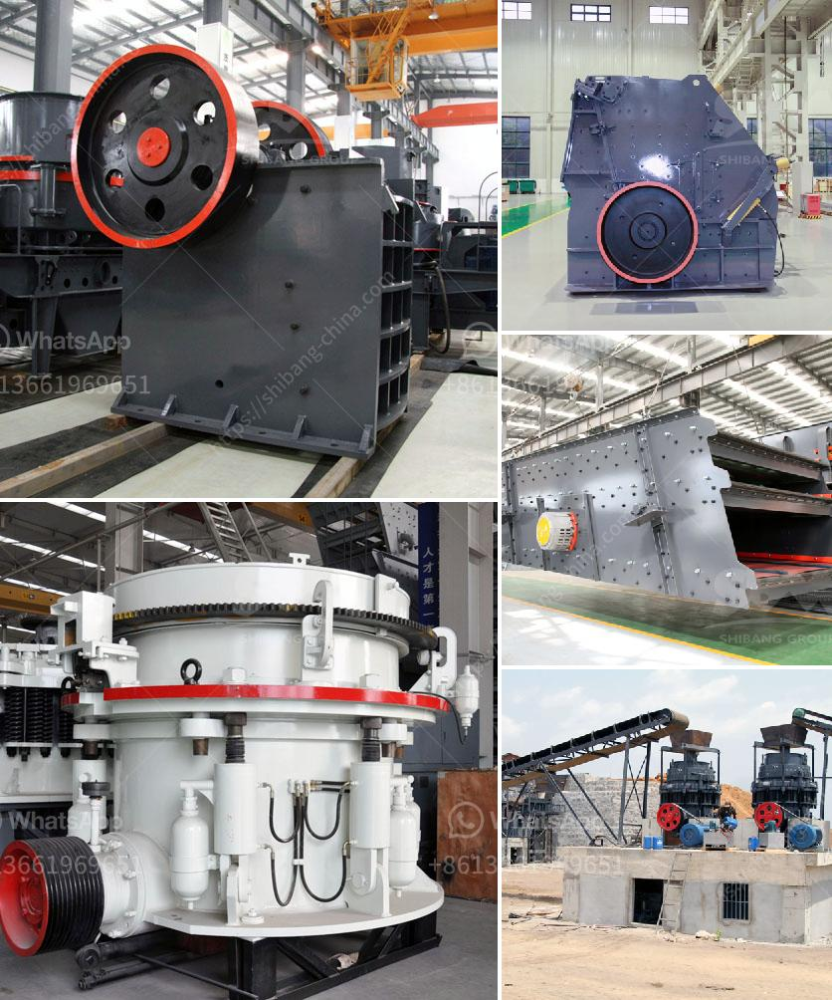

<h3>صنع مسحوق الكالسيوم</h3>
إن مسحوق الكالسيوم هو مادة معدنية تُستخدم على نطاق واسع في العديد من التطبيقات الصناعية والمنتجات الاستهلاكية. يتم صنعه عن طريق تكسير وطحن الحجارة أو الصخور الغنية بالكالسيوم، مثل الحجر الجيري أو الدولوميت. ونظرًا لتوفر المواد الخام وسهولة صنعه، يُعتبر صناعة مسحوق الكالسيوم عملية مشهورة وشائعة في العديد من الدول.

إن استخدام مسحوق الكالسيوم في العديد من المنتجات يعود إلى ميزاته المتعددة وفوائده العديدة. واحدة من أبرز الاستخدامات هي في صناعة الدهانات والورنيش، حيث يتم استخدامه كمادة حشو بيضاء لتحسين اللون والقوام والتغطية، كما يساهم في تقليل التكاليف وزيادة متانة الدهان.

بالإضافة إلى ذلك، يستخدم مسحوق الكالسيوم في صناعة الورق، حيث يعزز قوة ومقاومة الورق ويحسن خواصه التشريبية. كما يُضاف إلى منتجات التنظيف ومنتجات العناية الشخصية، مثل معاجين الأسنان أو مساحيق الوجه، حيث يعمل على تحسين قوام المنتج وزيادة فعاليته.

من الجوانب الأخرى، يستخدم مسحوق الكالسيوم في صناعة الأسمدة، حيث يعمل على تحسين خصوبة التربة عن طريق تعزيز استخدام العناصر المغذية. كما يعتبر مكملا غذائيا للحيوانات والدواجن، حيث يعزز صحة العظام والأسنان ويعمل على تعزيز عملية الهضم.

قد يتم تصنيع مسحوق الكالسيوم باستخدام عملية طحن وطحن الصخور الغنية بالكالسيوم. يتم تكسير الصخور الكبيرة إلى قطع صغيرة بواسطة الكسارات الصناعية، ثم تتم معالجتها في مصنع المسحوق. يتم طحن الحجارة في طواحين الكرة أو الطواحين العمودية للحصول على مسحوق ناعم. يتبع هذا العملية لإزالة الشوائب وفصل المسحوق عن الشوائب الأخرى قبل تعبئته في أكياس.

في الختام، يعد مسحوق الكالسيوم مادة معمّرة وقابلة للتطبيق في العديد من الصناعات. يتم صنعه من الحجارة الغنية بالكالسيوم ويُستخدم في الدهانات واللواصق والأسمدة والعناية الشخصية والتغذية الحيوانية. من خلال استخدامه، يمكن تحسين الخواص الميكانيكية والفيزيائية للمنتجات وزيادة قوتها وفاعليتها.
<h3>Contact us</h3><ul><li><strong>Whatsapp:&nbsp;<a href="https://wa.me/8613661969651">+8613661969651</a></strong></li><li><a href="https://swt.shibang-china.com/?git&amp;zhl&amp;صنع مسحوق الكالسيوم"><strong>Online Service(chat now)</strong></a></li></ul><h3>Related</h3><ul><li><a href='كسارة صغيرة متنقلة للحصى.md'>كسارة صغيرة متنقلة للحصى</a></li><li><a href='استخدام آلة مطحنة الكرة في إندونيسيا.md'>استخدام آلة مطحنة الكرة في إندونيسيا</a></li><li><a href='موردين مطاحن الكرة في جنوب أفريقيا.md'>موردين مطاحن الكرة في جنوب أفريقيا</a></li><li><a href='كل معدة لكل جهاز كسارة فك.md'>كل معدة لكل جهاز كسارة فك</a></li><li><a href='طاقة إنتاج مسحوق الجبس 80 طن في الساعة.md'>طاقة إنتاج مسحوق الجبس 80 طن في الساعة</a></li></ul>