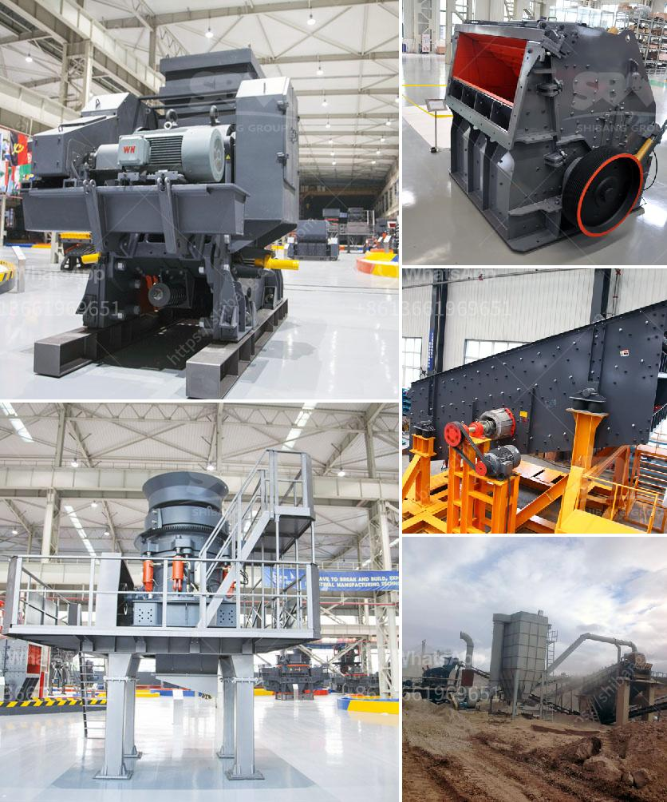

<h3>صور شاشات الاهتزاز</h3>
تعتبر صور شاشات الاهتزاز من التقنيات المبتكرة والمثيرة للاهتمام التي تتاح للمستخدمين في الوقت الحالي. تعد هذه الشاشات العصبية والمهتزة واحدة من تقنيات العرض الحديثة التي تقدم تجربة مرئية مميزة ومليئة بالمتعة والإثارة.

تُعد شاشات الاهتزاز جزءًا من تطور تقنية الشاشات التي تتطور باستمرار لتلبية احتياجات المستخدمين واستجابة لتوجهات السوق. تُستخدم هذه الشاشات في العديد من الصناعات، بما في ذلك صناعة الألعاب، والتصميم، وتحليل البيانات، وصناعة السيارات، وكثير من التطبيقات الأخرى.

توفر شاشات الاهتزاز تجربة مرئية مثيرة ومتفاعلة للمستخدم، حيث يتم توليد اهتزازات دقيقة في شاشة العرض بواسطة محركات صغيرة مدمجة، والتي يتم التحكم فيها بواسطة البرمجيات. تعزز هذه الاهتزازات الشعور بالواقعية والانغماس في التجربة، سواء كان ذلك في اللعبة أو في مشاهدة الأفلام أو في تطبيقات أخرى.

تتيح شاشات الاهتزاز للمستخدمين تجربة مذهلة من حيث الواقعية والتأثير البصري والتفاعلية. تساعد في نقل مشاهد الأفلام والألعاب إلى مستوى جديد تمامًا من حيث المشاركة والتجربة البصرية. تزود اللاعبين بأوضاع اهتزاز مختلفة تعكس العديد من المؤثرات البصرية المشوقة، مثل الانفجارات والاصطدامات والحركات السريعة.

تستخدم شاشات الاهتزاز أيضًا في المجالات التعليمية والعلومية والطبية. على سبيل المثال، يتم استخدامها في التدريب الجراحي لتحاكي حركات الأجزاء الداخلية للجسم وتزويد الجراح بتجربة تفاعلية قريبة جدًا من الواقع. توفر أيضًا تجربة تعليمية ممتعة، حيث يمكن استخدامها لتوضيح الظواهر العلمية المعقدة وتوسيع مفهومها.

يتناول الباحثون حاليًا استخدام تقنيات الاهتزاز في المزيد من التطبيقات والصناعات. قد يتم استخدامها في استعراض العقارات الافتراضية، مما يسمح للمتسوقين بتجربة العقار قبل شراءه. قد يُستخدم أيضًا في صناعة الموضة والأزياء لإظهار جمال المنتجات وملاءمتها للمستهلك.

في الختام، تُعد شاشات الاهتزاز تطورًا جديدًا في تقنية الشاشات يقدم تجربة بصرية مثيرة ومليئة بالإثارة والواقعية. تُستخدم في العديد من الصناعات والتطبيقات المختلفة، وتعد واحدة من التقنيات العصرية التي تعزز تفاعل المستخدم وتعطيه تجربة مرئية فريدة.
<h3>Contact us</h3><ul><li><strong>Whatsapp:&nbsp;<a href="https://wa.me/8613661969651">+8613661969651</a></strong></li><li><a href="https://swt.shibang-china.com/?git&amp;zhl&amp;صور شاشات الاهتزاز"><strong>Online Service(chat now)</strong></a></li></ul><h3>Related</h3><ul><li><a href='مطحنة عمودية للبيع في الولايات المتحدة.md'>مطحنة عمودية للبيع في الولايات المتحدة</a></li><li><a href='معدات المحجر للسكك الحديدية.md'>معدات المحجر للسكك الحديدية</a></li><li><a href='مطحنة طحن ألمانية.md'>مطحنة طحن ألمانية</a></li><li><a href='شركة موردة لكسارة الحجر.md'>شركة موردة لكسارة الحجر</a></li><li><a href='إعداد وحدة طحن الأسمنت بسعة 100 طن يوميًا.md'>إعداد وحدة طحن الأسمنت بسعة 100 طن يوميًا</a></li></ul>