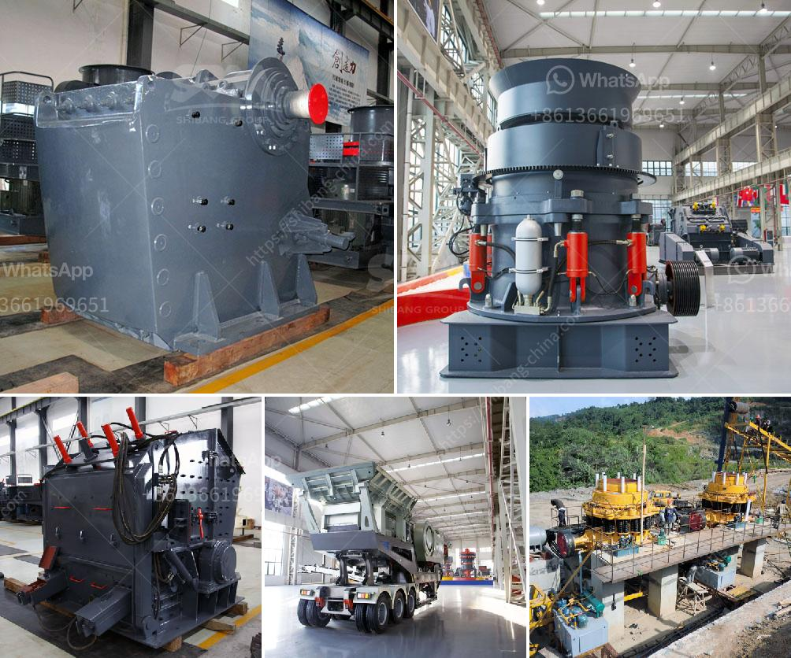

<h3>صور مطحنة الكرات Ceramics</h3>
يُعد مفهوم مطحنة الكرات السيراميكية واحدًا من أكثر التقنيات الحديثة شيوعًا في صناعة التعدين والصناعات الأخرى. تستخدم هذه التقنية كرات سيراميكية محملة على مبدأ دوران دون توقف لطحن المواد وخلطها بشكل فعال. تعتبر مطحنة الكرات السيراميكية بديلًا جيدًا للمعدات التقليدية المستخدمة في صناعة الصلب والألمنيوم والزجاج والصناعات الكيماوية الأخرى.

يطحن المزيج في مطحنة الكرات السيراميكية عن طريق الاحتكاك والتأثير بين الكرات السيراميكية والمادة المطحونة. تعمل الحركة الدائرية للكرات السيراميكية داخل الأسطوانة على تسهيل عملية الإزاحة وتخفيف الخردة. وبما أن الكرات السيراميكية خفيفة الوزن وغير قابلة للتآكل، فهي تعد خيارًا مثاليًا للحفاظ على نقاء المادة المطحونة دون أي تلوث من الكرات المستخدمة.

تتميز مطاحن الكرات السيراميكية بالعديد من الفوائد. فهي تقدم درجة عالية من الدقة في عملية الطحن وتضمن تجانس المزيج. بالإضافة إلى ذلك، فإن المطاحن السيراميكية لا تسبب تآكل الأجزاء المطاطية ولا تحتاج إلى الكثير من الصيانة المستمرة. تتمتع هذه المطاحن بعمر افتراضي طويل وتوفر أداءًا موثوقًا واستخدامًا سهلًا.

تستخدم مطاحن الكرات السيراميكية في صناعة البناء، حيث تساعد في طحن المواد الخشنة لتحتوي على حبيبات ذات أحجام متناسبة. كما تستخدم في صناعة الألوان والصباغة، حيث يتم طحن المواد الخام إلى حجم مطلوب قبل إضافتها إلى المنتجات النهائية. تُستخدم أيضًا في صناعة الكيماويات، حيث تساعد في طحن وخلط المبيدات الحشرية والأسمدة بطريقة فعالة.

في الختام، تُعتبر مطاحن الكرات السيراميكية التي تعمل على مبدأ الكرات المتحركة أدوات هامة في صناعة التعدين والصناعات الأخرى. يتميز هذا النوع من المطاحن بالدقة والكفاءة والموثوقية. بفضل تقنيتها المبتكرة، فهي تعزز من جودة المنتجات النهائية وتسهم في تحسين معايير الإنتاج. لذلك، يُعتبر استخدام مطاحن الكرات السيراميكية خيارًا مثاليًا للعديد من الصناعات التي تتطلب عملية الطحن والخلط بشكل فعال ودقيق.
<h3>Contact us</h3><ul><li><strong>Whatsapp:&nbsp;<a href="https://wa.me/8613661969651">+8613661969651</a></strong></li><li><a href="https://swt.shibang-china.com/?git&amp;zhl&amp;صور مطحنة الكرات Ceramics"><strong>Online Service(chat now)</strong></a></li></ul><h3>Related</h3><ul><li><a href='مصنع كسارة حجر البازلت.md'>مصنع كسارة حجر البازلت</a></li><li><a href='آلة صنع الرمل في كينيا.md'>آلة صنع الرمل في كينيا</a></li><li><a href='تجار الكسارات المحمولة في جنوب أفريقيا.md'>تجار الكسارات المحمولة في جنوب أفريقيا</a></li><li><a href='شركة تصنيع كرات الكرة في مومباي.md'>شركة تصنيع كرات الكرة في مومباي</a></li><li><a href='مصانع طحن الكرات.md'>مصانع طحن الكرات</a></li></ul>