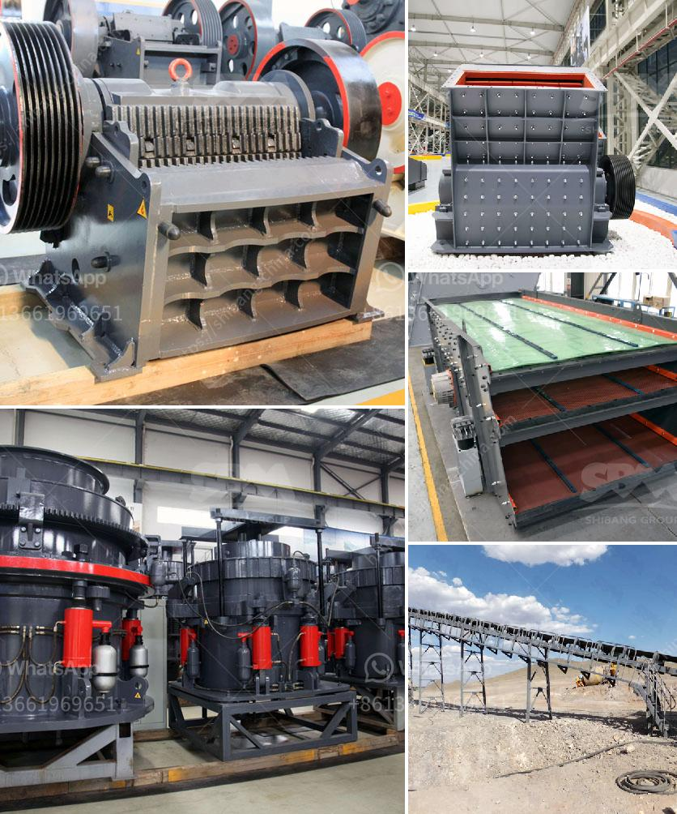

<h3>صورة خط إنتاج الكلنكر الاسمنتي</h3>
يعد خط إنتاج الكلنكر الأسمنتي عنصرًا أساسيًا في صناعة الأسمنت. يتكون خط الإنتاج من مراحل متتالية ومترابطة تهدف إلى إنتاج الكلنكر، الذي يعد المادة الرئيسية لإنتاج الأسمنت. في هذه المقالة ، سأقدم نظرة عامة على صورة خط إنتاج الكلنكر الأسمنتي.

يتكون خط إنتاج الكلنكر الأسمنتي عادة من عدة مراحل. يبدأ العملية بتكسير الحجر الجيري والطين وخلطهما في هوائي. يتم تسخين الهوائي إلى درجة حرارة عالية بواسطة الأفران.

تعد أفران الكلنكر أحد العناصر الأساسية في خط إنتاج الكلنكر الأسمنتي. يتم استخدام الأفران لتسخين الهوائي بدرجات حرارة تصل إلى حوالي 1500 درجة مئوية. يتم ضبط درجة الحرارة والوقت المطلوب للتسخين بدقة لضمان تحقيق جودة الكلنكر المطلوبة.

عندما يتم تسخين الهوائي في الأفران ، يتحول إلى ما يعرف بالكلنكر. يتكون الكلنكر من مزيج من الكلس والسيليكات والألومينا والحديد. يتم تبريد الكلنكر بسرعة بعد إخراجه من الأفران لتجنب التحول إلى أشكال غير مرغوب فيها.

بعد تبريد الكلنكر ، يتم طحنه للحصول على مسحوق الكلنكر النهائي. يتم استخدام مطاحن الأسطوانة أو مطاحن الكرات لتحقيق هذا الهدف. يتم طحن الكلنكر حتى يتم الحصول على الحجم المطلوب للجسيمات. يتم تعبئة مسحوق الكلنكر في أكياس أو شكائر جاهزة للتسليم للمستهلكين.

تتضمن خطوات إنتاج الكلنكر الأسمنتي الإجراءات الوقائية والتحكم في الجودة لضمان أنتجت الكلنكر ذو جودة عالية ومطابقة لمواصفات الأسمنت. يتم اتباع معايير صارمة في جميع مراحل إنتاج الكلنكر لضمان جودة المنتج النهائي وسلامة العمال والبيئة.

باختصار ، يعتبر خط إنتاج الكلنكر الأسمنتي عملية معقدة ومتطورة تتطلب تنفيذًا دقيقًا ومراقبة صارمة لضمان جودة الكلنكر المنتج. تعتبر صناعة الأسمنت أحد الصناعات الرئيسية وتلعب دورًا هامًا في البناء والبنية التحتية.
<h3>Contact us</h3><ul><li><strong>Whatsapp:&nbsp;<a href="https://wa.me/8613661969651">+8613661969651</a></strong></li><li><a href="https://swt.shibang-china.com/?git&amp;zhl&amp;صورة خط إنتاج الكلنكر الاسمنتي"><strong>Online Service(chat now)</strong></a></li></ul><h3>Related</h3><ul><li><a href='مطحنة الكرة لأكسيد الرصاص.md'>مطحنة الكرة لأكسيد الرصاص</a></li><li><a href='أنواع السيور الناقلة.md'>أنواع السيور الناقلة</a></li><li><a href='كسارات الخرسانة الصغيرة للسعة المنخفضة.md'>كسارات الخرسانة الصغيرة للسعة المنخفضة</a></li><li><a href='تصميم آلة كسارة الحجر مخطط تدفق التجميع.md'>تصميم آلة كسارة الحجر مخطط تدفق التجميع</a></li><li><a href='بيع مطحنة في كاليفورنيا.md'>بيع مطحنة في كاليفورنيا</a></li></ul>