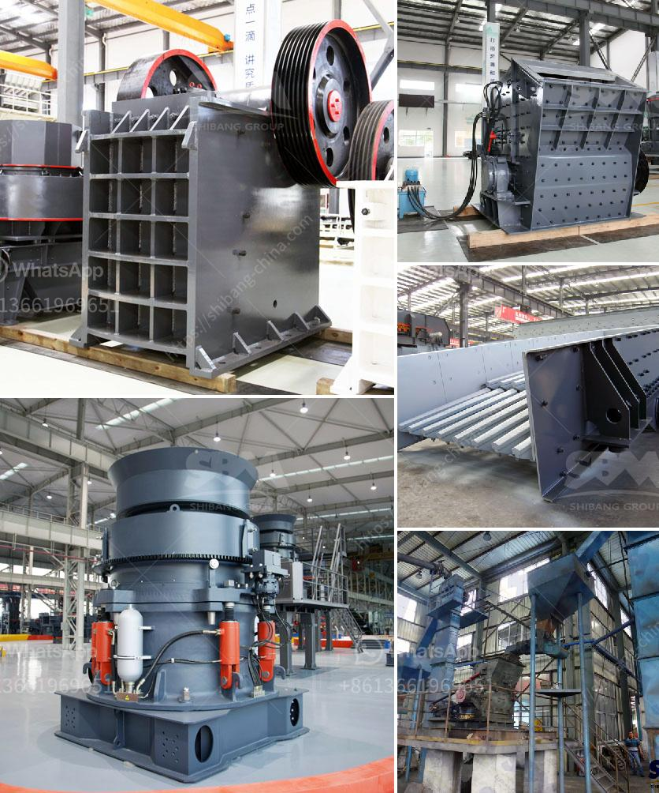

<h3>صورة لمصنع معالجة رمل السيليكا</h3>
تعتبر صناعة معالجة رمل السيليكا من الصناعات الحيوية التي تلعب دورًا هامًا في تزويد العديد من الصناعات بالمواد الخام الأساسية. ويمكن أن تعتبر الصورة لمصنع معالجة رمل السيليكا فرصة ممتازة لاستعراض عمليات التصنيع وأهمية هذه الصناعة.

عند النظر إلى الصورة، يتم لفت الانتباه بوجود العديد من الأجهزة والمعدات في المصنع. ترتبط هذه المعدات بعملية تجهيز وتنقية رمال السيليكا، والتي هي عملية متعددة المراحل تهدف إلى إزالة الشوائب والعيوب من الرمال وجعلها صالحة للاستخدام في صناعات مختلفة.

تبدأ عملية معالجة الرمل بالطحن، حيث تنقل الرمال إلى آلة طحن حيث يتم تفتيتها إلى جزيئات أصغر. ثم يتم نقل الرمل المطحون إلى جهاز فصل الشوائب حيث يتم فصل الشوائب الكبيرة والمعيقة عن الرمل النقي. بعد ذلك، يتم إرسال الرمل النقي إلى مرحلة تنقية أخرى حيث يتم فصل الشوائب الدقيقة والغير مرغوب فيها بواسطة عملية غسيل الماء والفصل بالطرد المركزي.

تعتبر هذه العمليات الأولية ضرورية لتحسين جودة الرمل وإزالة أي شوائب تؤثر على الأداء النهائي للرمل. وبعد الانتهاء من هذه العمليات، يمكن استخدام الرمل المعالج في العديد من الصناعات مثل صناعة الزجاج، والسيراميك، والصناعات الكيميائية، والبناء، وتصنيع اللوحات الإلكترونية، وغيرها.

إن مصانع معالجة رمل السيليكا تلعب دورًا حيويًا في تزويد هذه الصناعات بالمواد الخام اللازمة لإنتاج منتجاتهم، وتأمين جودة المنتج النهائي الذي يعتمد على جودة الرمل. بفضل هذه المصانع، يمكن للشركات المصنعة تقديم المنتجات ذات الجودة العالية وتلبية احتياجات السوق بشكل آمن ومستدام.

وفي الختام، يمكن القول إن الصورة لمصنع معالجة رمل السيليكا تعكس أهمية العملية والتقنيات المستخدمة في هذه الصناعة. إن توافر رمل السيليكا المعالج عالي الجودة يساهم في تطور الصناعات المختلفة ويدعم نمو الاقتصاد بشكل عام.
<h3>Contact us</h3><ul><li><strong>Whatsapp:&nbsp;<a href="https://wa.me/8613661969651">+8613661969651</a></strong></li><li><a href="https://swt.shibang-china.com/?git&amp;zhl&amp;صورة لمصنع معالجة رمل السيليكا"><strong>Online Service(chat now)</strong></a></li></ul><h3>Related</h3><ul><li><a href='كسارة الحجر في إندونيسيا.md'>كسارة الحجر في إندونيسيا</a></li><li><a href='التكلفة المتوسطة لمصنع تعدين الجرافيت.md'>التكلفة المتوسطة لمصنع تعدين الجرافيت</a></li><li><a href='أسعار مصنع كسارة الحجر.md'>أسعار مصنع كسارة الحجر</a></li><li><a href='صناعة تكسير ومعالجة الرخام على نطاق صغير.md'>صناعة تكسير ومعالجة الرخام على نطاق صغير</a></li><li><a href='قائمة موردي الحجر الجيري.md'>قائمة موردي الحجر الجيري</a></li></ul>