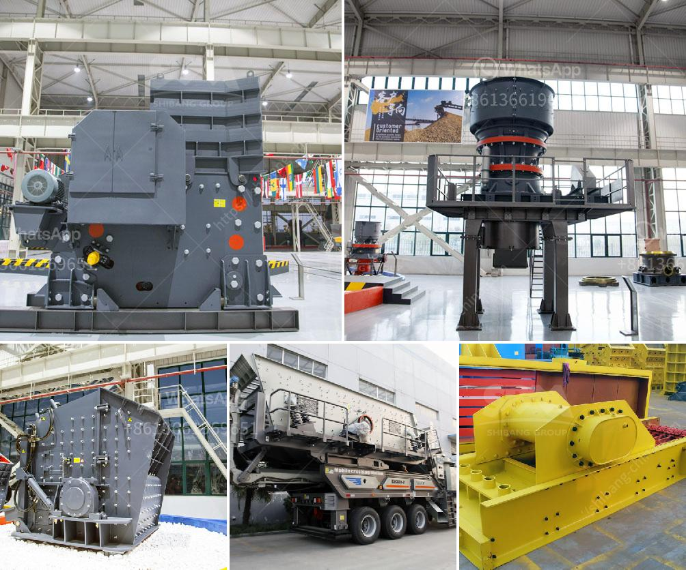

<h3>صورة مطحنة رولر ريموند الموديل 30</h3>
مطحنة رولر ريموند الموديل 30 هي واحدة من أحدث التكنولوجيات في مجال صناعة المطاحن. تتميز هذه الطرازات بقدرتها الهائلة على طحن المواد الخام وتحويلها إلى مسحوق ناعم يستخدم في العديد من الصناعات مثل الأسمنت والكيماويات والطلاء.

تتميز مطاحن رولر ريموند بعدة مزايا. أولاً، فهي تستخدم نظام التوجيه المركزي الذي يعمل على تجنب التلوث المتبادل للمواد الخام ويسمح بتحقيق درجة عالية من النقاء في الإنتاج. بفضل هذا النظام، يتم تجنب مشكلات التلوث والتلون غير المرغوب فيه.

ثانيًا، تتميز مطاحن رولر ريموند بشكل عام بمحركات قوية تعمل بكفاءة عالية. تعتبر هذه المحركات من أكثر المحركات كفاءة في استهلاك الطاقة، مما يوفر تكاليف التشغيل ويقلل من استهلاك الطاقة. بالإضافة إلى ذلك، يتم استخدام نظام تحكم آلي متطور يتيح ضبط سرعة المطحنة وتشغيلها بسلاسة وكفاءة.

ثالثًا، يتميز مطحنة رولر ريموند الموديل 30 بتصميم مدمج وعملي. فهي مصنوعة من مواد عالية الجودة تتحمل الاستخدام الشاق والتآكل. كما تتميز بتصميم مريح يسهل عملية التشغيل والصيانة.

أخيرًا، يتميز الموديل 30 بقدرته على طحن مجموعة واسعة من المواد الخام بدقة عالية. فهو يتميز بنظام تصنيف هواء مدمج يمكنه فصل الحبيبات حسب الحجم وتحقيق حجم الجسيمات المطلوبة.

في الختام، مطحنة رولر ريموند الموديل 30 هي واحدة من أحدث التقنيات في صناعة المطاحن. تتميز بقدرتها العالية على طحن المواد الخام بدقة عالية وتحويلها إلى مسحوق ناعم يستخدم في العديد من الصناعات. تتميز أيضًا بالكفاءة والمتانة، وتعتبر خيارًا مثاليًا للشركات التي تبحث عن مطاحن عالية الجودة وتقنية متطورة.
<h3>Contact us</h3><ul><li><strong>Whatsapp:&nbsp;<a href="https://wa.me/8613661969651">+8613661969651</a></strong></li><li><a href="https://swt.shibang-china.com/?git&amp;zhl&amp;صورة مطحنة رولر ريموند الموديل 30"><strong>Online Service(chat now)</strong></a></li></ul><h3>Related</h3><ul><li><a href='كسارة الحجر ساياجي.md'>كسارة الحجر ساياجي</a></li><li><a href='سعر كسارة حجر متنقلة صغيرة في روسيا.md'>سعر كسارة حجر متنقلة صغيرة في روسيا</a></li><li><a href='غسالة مواد خام جرايستون مستعملة.md'>غسالة مواد خام جرايستون مستعملة</a></li><li><a href='معدات استخراج الحجر.md'>معدات استخراج الحجر</a></li><li><a href='كسارات الحجر في فرنسا.md'>كسارات الحجر في فرنسا</a></li></ul>