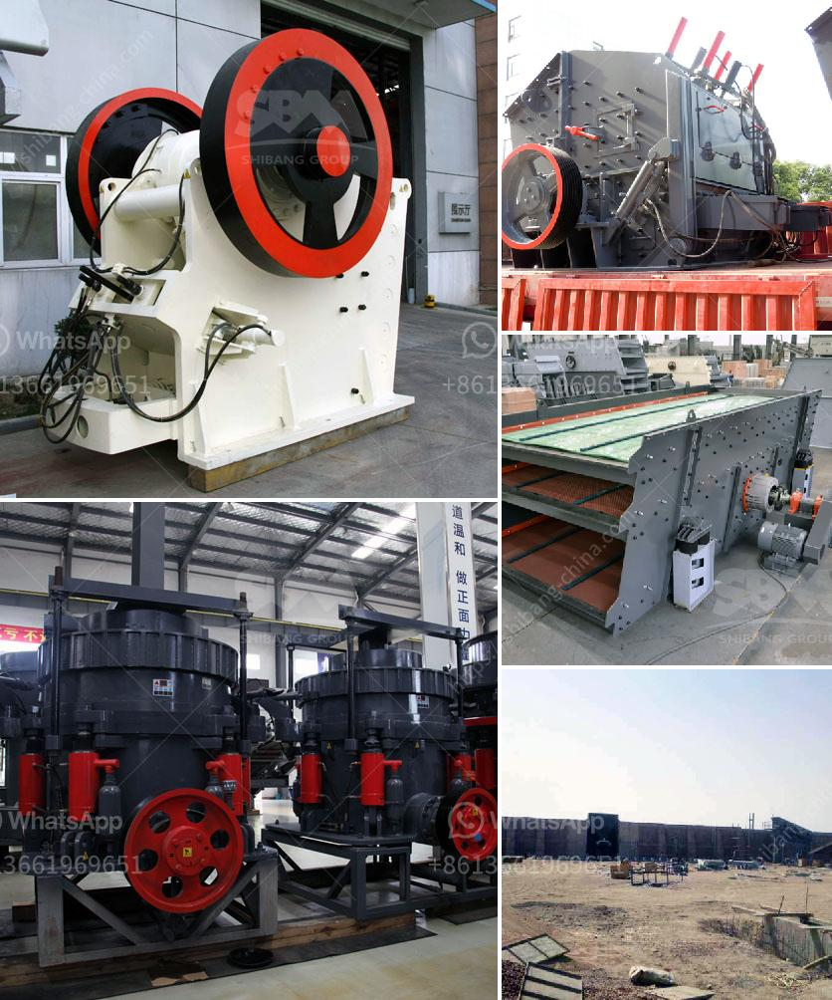

<h3>صيانة محطة توليد الفحم بصيغة PDF</h3>
تعتبر محطات توليد الفحم من أهم مصادر الطاقة في العالم، حيث تقوم بتوفير الكهرباء بكميات كبيرة للاستخدامات المختلفة. ومن أجل الحفاظ على أداء المحطة واستمرار عملها بكفاءة عالية، لا بد من القيام بصيانة دورية وفق خطة محكمة.

تتضمن صيانة محطة توليد الفحم العديد من الخطوات والإجراءات التي يجب اتباعها. وأحد أهم تلك الخطوات هو الفحص الدوري لجميع أجزاء المحطة بما في ذلك الأفران والمراجل ومحركات التوربينات وغيرها. يتم فحص هذه الأجزاء للتأكد من سلامتها واكتشاف أي عيوب محتملة قبل أن تتسبب في توقف المحطة أو تلحق الأضرار بها.

بالإضافة إلى الفحص الدوري، يجب أيضًا تنفيذ أعمال الصيانة الوقائية. تشمل هذه الأعمال تنظيف المعدات وتزييتها وتشغيلها بانتظام للتأكد من عملها بشكل صحيح. كما يتم استبدال الأجزاء التالفة أو البالية قبل أن تتسبب في مشكلات أكبر. وينبغي أيضًا فحص منظومة الأنابيب والتأكد من عدم وجود أي تسرب فيها.

تعتبر السلامة من الأمور الهامة جدًا في محطات توليد الفحم، ولذا يجب أن تكون الصيانة الدورية مصحوبة ببرامج تدريبية للموظفين لضمان أن يتم تنفيذ الإجراءات الصحيحة بأمان. يجب اتباع جميع التعليمات الأمنية و استخدام الأدوات والمعدات الموصى بها خلال أعمال الصيانة.

في الختام، تعتبر صيانة محطة توليد الفحم أمرًا ضروريًا للحفاظ على أداء المحطة ومنع توقفها أو حدوث أعطال كبيرة. يجب على الشركات المشغلة للمحطات الاهتمام بوضع خطة صيانة محكمة وتنفيذها بدقة حتى تستمر المحطة في تزويد المجتمع بالكهرباء بكفاءة عالية واستدامة.
<h3>Contact us</h3><ul><li><strong>Whatsapp:&nbsp;<a href="https://wa.me/8613661969651">+8613661969651</a></strong></li><li><a href="https://swt.shibang-china.com/?git&amp;zhl&amp;صيانة محطة توليد الفحم بصيغة PDF"><strong>Online Service(chat now)</strong></a></li></ul><h3>Related</h3><ul><li><a href='مطاحن الهامش في جنوب أفريقيا.md'>مطاحن الهامش في جنوب أفريقيا</a></li><li><a href='مكونات مطحنة الأسطوانة.md'>مكونات مطحنة الأسطوانة</a></li><li><a href='مطحنة الكرة المستخدمة للبيع في الهند.md'>مطحنة الكرة المستخدمة للبيع في الهند</a></li><li><a href='أكبر معدات تحسين خام الحديد في الصين.md'>أكبر معدات تحسين خام الحديد في الصين</a></li><li><a href='شاشة اهتزاز الحصى.md'>شاشة اهتزاز الحصى</a></li></ul>