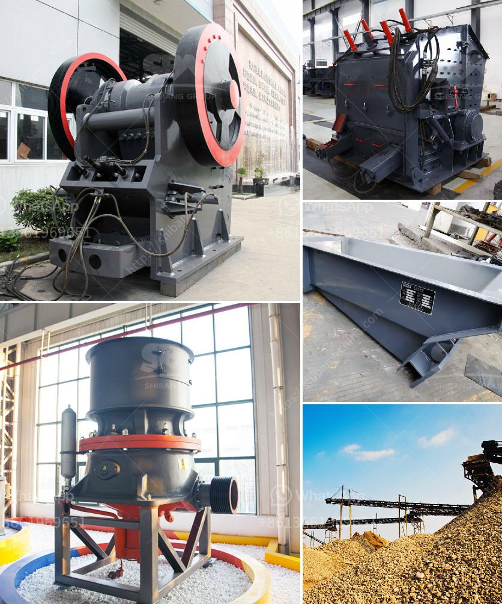

<h3>صيانة مطحنة الأسطوانة العمودية - تنزيل PDF</h3>
تعتبر مطحنة الأسطوانة العمودية من الأجهزة الهامة في عمليات التكسير والطحن الصناعية. تتكون هذه المطاحن من جهاز ميكانيكي يتكون من أسطوانتين عموديتين يمر من خلالها المواد الخام التي تحتاج إلى طحنها. وتتميز هذه المطاحن بفعاليتها وكفاءتها العالية في عملية الطحن.

مع مرور الوقت وتشغيل المطحنة بشكل مستمر، قد تحدث بعض المشاكل التي قد تؤثر على أداء المطحنة. ومن هنا يأتي دور الصيانة الدورية لهذه المطاحن. يهدف الصيانة إلى الحفاظ على أداء المطحنة بشكل ممتاز وتجنب حدوث أعطال غير متوقعة قد تؤدي إلى توقف العمل وخسارة الإنتاج.

يتضمن برنامج الصيانة الدورية لمطحنة الأسطوانة العمودية العديد من الأنشطة المهمة. في البداية، يجب فحص وتنظيف الأسطوانة وأجزاء المطحنة الأخرى، وذلك لإزالة أي بقايا أو تراكمات قد تؤثر على أداء المطحنة. كما يجب فحص التروس والمحامل وضبطها إذا لزم الأمر لضمان عملها بشكل صحيح.

علاوة على ذلك، يجب فحص الضغط ودرجة الحرارة وسرعة المطحنة بانتظام للتأكد من أنها تعمل في الحدود المحددة بشكل صحيح. كما يجب التحقق من أداء جهاز التشحيم وضبطه إذا لزم الأمر.

من المهم أيضًا تدريب الفنيين المعنيين بصيانة المطاحن العمودية على كيفية التعامل مع أجهزة القياس والفحص، وكذلك على عمليات التشحيم وإصلاح أي أعطال طارئة.

باختصار، يجب أن تكون صيانة مطحنة الأسطوانة العمودية عملية دورية ومنتظمة للحفاظ على أداء وكفاءة المطحنة. يتطلب ذلك فحصًا دقيقًا لكافة الأجزاء والمكونات الهامة، بالإضافة إلى تنظيفها وتشحيمها بانتظام. إذا تم الاهتمام الجيد بالصيانة، فإن مطحنة الأسطوانة العمودية ستظل تعمل بكفاءة طويلة الأمد وتسهم في زيادة الإنتاجية وتحقيق الأرباح للشركة.
<h3>Contact us</h3><ul><li><strong>Whatsapp:&nbsp;<a href="https://wa.me/8613661969651">+8613661969651</a></strong></li><li><a href="https://swt.shibang-china.com/?git&amp;zhl&amp;صيانة مطحنة الأسطوانة العمودية  تنزيل PDF"><strong>Online Service(chat now)</strong></a></li></ul><h3>Related</h3><ul><li><a href='مصانع الكسارات للبيع في جنوب أفريقيا.md'>مصانع الكسارات للبيع في جنوب أفريقيا</a></li><li><a href='سعر مصنع الرمل والحصى في الهند.md'>سعر مصنع الرمل والحصى في الهند</a></li><li><a href='كيفية بدء مشروع كسارة الحجر.md'>كيفية بدء مشروع كسارة الحجر</a></li><li><a href='عملية إنتاج لوحات الجبس.md'>عملية إنتاج لوحات الجبس</a></li><li><a href='كسارة حجر البلاد في الهند.md'>كسارة حجر البلاد في الهند</a></li></ul>