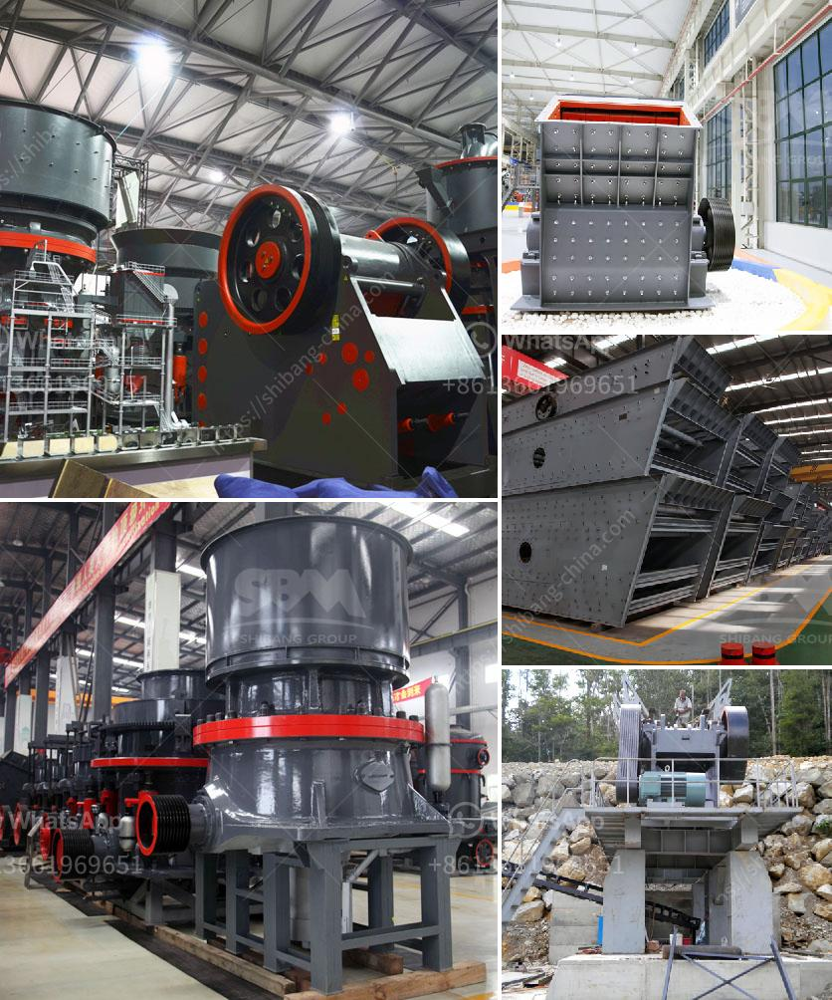

<h3>صيانة مطحنة ريموند</h3>
تعتبر مطحنة ريموند واحدة من أهم المعدات الصناعية في صناعة الطحن، حيث تعمل على طحن المواد الخام وتقسيمها إلى جزيئات صغيرة حسب الحجم المطلوب. ومن أجل ضمان أداء المطحنة بشكل فعال وطويل الأمد، يجب إجراء صيانة دورية لها. في هذه المقالة، سنتناول أهمية صيانة مطحنة ريموند وبعض الإرشادات لتنفيذها.

أولاً وقبل كل شيء، يجب فهم أن صيانة المطحنة الريموند تنقسم إلى صيانة دورية وصيانة طارئة. الصيانة الدورية تتمثل في إجراء التفتيش الروتيني والتنظيف وتزييت المكونات الميكانيكية للمطحنة. من جهة أخرى، الصيانة الطارئة تتطلب إصلاح الأعطال واستبدال الأجزاء التالفة.

هناك عدة خطوات يجب اتباعها عند صيانة مطحنة ريموند. أولاً، قبل البدء في أي أعمال صيانة، يجب عزل المطحنة عن مصدر الكهرباء وتفريغ الضغط المتبقي داخلها. ثم، يتم التحقق من الأجزاء الميكانيكية وتشحيمها بزيت التشحيم المناسب. يفضل أيضاً تنظيف المطحنة من الأتربة والشوائب التي يمكن أن تؤثر على أدائها.

علاوة على ذلك، يجب فحص حالة الأجزاء الكهربائية والإلكترونية للمطحنة. يجب التأكد من سلامة الأسلاك والموصلات واستبدال أي أجزاء تالفة. كما يجب التحقق من حالة المحركات والمحاور وسير النقل وإصلاحها إذا لزم الأمر.

ينصح بالاعتماد على خدمات فنيين ذوي خبرة في صيانة مطحنة ريموند، حيث يكونون قادرين على تقييم حالة المطحنة وتحديد أي أعطال تحتاج للإصلاح. كما يمتلكون المعرفة والمهارات اللازمة لإجراء أي تعديلات تقنية تحتاجها المطحنة وتحسين أدائها.

في الختام، يجب أن نؤكد أن صيانة مطحنة ريموند تعتبر جزءًا أساسيًا من عملية تشغيلها بكفاءة واستدامة. من خلال الاهتمام بصيانة المطحنة بشكل دوري، يمكن الحفاظ على أدائها المثلى وتجنب الأعطال غير المتوقعة. وبهذه الطريقة، يمكن للشركات الاستفادة من المطحنة بشكل أفضل وتحقيق نتائج إنتاجية مرضية.
<h3>Contact us</h3><ul><li><strong>Whatsapp:&nbsp;<a href="https://wa.me/8613661969651">+8613661969651</a></strong></li><li><a href="https://swt.shibang-china.com/?git&amp;zhl&amp;صيانة مطحنة ريموند"><strong>Online Service(chat now)</strong></a></li></ul><h3>Related</h3><ul><li><a href='تكلفة معدات التكسير والطحن في إثيوبيا.md'>تكلفة معدات التكسير والطحن في إثيوبيا</a></li><li><a href='مصنع كسارة مستعمل بسعر 100 طن في الساعة للبيع.md'>مصنع كسارة مستعمل بسعر 100 طن في الساعة للبيع</a></li><li><a href='آلة تصنيع الحجر من جنوب أفريقيا.md'>آلة تصنيع الحجر من جنوب أفريقيا</a></li><li><a href='كسارة تأثير صناعية.md'>كسارة تأثير صناعية</a></li><li><a href='مطحنة طحن عمودية مستعملة بسعة 100 طن في الساعة.md'>مطحنة طحن عمودية مستعملة بسعة 100 طن في الساعة</a></li></ul>