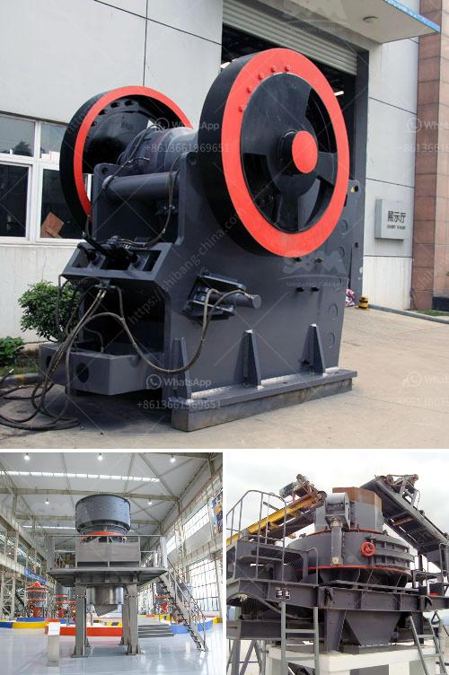

<h3>صيغة بسيطة لناقل الحزام</h3>
ناقل الحزام هو نوع من أنظمة النقل المستخدمة في العديد من الصناعات والمجالات لنقل المواد من مكان إلى آخر بطريقة سهلة وفعالة. تعتبر صيغة بسيطة لناقل الحزام من الصيغ الشائعة والمستخدمة على نطاق واسع. في هذه المقالة، سنناقش هذه الصيغة وكيفية عملها.

تتكون صيغة بسيطة لناقل الحزام من بكرة مدفوعة بمحرك كهربائي، وحزام يتحرك فوق البكرة لنقل المواد الأفقياً أو رأسياً. يتم تحميل المواد على الحزام في بداية الناقل، ويتم تفريغها في النهاية بواسطة آلية معينة. الحزام ينقل المواد بشكل منتظم ومستمر، مما يجعلها تنتقل بكفاءة عالية.

صيغة ناقل الحزام البسيطة تعتبر أكثر عملية واقتصادية للعديد من الصناعات. فهي توفر تكلفة منخفضة للتشغيل والصيانة، وتعمل بكفاءة عالية في نقل مجموعة متنوعة من المواد. تستخدم هذه الصيغة في العديد من الصناعات مثل التعدين والتعبئة والتغليف والنقل والزراعة وغيرها.

واحدة من أهم المزايا لصيغة الناقل البسيطة هي قدرتها على نقل المواد على مسافات طويلة بطريقة سلسة ومنتظمة. بفضل هذه الخاصية، يتم استخدام الناقل الحزام في نقل المواد الثقيلة والكبيرة مثل الأحجار والرمال والفحم والحبوب والمنتجات الأخرى. فضلاً عن ذلك، فإن صيغة الناقل البسيطة تمنح المستخدمين مرونة كبيرة في تصميم المسارات وتكييف الناقل بسهولة لتناسب احتياجاتهم الفردية.

وبفضل تقنية تشغيل الناقل بسهولة وكفاءة، يتم توفير الكثير من الوقت والجهد للشركات والمؤسسات التي تستخدمه. تعمل صيغة الناقل البسيطة بدقة وسرعة عالية، مما يسهم في زيادة إنتاجية العمل وتحسين الأداء العام.

باختصار، صيغة الناقل البسيطة لناقل الحزام تعتبر تقنية فعالة وموثوقة في نقل المواد بسلاسة وكفاءة. تستخدم في العديد من المجالات لتنقل مجموعة واسعة من المواد على مسافات طويلة. إذا كنت تبحث عن حل نقل فعال واقتصادي، فقد تكون صيغة الناقل البسيطة لناقل الحزام الخيار المثالي لك.
<h3>Contact us</h3><ul><li><strong>Whatsapp:&nbsp;<a href="https://wa.me/8613661969651">+8613661969651</a></strong></li><li><a href="https://swt.shibang-china.com/?git&amp;zhl&amp;صيغة بسيطة لناقل الحزام"><strong>Online Service(chat now)</strong></a></li></ul><h3>Related</h3><ul><li><a href='كسارات متنقلة وشاشات مستعملة في جنوب أفريقيا.md'>كسارات متنقلة وشاشات مستعملة في جنوب أفريقيا</a></li><li><a href='مطاحن تعدين الذهب المحمولة.md'>مطاحن تعدين الذهب المحمولة</a></li><li><a href='مصانع الكسارات تصنع.md'>مصانع الكسارات تصنع</a></li><li><a href='كسارة فك محمولة في المملكة العربية السعودية.md'>كسارة فك محمولة في المملكة العربية السعودية</a></li><li><a href='مصنع تكسير صخور متنقل وثابت جديد.md'>مصنع تكسير صخور متنقل وثابت جديد</a></li></ul>