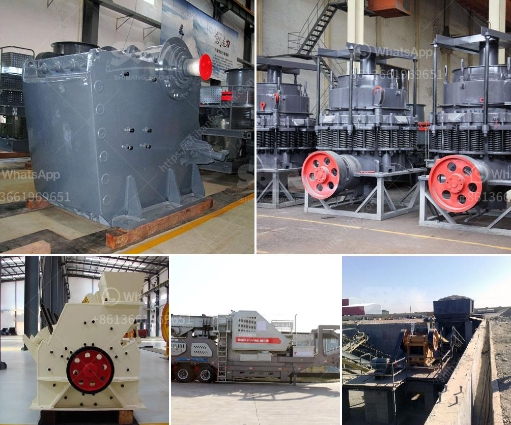

<h3>صيغة حساب قدرة كسارة الفك</h3>
تُستخدم كسارة الفك في العديد من الصناعات مثل التعدين والبناء وصناعة مواد البناء. تُستخدم هذه الكسارة لسحق المواد الخام إلى قطع صغيرة ومتجانسة تصلح للاستخدام في العديد من التطبيقات المختلفة. إن قدرة كسارة الفك تُعد عاملاً هاماً لتحديد إنتاجيتها وكفاءتها في العمل.

تُحْسَبُ سعة الإدخال بتحديد حجم المواد الخام وسرعة الإدخال. قد تحسب سعة الإدخال باستخدام الصيغة التالية:

سعة الإدخال (م³ / س) = عرض الفتحة (م) × طول الفتحة (م) × السرعة (م / د) × كثافة المواد (كجم / م³)

عرض الفتحة: هو الحجم الطولي للفتحة عند الفكين، ويمكن تعديلها لتناسب الحجم المطلوب للمواد المراد سحقها.

طول الفتحة: هو المسافة بين الفك العلوي والفك السفلي أثناء عملية السحق. يمكن تعديله أيضًا لتناسب الحجم المراد سحقه.

السرعة: هي سرعة تحرك الفك السفلي أو الفك العلوي أثناء عملية السحق.

كثافة المواد: تتعلق بوزن المتر المكعب من المواد المطلوب سحقها.

تُشير كفاءة القدرة إلى النسبة المئوية للطاقة المستهلكة التي تُستخدَم فعلاً في العملية الفعلية لسحق المواد. يُؤثر العديد من العوامل في كفاءة القدرة، بما في ذلك نوع وحجم المواد المراد سحقها وخصائص الكسارة.

يجب ملاحظة أن قدرة كسارة الفك قد تختلف حسب التطبيق والمواد المراد سحقها. إذا كنت تنوي شراء كسارة الفك أو ترغب في تحسين الكفاءة والإنتاجية لكسارة الفك الحالية، فإن استشارة الخبراء في هذا المجال والتحدث إلى موردي المعدات قد يكون مفيدًا للغاية.

باستخدام هذه الصيغة لحساب قدرة كسارة الفك، يمكن للمهندسين والعاملين في صناعة التعدين وصناعة مواد البناء تقييم الكفاءة والإنتاجية المتوقعة من كسارة الفك المستخدمة. تساهم معرفة قدرة الكسارة في تحسين عمليات الإنتاج وزيادة الكفاءة وتقليل التكاليف، مما يساهم في تحقيق النجاح والاستدامة في هذه الصناعات.
<h3>Contact us</h3><ul><li><strong>Whatsapp:&nbsp;<a href="https://wa.me/8613661969651">+8613661969651</a></strong></li><li><a href="https://swt.shibang-china.com/?git&amp;zhl&amp;صيغة حساب قدرة كسارة الفك"><strong>Online Service(chat now)</strong></a></li></ul><h3>Related</h3><ul><li><a href='مغذي اهتزازي لخام السنتر.md'>مغذي اهتزازي لخام السنتر</a></li><li><a href='استفسار حول كسارة الصدم.md'>استفسار حول كسارة الصدم</a></li><li><a href='كسارة حجر محمولة.md'>كسارة حجر محمولة</a></li><li><a href='آلة نقل حجر الكوارتز.md'>آلة نقل حجر الكوارتز</a></li><li><a href='مطحنة أسطوانية ثنائية المرور.md'>مطحنة أسطوانية ثنائية المرور</a></li></ul>