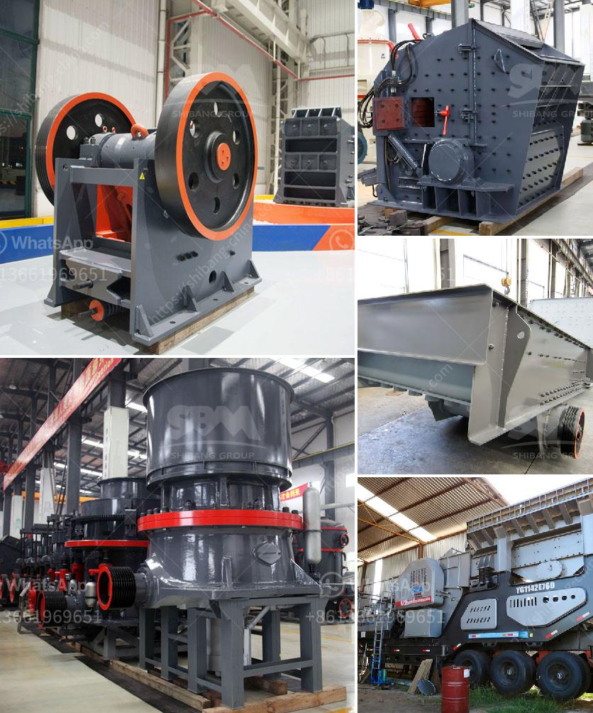

<h3>ضبط حجم الفك كسارة الإغلاق</h3>
تعتبر كسارة الفك من الأدوات الهامة في صناعة التعدين ومعالجة المواد الخام. وتعمل الكسارة الفكية عن طريق ضغط المواد بين فكيها المتحرك والثابت، مما يؤدي إلى تفتيتها إلى قطع صغيرة من الحجم المطلوب. لذلك، يعتبر ضبط حجم الفك في كسارة الإغلاق أمرًا حاسمًا لجودة المنتج الأخير.

يتم ضبط حجم الفك في كسارة الإغلاق بواسطة التحكم في عرض الفجوة بين الفكين. يتم ضبط الفجوة باستخدام الفواصل، وتعتمد قيمة الفاصل على الحجم المرغوب للمنتج النهائي. عندما تكون الفجوة صغيرة، يتم تكسير المواد بشكل أدق، بينما يؤدي جعلها أكبر إلى تحقيق تفتيت أكبر.

تأثير ضبط حجم الفك يظهر بوضوح في جودة المواد المنتجة. فعند ضبط الفك بشكل صحيح، يتم الحصول على قطع متجانسة وذات حجم موحد، مما يسهل عمليات معالجة المنتج الأخير مثل الغربلة والتركيز والتقليل من احتمالات الأخطاء في الإنتاج. على الجانب الآخر، عندما يتم ضبط الفك بشكل غير صحيح، قد يؤدي ذلك إلى تشكيل قطع بحجم غير متجانس، مما يؤثر سلبًا على جودة المنتج النهائي ويزيد من فاقد الناتج.

إجراء ضبط حجم الفك يتطلب القدرة على تحليل البيانات وقراءة القيم الهندسية المقدمة من الكسارة. وعادة ما يتم استخدام أجهزة الاستشعار والأدوات الأوتوماتيكية لتوفير قياسات دقيقة وتحسين عمليات الضبط. وفي حالة زيادة أو تقليل حجم الفك المطلوب، يمكن ضبط الفجوة باستخدام الفواصل المناسبة وتحريك الفك المتحرك.

بالاعتماد على حجم المنتج النهائي المرغوب وجودة الخامة الأولية، يتم ضبط حجم الفك في كسارة الإغلاق بدقة وإتقان. يجب على العاملين في صناعة التعدين وتجهيز المواد الخام أن يكونوا على دراية بعمليات ضبط الفك وكيفية تحقيق الجودة المطلوبة للمنتج. بالقدرة على ضبط حجم الفك بشكل صحيح، يمكن للشركات تحقيق كفاءة عالية في التعامل مع المواد وتقديم منتجات متجانسة وذات جودة عالية لعملائها.

باختصار، يعد ضبط حجم الفك في كسارة الإغلاق أمرًا حاسمًا لتحقيق جودة المنتج النهائي. إن التحكم في عرض الفجوة بين الفكين يؤثر على قدرة الكسارة على تفتيت المواد بشكل صحيح وإنتاج قطع بحجم متجانس. لذا، ينبغي أن يولي العاملون في صناعة التعدين وإنتاج المواد الخام اهتمامًا كبيرًا لعمليات ضبط الفك وضمان استخدام الفواصل المناسبة للحصول على جودة عالية في المنتج النهائي.
<h3>Contact us</h3><ul><li><strong>Whatsapp:&nbsp;<a href="https://wa.me/8613661969651">+8613661969651</a></strong></li><li><a href="https://swt.shibang-china.com/?git&amp;zhl&amp;ضبط حجم الفك كسارة الإغلاق"><strong>Online Service(chat now)</strong></a></li></ul><h3>Related</h3><ul><li><a href='مطحنة تشانغفا للطحن.md'>مطحنة تشانغفا للطحن</a></li><li><a href='معدل كسارة الحجر في نيجيريا.md'>معدل كسارة الحجر في نيجيريا</a></li><li><a href='كسارات مخروط هيدروليكية.md'>كسارات مخروط هيدروليكية</a></li><li><a href='آخر خط إنتاج مسحوق الجبس.md'>آخر خط إنتاج مسحوق الجبس</a></li><li><a href='عملية سحق الكسارة.md'>عملية سحق الكسارة</a></li></ul>