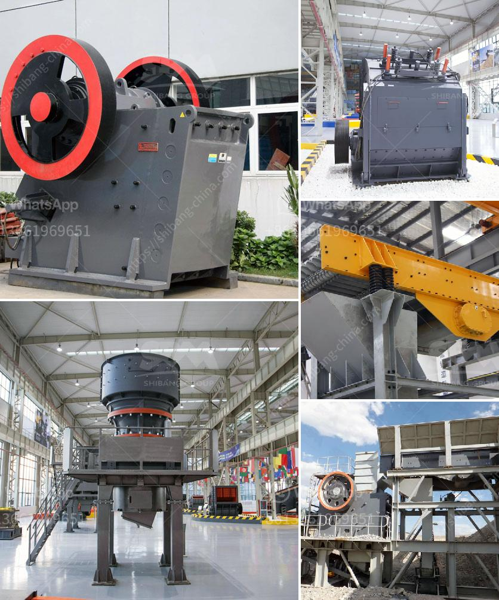

<h3>ضواغط الديزل للبيع في جنوب أفريقيا</h3>
تعتبر ضواغط الديزل من أهم الأدوات التي تستخدم في مجال البناء والإنشاءات في جنوب أفريقيا. تستخدم هذه الضواغط لتوفير الطاقة اللازمة لتشغيل الأدوات اليدوية مثل الهمر الهوائي والمثقاب الهوائي والمطرقة الهوائية وغيرها. تتميز ضواغط الديزل بقوتها العالية وكفاءتها في تشغيل الأدوات الهوائية بسهولة وفعالية.

تأتي ضواغط الديزل بمجموعة متنوعة من الأحجام والقدرات التي تتناسب مع احتياجات العمل المختلفة. تتراوح القدرة النموذجية لهذه الضواغط بين 185 CFM و 1600 CFM. تعتبر هذه القدرات العالية مثالية للاستخدام في البناء والإنشاءات الكبيرة مثل الطرق والجسور والمباني العالية.

يتم تشغيل هذه الضواغط بواسطة محرك ديزل قوي يعمل على توليد الطاقة اللازمة لتشغيل الضاغط الهوائي. تعتبر الوقود الديزل أكثر فعالية من حيث استهلاك الطاقة وتوفير التكاليف مقارنة بالبنزين. وبالتالي، يمكن لضواغط الديزل توفير تشغيل طويل الأمد واستخدام فعال للوقود.

تمتاز ضواغط الديزل بتصميم قوي ومتين يمكنه التعامل مع البيئات القاسية والظروف الصعبة في مواقع العمل. تتضمن بعض النماذج صناديق التحكم عن بعد للتحكم السهل والمريح في عمل الضاغط. كما تتميز أجزاء الضاغط بجودة عالية تجعلها تدوم لفترة طويلة بدون الحاجة إلى صيانة متكررة.

بالإضافة إلى ذلك، تعتبر ضواغط الديزل قابلة للنقل بسهولة وملاءمة. فهي تأتي عادةً مع عجلات ومقابض لتسهيل حركتها من موقع العمل إلى آخر، مما يسهل على العمال نقلها واستخدامها في أماكن مختلفة.

بشكل عام، يمكن القول إن ضواغط الديزل تعتبر استثمارًا مواتيًا لقطاع البناء والإنشاءات في جنوب أفريقيا. فهي توفر الطاقة اللازمة لتشغيل الأدوات اليدوية بكفاءة وفعالية، مما يؤدي إلى زيادة الإنتاجية وتسريع وتيرة العمل. لذا، إذا كنت تبحث عن ضاغط قوي وفعال لاستخدامه في مشروع البناء الخاص بك، فإن ضاغط الديزل سيكون خيارًا مثاليًا لك.
<h3>Contact us</h3><ul><li><strong>Whatsapp:&nbsp;<a href="https://wa.me/8613661969651">+8613661969651</a></strong></li><li><a href="https://swt.shibang-china.com/?git&amp;zhl&amp;ضواغط الديزل للبيع في جنوب أفريقيا"><strong>Online Service(chat now)</strong></a></li></ul><h3>Related</h3><ul><li><a href='عمليات سحق الركام.md'>عمليات سحق الركام</a></li><li><a href='آلة طحن السليكات في الهند.md'>آلة طحن السليكات في الهند</a></li><li><a href='معدات مصنع الكسارة.md'>معدات مصنع الكسارة</a></li><li><a href='كرات كربونات الكالسيوم.md'>كرات كربونات الكالسيوم</a></li><li><a href='مطحنة طحن رايموند في باكستان.md'>مطحنة طحن رايموند في باكستان</a></li></ul>