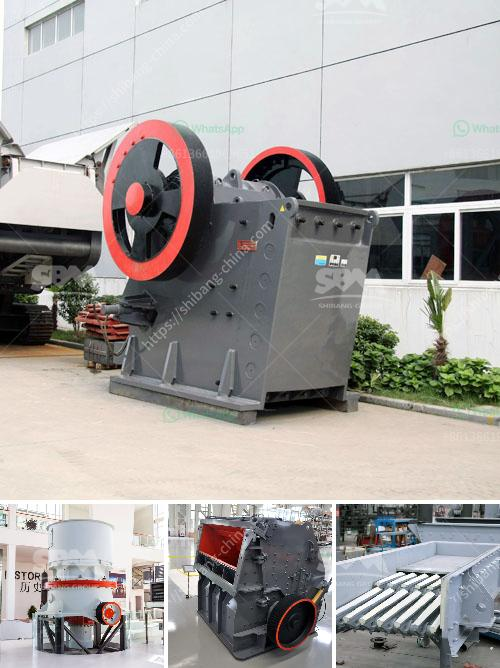

<h3>طاحونة الحجر إلى النانوجسيمات</h3>
تعتبر طواحين الحجر النانوية من التقنيات المبتكرة والمتطورة في مجال الصناعة والبحث العلمي. تهدف هذه الطواحين إلى تحويل حبيبات المواد الصلبة إلى جسيمات نانوية، وهي جسيمات بأحجام أقل من 100 نانومتر.

تتميز طواحين الحجر النانوية بالدقة والفعالية العالية في تحويل الحبيبات الكبيرة إلى نانوجسيمات. تعمل هذه الطواحين عن طريق وجود حجر أو حبة ثابتة تدار بمحرك، مع وجود حجر صغير يدار فوق الحجر الثابت بسرعة عالية.

تتم عملية التحويل عن طريق احتكاك الحبة أو الحجر الصغير بالمادة المراد تحويلها، مما يؤدي إلى طحنها وتقسيمها إلى جسيمات أصغر بشكل تدريجي. يتم ضبط سرعة الحجر الصغير والضغط المطبق على المادة للحصول على الحجم المناسب للنانوجسيمات.

تتيح هذه الطواحين تحويل مجموعة واسعة من المواد إلى نانوجسيمات، بما في ذلك المواد الخام الصلبة والمواد الكيميائية ومنتجات التكنولوجيا العالية. كما يمكن تحسين الخصائص الميكانيكية والكيميائية لهذه المواد بعد عملية التحويل.

وبفضل تطور هذه التقنية، يمكن استخدام النانوجسيمات في تطبيقات متعددة. فهي تستخدم في صناعة الأدوية والأغذية والطلاءات والمواد البنائية والكهروضوئية والإلكترونية والتجميلية وغيرها الكثير.

ومن الفوائد الرئيسية لطواحين الحجر النانوية توفير الوقت والجهد في عملية التحويل، وزيادة دقة النتائج وتحسين جودة المنتجات. كما تقلل هذه الطواحين من تكاليف الإنتاج وتحافظ على البيئة من خلال تقليل استخدام المواد الخام وتقليل ناتج النفايات.

ولكن، رغم المزايا الكبيرة لطواحين الحجر النانوية، تحتاج إلى الحذر عند استخدامها. يجب اتباع تعليمات السلامة واستخدام الواقيات الشخصية لتجنب أي أضرار صحية ناتجة عن تشتت الجسيمات النانوية في الهواء.

في النهاية، تتيح طواحين الحجر النانوية تحويل المواد الصلبة إلى نانوجسيمات بكفاءة عالية، مما يفتح الأبواب أمام فوائد عديدة في مجالات متعددة. بفضل هذه التكنولوجيا، يمكن تحقيق تقدم قياسي في مجال التكنولوجيا والابتكار.
<h3>Contact us</h3><ul><li><strong>Whatsapp:&nbsp;<a href="https://wa.me/8613661969651">+8613661969651</a></strong></li><li><a href="https://swt.shibang-china.com/?git&amp;zhl&amp;طاحونة الحجر إلى النانوجسيمات"><strong>Online Service(chat now)</strong></a></li></ul><h3>Related</h3><ul><li><a href='مطحنة أسطوانية عمودية للفحم.md'>مطحنة أسطوانية عمودية للفحم</a></li><li><a href='قائمة الأسعار في زيمبابوي لمطاحن الكرة.md'>قائمة الأسعار في زيمبابوي لمطاحن الكرة</a></li><li><a href='غربال وكسارة للبيع.md'>غربال وكسارة للبيع</a></li><li><a href='تكلفة كسارة الحصى.md'>تكلفة كسارة الحصى</a></li><li><a href='مصنع كامل لاستخراج النحاس للبيع.md'>مصنع كامل لاستخراج النحاس للبيع</a></li></ul>