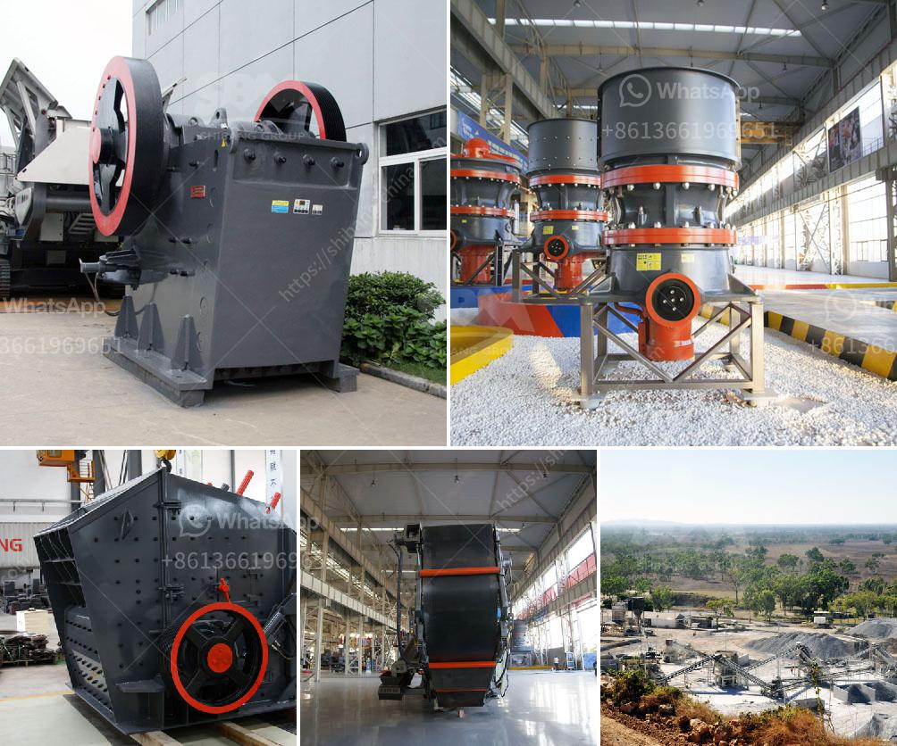

<h3>طاحونة السخام</h3>
تعتبر طاحونة السخام واحدة من الطواحين التقليدية التي استُخدمت في الماضي لطحن الحبوب واستخراج الدقيق. تتكون طاحونة السخام من بناءٍ حجري يتكون عادةً من ثلاث طوابق متلاصقة تتواجد في المناطق الريفية وتعكس تاريخ وحضارة المجتمعات القديمة.

تستند فكرة عمل طاحونة السخام على استغلال قوة الرياح لتحريك الأجزاء الميكانيكية الموجودة بداخلها. يتم تحويل حركة الرياح إلى طاقة دورانية تدفع بشكلٍ مباشر أحجار الطحن المائلة الواقعة في الطور الأسفل من الطاحونة. توجد فتحة صغيرة لدخول الحبوب المراد طحنها وقد تم اختراعها بطرق تقنية متطورة.

تكمن أهمية طاحونة السخام في أنها توفر الدقيق اللازم لإعداد الخبز والمنتجات الحبوبية الأخرى. بالإضافة إلى ذلك، تعد طاحونة السخام جزءًا من التراث الثقافي والتاريخي للمجتمعات حول العالم. يُعتبر مشاهدة ومعرفة عمل هذه الطواحين واحدة من الأنشطة الشائعة للسياح في بعض البلدان التي لا تزال تحافظ على هذه الآلات التقليدية.

وعلى الرغم من تطور تكنولوجيا الطحن حيث تم استبدال الطواحين التقليدية بالتكنولوجيا الحديثة، إلّا أن طاحونة السخام لا تزال تتمتع بأهمية كبيرة في بعض القرى والمناطق الريفية حول العالم حيث لا تتوفر وسائل طحن حديثة. كما أن استخدامها يساهم في تقليل الاعتماد على الطاقة الكهربائية والحفاظ على البيئة.

في الختام، يُمكن القول إن طاحونة السخام تعد أداة تقليدية مهمة لطحن الحبوب واستخراج الدقيق في الماضي. وعلى الرغم من تطور التكنولوجيا، تظل تلك الطواحين تسجل جزءًا من التراث الثقافي للمجتمعات حول العالم وتحظى بشعبيةٍ لا تزال تجلب السياح إلى الأماكن التي تحتفظ بهذا التراث التقليدي.
<h3>Contact us</h3><ul><li><strong>Whatsapp:&nbsp;<a href="https://wa.me/8613661969651">+8613661969651</a></strong></li><li><a href="https://swt.shibang-china.com/?git&amp;zhl&amp;طاحونة السخام"><strong>Online Service(chat now)</strong></a></li></ul><h3>Related</h3><ul><li><a href='كسارات مسحوق التلك.md'>كسارات مسحوق التلك</a></li><li><a href='مطحنة أسطوانية للبيع في نيوزيلندا.md'>مطحنة أسطوانية للبيع في نيوزيلندا</a></li><li><a href='كسارة التعدين في تنزانيا.md'>كسارة التعدين في تنزانيا</a></li><li><a href='مطحنة الكرات المطحنة في الهند.md'>مطحنة الكرات المطحنة في الهند</a></li><li><a href='الشركات التي تبيع كسارة الفك في كينيا.md'>الشركات التي تبيع كسارة الفك في كينيا</a></li></ul>