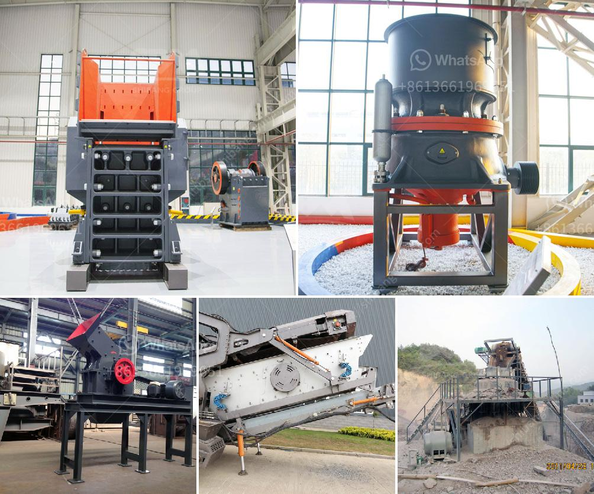

<h3>طاحونة الكرة الرطبة في الصين</h3>
في الصين، واحدة من أبرز المعدات المستخدمة في صناعة المعادن هي طاحونة الكرة الرطبة. تعتبر طاحونة الكرة الرطبة جهازًا يستخدم لطحن المواد السائلة والرطبة، وذلك من أجل الحصول على حبيبات صغيرة وترابط أفضل.

تاريخ طويل ومرجعيات رائعة في صناعة الكرة الرطبة جعلت الصين واحدة من أكبر المنتجين لهذه الأجهزة في العالم. يتم تصنيع طواحين الكرة الرطبة في الصين من خلال تقنيات متقدمة وبأعلى مستوى من الجودة.

تتكون طاحونة الكرة الرطبة من هيكل رئيسي يحتوي على أسطوانة دوارة تحتوي على وسائل طحن معدنية مثل الكرات الصلبة. يتم توجيه المواد والمياه إلى الأسطوانة الدوارة، وتتحرك داخل الأسطوانة وتتعرض للطحن بواسطة الكرات الصلبة.

تستخدم طواحين الكرة الرطبة في عدة صناعات مثل التعدين، والتعدين اللافلزي، والكيميائية، والبناء، والمواد المقاومة للحرارة، والخزف. تساهم الكرة الرطبة في عمليات إعداد المواد وإنتاجها، وتقليل حجم المواد، وتوفير الوقت والطاقة في العمليات الطحن.

تتميز طواحين الكرة الرطبة في الصين بعدة مزايا. أولاً، فهي تتميز بأداء ممتاز للطحن وجودة عالية للمنتج النهائي. ثانياً، تتميز بتصميم موفر للطاقة وفعال في استخدامها، مما يوفر التكاليف للشركات المصنعة. ثالثاً، تتميز ببساطة الاستخدام والصيانة، مما يجعلها مفضلة للعديد من الشركات.

بالإضافة إلى ذلك، تعتبر طواحين الكرة الرطبة في الصين أجهزة مستدامة وصديقة للبيئة. فهي تستخدم تقنيات حديثة لتقليل الانبعاثات الضارة، وتوفر كفاءة عالية في استهلاك الموارد الطبيعية مثل الماء والطاقة.

أخيرًا، يمكن القول إن طاحونة الكرة الرطبة هي جهاز أساسي في عمليات الطحن الصناعية في الصين. توفر الجودة العالية والأداء الممتاز والكفاءة المستدامة، مما يساهم في نجاح الصناعة وتقدمها. لذا، فإن الطاحونة الرطبة في الصين تظل أحد الأنظمة الهامة لتحقيق النمو الاقتصادي المستدام والمزدهر للصين.
<h3>Contact us</h3><ul><li><strong>Whatsapp:&nbsp;<a href="https://wa.me/8613661969651">+8613661969651</a></strong></li><li><a href="https://swt.shibang-china.com/?git&amp;zhl&amp;طاحونة الكرة الرطبة في الصين"><strong>Online Service(chat now)</strong></a></li></ul><h3>Related</h3><ul><li><a href='شاشات وكسارات الركام.md'>شاشات وكسارات الركام</a></li><li><a href='تسعير حزام الناقل في ماليزيا.md'>تسعير حزام الناقل في ماليزيا</a></li><li><a href='مطاحن الكرة الأرجنتينية.md'>مطاحن الكرة الأرجنتينية</a></li><li><a href='مصنع عملية التصنيع في جنوب أفريقيا.md'>مصنع عملية التصنيع في جنوب أفريقيا</a></li><li><a href='خط إنتاج الخرسانة الثاني.md'>خط إنتاج الخرسانة الثاني</a></li></ul>