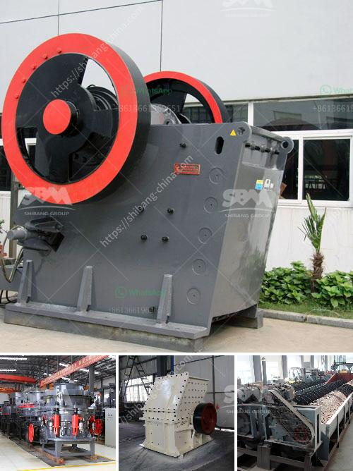

<h3>طاحونة حديثة للكربونات</h3>
تحتاج صناعة الكيمياء والعديد من الصناعات الأخرى إلى توفير كميات كبيرة من الكربونات. تعد الكربونات مركبات مهمة تستخدم في صناعة المواد الكيميائية، والزجاج، والأسمنت، والدهانات، والمبيدات الزراعية وغيرها الكثير. وبالمثل، يتم استخدام الكربونات في العديد من التطبيقات في صناعة الأغذية والمشروبات.

تستخدم الطواحين التقليدية لطحن الكربونات، وهي عملية تستغرق وقتًا وتكلفة عالية. تعتمد الطواحين التقليدية على القوة البشرية أو الحيوانية أو الطاقة الكهربائية لتشغيلها، وتعمل على طحن الكربونات بواسطة حجارة ثقيلة أو أسطوانات معدنية. ومع ذلك، فإن هذه الطواحين التقليدية تعاني من عدة مشاكل، مثل تكلفتها العالية واستهلاك الطاقة الزائد.

حديثاً، تم تطوير طاحونة حديثة لطحن الكربونات بطريقة أكثر كفاءة واقتصادية. تتميز هذه الطواحين الحديثة بتقنيات متقدمة وهيكل مبتكر يدعم عمليات الطحن بطريقة سريعة وفعالة. تعمل هذه الطاحونة الحديثة باستخدام المحركات الكهربائية ذات الأداء العالي التي توفر الطاقة اللازمة لتشغيلها.

بالإضافة إلى ذلك، تتوفر الطواحين الحديثة بنماذج مختلفة وقدرات متعددة، مما يسمح للصناعات المختلفة باختيار الطاحونة المناسبة لها وفقًا لاحتياجاتها الخاصة. تتميز هذه الطواحين بأنها قادرة على طحن كميات كبيرة من الكربونات في وقت قصير، مما يقلل من وقت وجهود العمل ويزيد من إنتاجية العملية.

بالإضافة إلى ذلك، تعتبر الطواحين الحديثة أكثر استدامة وصديقة للبيئة. فهي تستخدم أقل الطاقة وتقلل من الانبعاثات الضارة للبيئة. وبفضل تقنياتها المتقدمة، فإن الطواحين الحديثة قادرة على إنتاج مسحوق كربونات عالي الجودة بنسبة تفوق الطواحين التقليدية.

بشكل عام، تعتبر الطواحين الحديثة للكربونات خطوة إيجابية نحو تحسين عمليات الإنتاج وتقليل التكاليف وحماية البيئة. إن تبني الصناعات للطواحين الحديثة سيساهم في دفع عجلة التطور التكنولوجي والاستدامة في صناعات الكيمياء والأغذية وغيرها، مما يسهم في تحقيق نتائج أفضل واقتصاد أكثر فعالية.
<h3>Contact us</h3><ul><li><strong>Whatsapp:&nbsp;<a href="https://wa.me/8613661969651">+8613661969651</a></strong></li><li><a href="https://swt.shibang-china.com/?git&amp;zhl&amp;طاحونة حديثة للكربونات"><strong>Online Service(chat now)</strong></a></li></ul><h3>Related</h3><ul><li><a href='ما هو مطحنة الكرة.md'>ما هو مطحنة الكرة</a></li><li><a href='أسعار السيور الناقلة في ماليزيا.md'>أسعار السيور الناقلة في ماليزيا</a></li><li><a href='كسارة محمولة في الفلبين بسعر مناسب.md'>كسارة محمولة في الفلبين بسعر مناسب</a></li><li><a href='مطحنة رايموند العمودية.md'>مطحنة رايموند العمودية</a></li><li><a href='تطبيق كسارة الصدم.md'>تطبيق كسارة الصدم</a></li></ul>