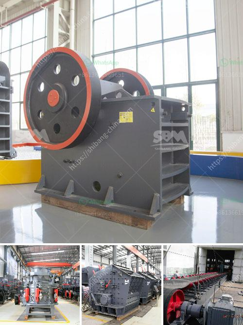

<h3>طاحونة رايموند للفحم</h3>
تعتبر طاحونة رايموند واحدة من أهم الأدوات المستخدمة في صناعة الفحم والمواد المعدنية الأخرى. يتم استخدامها لطحن الفحم إلى مسحوق ناعم يستخدم في عمليات الحرق لإنتاج الطاقة.

تم تصميم طاحونة رايموند خصيصًا لطحن المواد الهشة مثل الفحم والبوكسيت والكاولين والجبس والحجر الجيري وغيرها. تتميز بمبدأ الطحن الفائق الدقة والتي تساعد في تحقيق درجة نعومة عالية للمسحوق المنتج.

تتألف طاحونة رايموند من محرك رئيسي يدفع المروحة الرئيسية والمروحة العلوية. يقوم المحرك الرئيسي بتدوير شفرة المحرزة بشكل سريع لطحن المواد. كما يتم استخدام المروحة الرئيسية لتوجيه الهواء الداخل إلى مجموعة من الأنابيب الغلافية لنقل المواد الخام.

تتميز طاحونة رايموند بأنها قادرة على طحن المواد بسرعة كبيرة، مما يساعد على زيادة إنتاجية الطاحونة. كما أنها توفر أيضًا تحكما دقيقا في حجم الجسيمات المراد طحنها، مما يتيح للمستخدمين ضبط حجم الجسيم المطلوب وفقا لاحتياجاتهم.

تعتبر طاحونة رايموند من الأدوات الفعالة والموفرة للطاقة في مجال صناعة الفحم. فهي تعمل بكفاءة عالية وتعتبر بديلًا مثاليًا للطاحونات التقليدية التي تستهلك كميات كبيرة من الطاقة الكهربائية.

بالإضافة إلى ذلك، تعتبر طاحونة رايموند سهلة التشغيل والصيانة، مما يقلل من تكاليف الصيانة ويساعد على زيادة عمر الطاحونة.

في الاخير، تتألف طاحونة رايموند من مواد عالية الجودة وتصميم متين، مما يجعلها خيارًا مثاليًا لمن يبحثون عن طاحونة قوية وموثوقة لطحن الفحم والمواد المعدنية الأخرى.

لخلاصة المقالة، تعتبر طاحونة رايموند أداة مهمة في صناعة الفحم والمواد المعدنية، حيث تساعد في طحن المواد إلى مسحوق ناعم بدرجة نعومة عالية. تتميز بكفاءة عالية وقدرة على طحن المواد بسرعة، كما أنها سهلة التشغيل والصيانة. بفضل تصميمها المتين واستخدام مواد عالية الجودة، تعد طاحونة رايموند خيارًا مثاليًا لأولئك الذين يبحثون عن أداة قوية وموثوقة لطحن الفحم والمواد المعدنية الأخرى.
<h3>Contact us</h3><ul><li><strong>Whatsapp:&nbsp;<a href="https://wa.me/8613661969651">+8613661969651</a></strong></li><li><a href="https://swt.shibang-china.com/?git&amp;zhl&amp;طاحونة رايموند للفحم"><strong>Online Service(chat now)</strong></a></li></ul><h3>Related</h3><ul><li><a href='تأجير كسارة إعادة تدوير الخرسانة.md'>تأجير كسارة إعادة تدوير الخرسانة</a></li><li><a href='آلة فحص الرمل في ماليزيا.md'>آلة فحص الرمل في ماليزيا</a></li><li><a href='عملية سحق الفحم 200 tph.md'>عملية سحق الفحم 200 tph</a></li><li><a href='تقرير تفصيلي حول مصنع مسحوق الكوارتز.md'>تقرير تفصيلي حول مصنع مسحوق الكوارتز</a></li><li><a href='تصنيع آلات السحق في بوليفيا.md'>تصنيع آلات السحق في بوليفيا</a></li></ul>