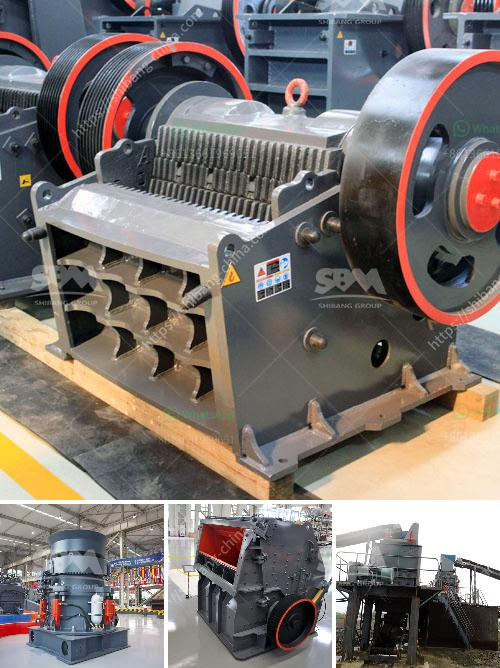

<h3>طاحونة طحن الكالسيوم</h3>
تعتبر طاحونة طحن الكالسيوم من المعدات الهامة التي تستخدم في صناعات متعددة مثل الصناعات الكيماوية وصناعة البناء والزراعة. تعتمد طاحونة طحن الكالسيوم على تكسير وطحن الكالسيوم الصلب إلى جسيمات أصغر بحجم محدد. يتم ذلك عن طريق تطبيق قوة عالية على المادة الخام بواسطة المطرقة أو المطحنة.

يتم استخدام طاحونة طحن الكالسيوم لإنتاج مسحوق الكالسيوم الناعم الذي يستخدم في العديد من التطبيقات. واحدة من هذه التطبيقات هي في صناعة الأسمدة حيث يتم استخدام مسحوق الكالسيوم لتحسين خصوبة التربة. يتم امتصاص المسحوق بسرعة وسهولة من قبل النباتات، مما يحسن نموها وإنتاجها.

بالإضافة إلى ذلك، يستخدم مسحوق الكالسيوم كمضاف غذائي في العديد من المنتجات المغذية. فهو يحتوي على الكالسيوم الذي يلعب دورًا هامًا في بناء العظام والأسنان القوية وصحة القلب والعضلات. يتم استخدام مسحوق الكالسيوم في صناعة الأغذية والأدوية لتعزيز قيمتها الغذائية.

تستخدم العديد من الشركات طاحونة طحن الكالسيوم لإعادة تدوير المواد الخام واستخدامها في تصنيع منتجات أخرى. وباستخدام هذه الطاحونة، يتم تحسين كفاءة الإنتاج وتقليل تكلفة التصنيع.

بصفة عامة، تعتبر طاحونة طحن الكالسيوم واحدة من الأدوات الأساسية في صناعة الكالسيوم. يتم استخدامها لتحقيق نتائج ذات جودة عالية وتعزيز الإنتاجية. وتلعب دورًا هامًا في تلبية احتياجات السوق وتعظيم الربحية.

في النهاية، تعد طاحونة طحن الكالسيوم أداة أساسية في عملية تحويل الكالسيوم الصلب إلى مسحوق ناعم يمكن استخدامه في العديد من التطبيقات المختلفة. تحسين جودة المنتج وزيادة الإنتاجية من خلال استخدام هذه الطاحونة يساهم في نمو وازدهار الصناعات المستخدمة للكالسيوم وتلبية احتياجات السوق المتزايدة.
<h3>Contact us</h3><ul><li><strong>Whatsapp:&nbsp;<a href="https://wa.me/8613661969651">+8613661969651</a></strong></li><li><a href="https://swt.shibang-china.com/?git&amp;zhl&amp;طاحونة طحن الكالسيوم"><strong>Online Service(chat now)</strong></a></li></ul><h3>Related</h3><ul><li><a href='استخدامات الصناعية لمسحوق الرخام الأبيض.md'>استخدامات الصناعية لمسحوق الرخام الأبيض</a></li><li><a href='كسارات مسحوق التلك.md'>كسارات مسحوق التلك</a></li><li><a href='كسارة المحجر في الفلبين للبيع.md'>كسارة المحجر في الفلبين للبيع</a></li><li><a href='صورة مطحنة رولر ريموند الموديل 30.md'>صورة مطحنة رولر ريموند الموديل 30</a></li><li><a href='مصانع التعدين.md'>مصانع التعدين</a></li></ul>