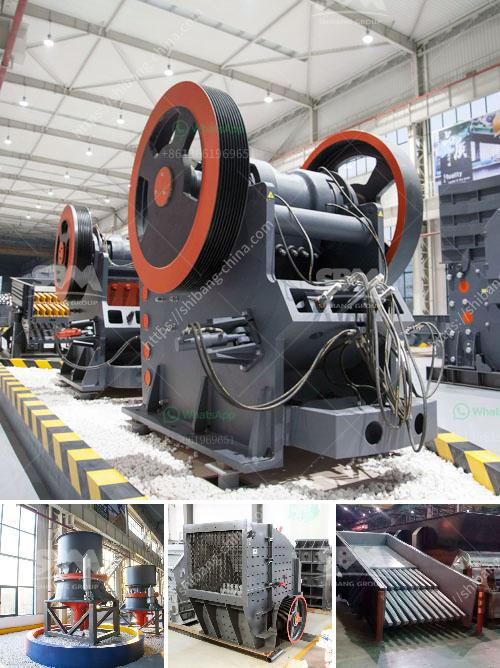

<h3>طاحونة عمودية للأسمنت في كينيا بسعة 100 طن</h3>
تعتبر طاحونة الأسمنت العمودية واحدة من أهم الآلات المستخدمة في صناعة الأسمنت في كينيا وفي جميع أنحاء العالم. تُستخدم هذه الأنواع من الطواحين لطحن وسحق المواد الخام لتحويلها إلى مسحوق الأسمنت.

تتميز الطواحين العمودية بعدة مزايا تجعلها خياراً مفضلاً لصناعة الأسمنت في كينيا. أحد أهم هذه المزايا هو حجمها المدمج والصغير، حيث تتطلب مساحة أقل من التركيب في المصنع مقارنة بالطاحونات التقليدية الأخرى. هذا الأمر يعني أنه يمكن تثبيت المزيد من الطواحين العمودية في نفس المساحة، مما يزيد من إنتاجية المصنع.

بالإضافة إلى ذلك، تتميز الطواحين العمودية بنظام طحن فعال وقدرة على طحن المواد الخام بشكل أفضل وأسرع. تستخدم هذه الطواحين نظام الطحن الترددي الأحادي الذي يجعل من السهل ضبط فتحة الطحن ونسبة الطحن المطلوبة. هذا يساعد على الحصول على جودة الأسمنت المطلوبة وتحسين كفاءة الإنتاج.

يعزز استخدام الطواحين العمودية أيضًا سلامة العمال في المصنع، حيث تُعتبر أكثر أمانًا للاستخدام. بالمقارنة مع الطواحين التقليدية الأخرى، فإن الطواحين العمودية لا تتطلب إجراءات تشغيل معقدة أو مخاطر المسافة القريبة بين المواد الخام والأحزمة الناقلة. هذا يقلل من حدوث حوادث العمل ويحمي العمال من الإصابات.

وتأخذ طواحين الأسمنت العمودية الاعتبار أيضاً مسألة الحفاظ على البيئة. تعتبر صناعة الأسمنت من أكثر الصناعات استهلاكًا للطاقة ويمكن أن تُسبب تلوثًا بيئيًا كبيرًا. ومع ذلك، تعمل الطواحين العمودية بشكل فعال على توفير الطاقة والتقليل من انبعاثات الكربون. هذا يدعم جهود الحفاظ على البيئة وتحقيق الاستدامة في صناعة الأسمنت في كينيا.

باختصار، تُعتبر الطواحين العمودية للأسمنت بسعة 100 طن من أحدث الابتكارات والتقنيات المستخدمة في صناعة الأسمنت في كينيا. تجمع بين الكفاءة العالية والأمان والاهتمام بالبيئة، مما يعزز إنتاجية المصانع وجودة الأسمنت المنتج وسلامة العمال والاستدامة البيئية.
<h3>Contact us</h3><ul><li><strong>Whatsapp:&nbsp;<a href="https://wa.me/8613661969651">+8613661969651</a></strong></li><li><a href="https://swt.shibang-china.com/?git&amp;zhl&amp;طاحونة عمودية للأسمنت في كينيا بسعة 100 طن"><strong>Online Service(chat now)</strong></a></li></ul><h3>Related</h3><ul><li><a href='معالجة تكسير البازلت.md'>معالجة تكسير البازلت</a></li><li><a href='مطحنة هامر 7 في 8 للذهب والكوارتز.md'>مطحنة هامر 7 في 8 للذهب والكوارتز</a></li><li><a href='مطحنة فحم في ماليزيا.md'>مطحنة فحم في ماليزيا</a></li><li><a href='أسعار معدات المحجر.md'>أسعار معدات المحجر</a></li><li><a href='أعمال التعدين والاستغلال في جنوب أفريقيا.md'>أعمال التعدين والاستغلال في جنوب أفريقيا</a></li></ul>