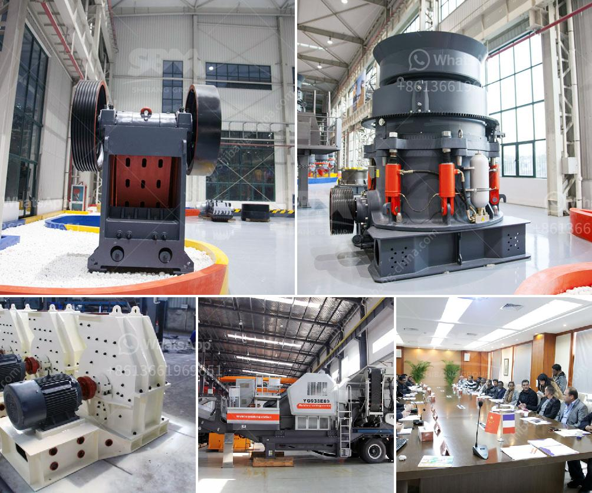

<h3>طاحونة عمودية للفحم</h3>
تُعد طواحين الفحم العمودية جزءًا هامًا من صناعة توليد الكهرباء الحديثة. فهي تستخدم لطحن الفحم وتحويله إلى مسحوق ناعم يُستخدم في أفران الاحتراق لتوليد البخار الضروري لتشغيل الأجهزة المولدة للكهرباء.

تعمل هذه الطواحين بنظام عمل محوري، حيث يكون لديها محرك يدور بسرعة عالية. تتكون الطاحونة العمودية عادة من جسم معدني مكون من مجموعة من الأجزاء الميكانيكية والأنظمة الهيدروليكية والتي تعمل معًا لتحقيق الغرض المطلوب من طحن الفحم.

تستخدم الطحونة العمودية عادة في المحطات الحرارية الكبيرة التي تعتمد على الفحم كوقود رئيسي. يتم تغذية الطاحونة بكمية من الفحم من الأعلى وتمر بهاروات الطحن، الأكثر تقدما، وتتم عملية الطحن في الداخل. يتم سحق الفحم وتحويله إلى مسحوق ناعم الملمس يمكن استخدامه في عملية حرق الفحم لتوليد الكهرباء.

تتمتع الطواحين العمودية بالعديد من المزايا. فبالمقارنة مع أنواع الطواحين الأخرى، فإن العمودية توفر مساحة أقل للتثبيت وتعتبر أكثر كفاءة في استخدام الطاقة وأقل استهلاكًا للوقود. هذا يتيح استخدام كميات أكبر من الفحم وبالتالي زيادة قدرة التوليد. علاوة على ذلك، الطواحين العمودية قابلة للتشغيل المستمر لفترات طويلة دون الحاجة إلى توقف للصيانة.

وللطواحين العمودية بعض العيوب أيضًا. فهي تكون عادة مكلفة الشراء والصيانة وتستهلك كميات كبيرة من الماء في عمليات التبريد. بالإضافة إلى ذلك، يتطلب تشغيلها ضبطًا دقيقًا لضمان الأداء المثلى.

تُعدّ طواحين الفحم العمودية هي تقنية حديثة وفعالة في صناعة توليد الكهرباء. إن استخدامها المُنتظم والجيد يُمكن أن يسهم في توفير الطاقة وتحسين الكفاءة البيئية، وهو ما يعزز الاستدامة في قطاع الطاقة.
<h3>Contact us</h3><ul><li><strong>Whatsapp:&nbsp;<a href="https://wa.me/8613661969651">+8613661969651</a></strong></li><li><a href="https://swt.shibang-china.com/?git&amp;zhl&amp;طاحونة عمودية للفحم"><strong>Online Service(chat now)</strong></a></li></ul><h3>Related</h3><ul><li><a href='وحدة طحن الكلنكر الأسمنتي.md'>وحدة طحن الكلنكر الأسمنتي</a></li><li><a href='كسارة الكرة للحديد فقط الشركة.md'>كسارة الكرة للحديد فقط الشركة</a></li><li><a href='آلة الجبس في ألمانيا.md'>آلة الجبس في ألمانيا</a></li><li><a href='كسارة لفة معدات مستخدمة tph الفحم الروسية.md'>كسارة لفة معدات مستخدمة tph الفحم الروسية</a></li><li><a href='إجراءات مكتبية لمصنع كسارة الحجر في مدى.md'>إجراءات مكتبية لمصنع كسارة الحجر في مدى</a></li></ul>