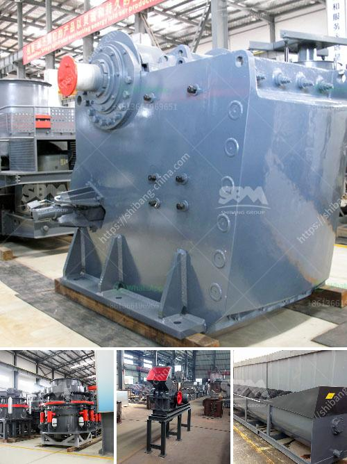

<h3>طاحونة كرات في كينيا</h3>
تُعد طواحين الكرات من بين الأدوات الرئيسية في صناعة التعدين، وهي تستخدم على نطاق واسع في طحن وسحق المواد الخام المختلفة. وفي كينيا، تعتبر طاحونة الكرات من المعدات الأساسية في قطاع التعدين، حيث يتم استخدامها بشكل متكرر لطحن الصخور والمعادن قبل استخلاص العناصر المرغوبة منها.

تمتاز طواحين الكرات ببنيتها القوية والتصميم المحكم، حيث تعمل عن طريق الاحتكاك والتصادم بين الكرات المعدنية والمادة المطحونة. تحتوي هذه الطواحين على أسطوانة تدور بسرعة، ويتم إدخال المادة المطحونة في الأسطوانة من خلال فتحة الإمداد. تتم تحريك الكرات المعدنية داخل الأسطوانة بواسطة حركة الدوران، وتسحق المواد بين الكرات المدحومة وجدران الأسطوانة. يتم جمع المواد المطحونة معًا وتصفيتها إلى الحجم المطلوب قبل التصفية النهائية.

تتواجد طواحين الكرات في كينيا بأحجام وسعات مختلفة، حسب حجم الإنتاج المطلوب ونوعية المواد التي ستتم معالجتها. وتتوفر أيضًا أحجام صغيرة من هذه الطواحين المناسبة للعمليات ذات القدرة الإنتاجية المنخفضة. بالإضافة إلى ذلك، فإن طواحين الكرات في كينيا تتميز بتقنيات التحكم الحديثة، مما يتيح التحكم الدقيق في عملية الطحن وزيادة كفاءة الإنتاج.

تعتبر صناعة التعدين من أهم القطاعات الاقتصادية في كينيا، حيث توجد في البلاد موارد ثروة معدنية كبيرة مثل الذهب والفحم والتيتانيوم والنحاس. وتلعب طواحين الكرات دورًا حيويًا في استخلاص هذه العناصر من الصخور والمعادن، وفصلها عن المواد الغير مرغوب فيها.

إلى جانب التعدين الصناعي، توجد أيضًا طواحين الكرات في القطاع الزراعي في كينيا. حيث يتم استخدامها لطحن الحبوب وتحويلها إلى طحين، وهذا يعتبر جزءًا هامًا في تلبية احتياجات الغذاء في البلاد.

في الختام، تُعد طواحين الكرات من الأدوات الهامة لصناعة التعدين في كينيا، حيث تساهم في استخراج المواد الثمينة من الأرض وتحقيق التنمية الاقتصادية. كما تقدم هذه الطواحين خدمة في قطاع الزراعة، حيث تلعب دورًا هامًا في وجود مواد غذائية جيدة وفي تحقيق الاكتفاء الذاتي.
<h3>Contact us</h3><ul><li><strong>Whatsapp:&nbsp;<a href="https://wa.me/8613661969651">+8613661969651</a></strong></li><li><a href="https://swt.shibang-china.com/?git&amp;zhl&amp;طاحونة كرات في كينيا"><strong>Online Service(chat now)</strong></a></li></ul><h3>Related</h3><ul><li><a href='معدات لتركيز خام الذهب.md'>معدات لتركيز خام الذهب</a></li><li><a href='كيفية غسل الرمل للبناء.md'>كيفية غسل الرمل للبناء</a></li><li><a href='سعر مركز تركيز خام النحاس.md'>سعر مركز تركيز خام النحاس</a></li><li><a href='مطحنة كبيرة القدرة في ماليزيا.md'>مطحنة كبيرة القدرة في ماليزيا</a></li><li><a href='آلة سحق البلاد.md'>آلة سحق البلاد</a></li></ul>