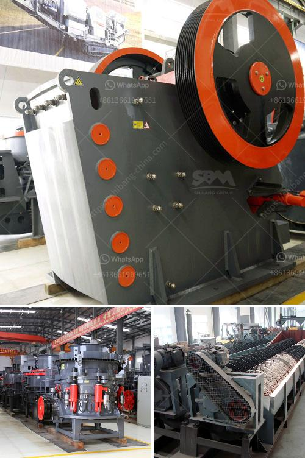

<h3>طاحونة كرات لطحن الحجر الجيري</h3>
تعد طاحونة الكرات واحدة من أهم الآلات المستخدمة في عملية طحن الحجر الجيري. وتستخدم هذه الطواحين في صناعات مختلفة مثل صناعة الاسمنت والأسمدة والزجاج والسيراميك. تعمل طاحونة الكرات على طحن المواد الخام بواسطة كرات فولاذية تدور داخل الجهاز على شكل اسطواني.

تتكون الطاحونة من جسم أسطواني مع مدخل لإدخال المواد الخام ومخرج لإخراج الناتج المطحون. وتعمل الكرات الفولاذية في داخل الطاحونة على طحن الحجر الجيري بواسطة قوة الاحتكاك والارتطام. تتميز هذه العملية بكفاءة عالية وسرعة في الطحن.

وتعتبر الكرات الفولاذية المستخدمة في الطواحين من العناصر المهمة في عملية الطحن. فهي تأتي بأحجام وأوزان مختلفة حسب الغرض من الطحن وحسب حجم الحجر الجيري المراد طحنه. وتكون هذه الكرات مغطاة بطبقة من المواد المانعة للتآكل لتحميها من التلف مع مرور الوقت.

يتم استخدام طاحونة الكرات في عملية طحن الحجر الجيري للحصول على حجم الجسيمات المطلوب وتوزيع حجم الجسيمات المناسب. وتعد عملية الطحن أحد الخطوات الأساسية في صناعة الإسمنت والأسمدة حيث يتم طحن الحجر الجيري الخام المستخدم كمادة خام أساسية.

تعد طواحين الكرات من الآلات ذات الكفاءة العالية في عملية الطحن. فهي تمتاز بسعة تحميل كبيرة وقدرة عالية على طحن الحجر الجيري بسرعة وبدقة. وتعد هذه الطواحين أحد الحلول المناسبة لعمليات الطحن التي تتطلب كمية كبيرة من الحجر الجيري وسرعة في إنتاج الناتج المطحون.

باختصار، تعتبر طواحين الكرات الحل الأمثل لعملية طحن الحجر الجيري في صناعات مختلفة. وتوفر هذه الطواحين سرعة وكفاءة عالية في الطحن مما يساهم في زيادة الإنتاجية وتوفير الوقت والجهد. وتعد الكرات الفولاذية المستخدمة في الطواحين جزءًا مهمًا من هذه الآلة وتعزز من كفاءتها واستدامتها على المدى الطويل.
<h3>Contact us</h3><ul><li><strong>Whatsapp:&nbsp;<a href="https://wa.me/8613661969651">+8613661969651</a></strong></li><li><a href="https://swt.shibang-china.com/?git&amp;zhl&amp;طاحونة كرات لطحن الحجر الجيري"><strong>Online Service(chat now)</strong></a></li></ul><h3>Related</h3><ul><li><a href='آلات التكسير والفحص.md'>آلات التكسير والفحص</a></li><li><a href='معدات سحق الجرانيت.md'>معدات سحق الجرانيت</a></li><li><a href='كسارة معدنية للإيجار.md'>كسارة معدنية للإيجار</a></li><li><a href='كسارات حجر محمولة أوغندا للبيع.md'>كسارات حجر محمولة أوغندا للبيع</a></li><li><a href='سيور ناقلة معدنية في الألواح.md'>سيور ناقلة معدنية في الألواح</a></li></ul>