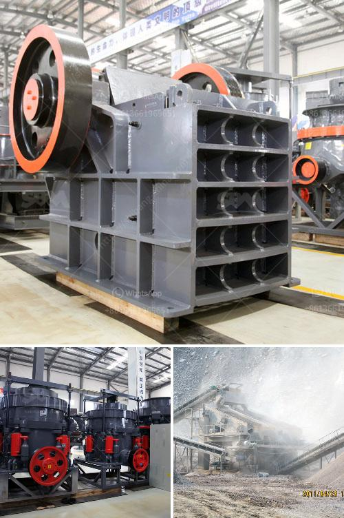

<h3>طاحونة مسحوق ناعمة جدا</h3>
تعتبر طاحونة المسحوق الناعمة جداً أحد التقنيات الحديثة المهمة في صناعة الأغذية والمواد الكيميائية والمعادن والأدوية والعديد من الصناعات الأخرى. تُستخدم هذه الطواحين لتحويل المواد الخام إلى مسحوق ناعم جدًا بأحجام جسيمات دقيقة تتراوح بين العدد الكبير من الكيلومترات.

تتكون طاحونة المسحوق الناعمة جدا من عدة أجزاء رئيسية. يتم تحميل المواد الخام في الجزء العلوي من الطاحونة، ثم يتم سحقها داخل حجر الطحن أو سلة الطحن الموجودة في الطاحونة. يعمل الحجر أو القرص الموجود داخل الطاحونة على فصل الجسيمات الكبيرة عن الصغيرة وطحنها بدقة عالية. تتم غربلة المسحوق الناتج من العملية للتأكد من حصوله على حجم الجسيمات المطلوب.

إضافةً إلى ذلك، تحتوي الطواحين العادية على نظام للتبريد لمنع ارتفاع درجة حرارة المواد الخام. فرغم أن توليد الحرارة يمكن أن يستخدم لمقاومة البكتيريا والجراثيم في الأغذية، إلا أن بعض المواد الحساسة قد تتأثر بارتفاع درجة الحرارة. لذا، فإن وجود نظام تبريد في الطاحونة يمكن أن يحمي المواد الحساسة من التلف.

بالإضافة إلى العديد من الاستخدامات الصناعية، تتيح طواحين المسحوق الناعمة الجدا أيضاً إنتاج مساحيق دقيقة للاستخدام في المستحضرات التجميلية والمنتجات الصيدلانية. يتطلب إنتاج هذه المنتجات أدوات دقيقة جدًا وسهولة في ضبط حجم الجسيمات، وهذا ما تقدمه طواحين المسحوق الناعمة جدًا.

في النهاية، تعد طواحين المسحوق الناعمة جدًا تقنية حديثة وفعالة لصناعات عديدة. إن تحويل المواد الخام إلى مسحوق ناعم يوفر مزايا عديدة، مثل زيادة قابلية الامتزاج والذوبانية وتحسين نوعية المنتج النهائي. كما تلعب دورًا هامًا في تحسين كفاءة العمليات الصناعية وتقليل استهلاك الطاقة. لهذا السبب، يجب على الشركات المصنعة اعتبار استخدام طواحين المسحوق الناعمة جدا فيما بعد.
<h3>Contact us</h3><ul><li><strong>Whatsapp:&nbsp;<a href="https://wa.me/8613661969651">+8613661969651</a></strong></li><li><a href="https://swt.shibang-china.com/?git&amp;zhl&amp;طاحونة مسحوق ناعمة جدا"><strong>Online Service(chat now)</strong></a></li></ul><h3>Related</h3><ul><li><a href='مصانع الأسمنت الحجر في أفريقيا.md'>مصانع الأسمنت الحجر في أفريقيا</a></li><li><a href='آلة صنع مسحوق الحجر الجيري في باكستان.md'>آلة صنع مسحوق الحجر الجيري في باكستان</a></li><li><a href='آلة طحن وخلط الكوارتز.md'>آلة طحن وخلط الكوارتز</a></li><li><a href='معدات معالجة خام الذهب المستخدمة للبيع.md'>معدات معالجة خام الذهب المستخدمة للبيع</a></li><li><a href='طاحونة كرات في كينيا.md'>طاحونة كرات في كينيا</a></li></ul>