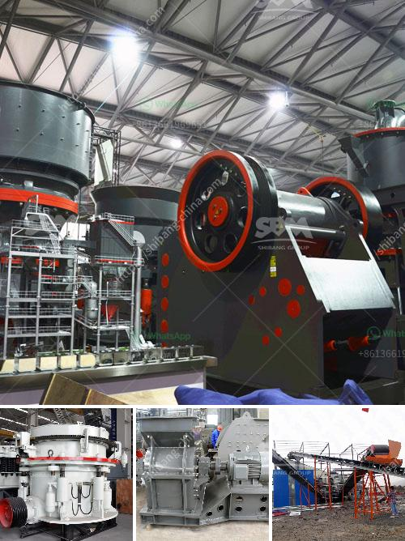

<h3>طاحونة مطرقية صغيرة بقطر 10 مم</h3>
تعد الطواحين المطرقية الصغيرة من الأدوات الهامة في العديد من الصناعات المختلفة. تستخدم هذه الطواحين لطحن المواد الصلبة إلى جزيئات صغيرة، مما يجعلها منتجًا مثاليًا للاستخدام في صناعات مثل التعدين والصناعات الزراعية وتحضير العينات في المختبرات.

تتألف الطاحونة المطرقية الصغيرة القطر 10 ملم من عدة أجزاء رئيسية. تتضمن هذه الأجزاء جسم الطاحونة، وهو الهيكل الرئيسي الذي يستقبل المواد المطحونة. بالإضافة إلى ذلك، تحتوي الطاحونة على مطرقة تدور بسرعة عالية داخل الجسم، وتصطدم بالمواد الموجودة في الجسم. والهدف من ذلك هو تفتيت المواد إلى جزيئات صغيرة.

تتم عملية الطحن في الطاحونة المطرقية الصغيرة عن طريق الاحتكاك والقوة الصدمية. عندما تدخل المواد إلى الطاحونة، تتعرض للتأثير القوي للمطرقة. تعمل القوة الصدمية على تكسير المواد وتحطيمها إلى جزيئات أصغر. يتم استبدال الشاشات المثبتة على الجسم بشكل منتظم لتحقيق حجم الجسيم المطلوب.

كما أن الطواحين المطرقية الصغيرة ذات القطر 10 ملم تملك إعدادات متعددة لأجزاء الطاحونة. يمكن ضبط سرعة تدوير المطرقة وقوة الضرب المطبقة. هذا يسمح بتحقيق الاستخدام المثلى للطاحونة حسب نوع المادة المراد طحنها.

تتميز الطواحين المطرقية الصغيرة بعدة مزايا أخرى. فهي سهلة الاستخدام والصيانة، كما يمكنها طحن المواد بشكل سريع وفعال. تساعد هذه الطواحين على توفير الوقت والجهد في عملية الطحن، وإنتاجية عالية وتكاليف تشغيل منخفضة.

وفي الختام، تعتبر الطواحين المطرقية الصغيرة ذات القطر 10 ملم أدوات مثالية في العديد من الصناعات. تعمل على طحن وتفتيت المواد لتحقيق حجم الجسيم المطلوب. بفضل سهولة الاستخدام والصيانة وتكاليف التشغيل المنخفضة، فإنها تلبي احتياجات العديد من الشركات والمعامل وتساهم في تحقيق العملية الإنتاجية بكفاءة.
<h3>Contact us</h3><ul><li><strong>Whatsapp:&nbsp;<a href="https://wa.me/8613661969651">+8613661969651</a></strong></li><li><a href="https://swt.shibang-china.com/?git&amp;zhl&amp;طاحونة مطرقية صغيرة بقطر 10 مم"><strong>Online Service(chat now)</strong></a></li></ul><h3>Related</h3><ul><li><a href='آلات سحق الفحم في جنوب أفريقيا.md'>آلات سحق الفحم في جنوب أفريقيا</a></li><li><a href='كسارات الفك مسحوق كربيد التنجستن.md'>كسارات الفك مسحوق كربيد التنجستن</a></li><li><a href='آلات تعدين الذهب مستعملة.md'>آلات تعدين الذهب مستعملة</a></li><li><a href='المعدات اللازمة لبدء تعدين الحجر الجيري.md'>المعدات اللازمة لبدء تعدين الحجر الجيري</a></li><li><a href='مصنع معدات تعدين الرخام.md'>مصنع معدات تعدين الرخام</a></li></ul>