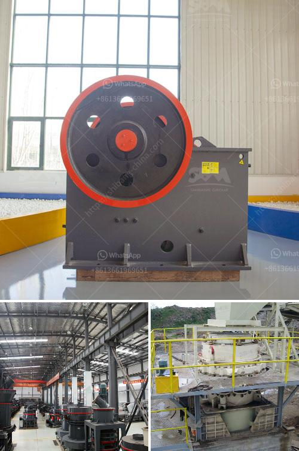

<h3>طاقة إنتاج مسحوق الجبس 80 طن في الساعة</h3>
تعدّ مسحوق الجبس من المواد الأساسية في صناعة البناء والتشييد بسبب خصائصه المميزة واستخداماته الواسعة. يتم إنتاج مسحوق الجبس بواسطة عمليات إنتاج متطورة تتضمن عدة خطوات.

أولاً وقبل البدء في عملية إنتاج مسحوق الجبس، يتم استخراج الجبس بواسطة عمليات التعدين من الصخور وتكسيرها إلى قطع صغيرة. بعد ذلك، يتم تنقية الجبس وتنظيفه من الشوائب والمواد الغريبة.

بعد تنقية الجبس وإزالة الأوساخ، يتم نقله إلى محطة الطحن حيث يتم طحنه إلى شكل مسحوق ناعم. هذا الطحن يتم عادة باستخدام طواحين الكرة أو طواحين الأسطوانة العمودية، ويتم ضبط حجم الجسيمات وفقًا للمواصفات المطلوبة.

بعد عملية الطحن، يتم تخزين المسحوق في مخازن خاصة لحين استخدامه في عمليات البناء. يتم تعبئة وتغليف المسحوق في أكياس محكمة الإغلاق أو حاويات كبيرة للتسهيل في عمليات النقل والتخزين.

يتطلب إنتاج مسحوق الجبس بمعدل 80 طن في الساعة معدات إنتاج قوية وفعالة. يجب أيضًا توفير طاقة كهربائية كافية لتشغيل هذه المعدات لفترات طويلة من الزمن.

من الجوانب الأخرى، ينبغي الاهتمام بالحفاظ على صحة الموظفين والعاملين في هذه المنشأة، حيث يتعرضون لمخاطر الغبار المتولد من عمليات الطحن والتعبئة والتغليف. يجب توفير إجراءات السلامة والوقاية المناسبة لضمان سلامة العاملين وجودة المنتج.

باختصار، إن إنتاج مسحوق الجبس بمستوى 80 طن في الساعة يتطلب أنظمة إنتاج متطورة وتنظيمًا جيدًا. يجب الاهتمام بالجودة والكفاءة والسلامة في جميع مراحل الإنتاج لضمان توفير منتج نهائي عالي الجودة يلبي احتياجات قطاع البناء والتشييد.
<h3>Contact us</h3><ul><li><strong>Whatsapp:&nbsp;<a href="https://wa.me/8613661969651">+8613661969651</a></strong></li><li><a href="https://swt.shibang-china.com/?git&amp;zhl&amp;طاقة إنتاج مسحوق الجبس 80 طن في الساعة"><strong>Online Service(chat now)</strong></a></li></ul><h3>Related</h3><ul><li><a href='شركة تصنيع كسارة الطحن في راجكوت، الهند.md'>شركة تصنيع كسارة الطحن في راجكوت، الهند</a></li><li><a href='مصنع تكسير الجرانيت 200 طن في الساعة للبيع.md'>مصنع تكسير الجرانيت 200 طن في الساعة للبيع</a></li><li><a href='كسارة تأثير صناعية.md'>كسارة تأثير صناعية</a></li><li><a href='البحث عن معدات تجهيز الفحم الصغيرة.md'>البحث عن معدات تجهيز الفحم الصغيرة</a></li><li><a href='كم من الأرض مطلوبة لكسارة الحجر.md'>كم من الأرض مطلوبة لكسارة الحجر</a></li></ul>