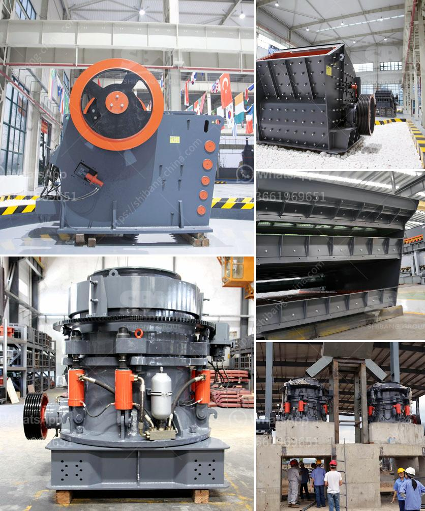

<h3>طبقة ألمنيوم عالية لمطحنة الكرة</h3>
تعد مطحنة الكرة واحدة من أهم المعدات المستخدمة في صناعة تكسير المواد الخام وطحنها. تستخدم هذه المطحنة في مصانع الأسمنت ومصانع السيراميك ومصانع الألغام والعديد من الصناعات الأخرى. وتُستخدم الطبقة العالية من الألمنيوم في صناعة هذه المطحنة لأنها تحتوي على العديد من الخصائص المتفوقة التي تجعلها مثالية لهذا الغرض.

أولاً وقبل كل شيء، يتم استخدام الطبقة العالية من الألمنيوم لأنها مقاومة للتآكل. يتم تعريض المطاحن لظروف عمل قاسية تتطلب مقاومة عالية للتآكل. وبفضل الألمنيوم، يمكن حماية المطحنة من التآكل الناتج عن الرطوبة والمواد الكيميائية ودرجات الحرارة العالية التي قد يتعرض لها المعدن.

ثانيًا، فإن الطبقة العالية من الألمنيوم تتميز بالقوة والصلابة. هذه الصفات مهمة لأنها تسمح بتحمل الأحمال الثقيلة التي تتعرض لها المطحنة أثناء العمل. يجب أن تكون الأجزاء الداخلية والخارجية للمطحنة قوية بما يكفي لمواجهة القوى التي تتعرض لها أثناء طحن المواد الخام. وتوفر الطبقة العالية من الألمنيوم هذه القوة والمتانة المطلوبة.

ثالثًا، فإن الطبقة العالية من الألمنيوم مقاومة للتآكل الكهربائي. قد يحدث التآكل الكهربائي في المطحنة نتيجة لوجود مواد مختلفة وتفاعل بينها. ولكن، يمكن تجنب هذا التآكل باستخدام مادة مقاومة للتآكل الكهربائي مثل الألمنيوم. هذا يساعد على زيادة عمر المطحنة وتقليل التكاليف الناتجة عن الصيانة والاستبدال المتكرر للأجزاء التالفة.

وفي النهاية، يمكن القول إن استخدام الطبقة العالية من الألمنيوم في مطاحن الكرة يعتبر خيارًا مثاليًا. فهي توفر مجموعة من الخصائص المتفوقة مثل مقاومة التآكل والقوة والصلابة ومقاومة التآكل الكهربائي. بفضل هذه الخصائص، تعتبر المطاحن ذات الطبقة العالية من الألمنيوم أكثر فاعلية وموثوقية ويمكن الاعتماد عليها في عمليات التكسير والطحن.
<h3>Contact us</h3><ul><li><strong>Whatsapp:&nbsp;<a href="https://wa.me/8613661969651">+8613661969651</a></strong></li><li><a href="https://swt.shibang-china.com/?git&amp;zhl&amp;طبقة ألمنيوم عالية لمطحنة الكرة"><strong>Online Service(chat now)</strong></a></li></ul><h3>Related</h3><ul><li><a href='كسارة الفك الصينية PE 150 250 في الفلبين.md'>كسارة الفك الصينية PE 150 250 في الفلبين</a></li><li><a href='عملية تعدين الذهب.md'>عملية تعدين الذهب</a></li><li><a href='شاشة تهتز الفحم المصنعين في جنوب أفريقيا.md'>شاشة تهتز الفحم المصنعين في جنوب أفريقيا</a></li><li><a href='آلات غسيل الفحم.md'>آلات غسيل الفحم</a></li><li><a href='معدات لإنتاج الحجر الطبيعي.md'>معدات لإنتاج الحجر الطبيعي</a></li></ul>