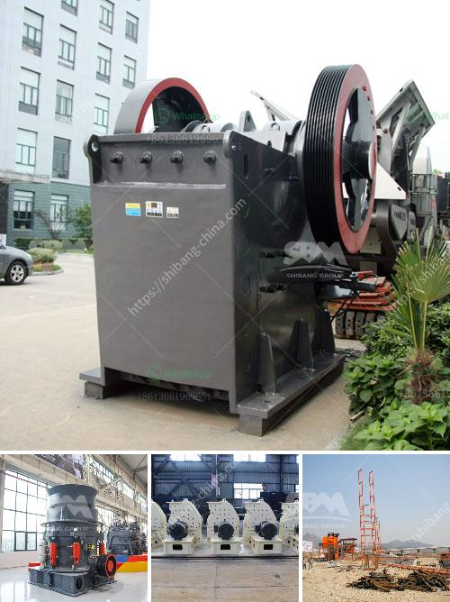

<h3>طحن الحجر الجيري</h3>
يعد الحجر الجيري أحد المواد الهامة في صناعة البناء والإنشاءات، فهو يستخرج من الطبيعة على هيئة صخور صلبة ذات لون مائل إلى الأبيض. ومن أجل استخدامه في عدة مجالات، يجب طحن الحجر الجيري.

عملية طحن الحجر الجيري تتم عن طريق تفتيتها إلى قطع صغيرة باستخدام ماكينة طحن خاصة. وتتم هذه العملية تحت تأثير قوة الاحتكاك والضغط. وتعتبر ماكينة الطحن من أبرز الآلات المستخدمة في عملية تكسير الحجر الجيري. تتكون هذه الماكينة من العديد من الأجزاء المتحركة والثابتة التي تقوم بطحن الحجر الجيري إلى حبيبات صغيرة جدًا بمقاسات محددة.

تحتوي آلة طحن الحجر الجيري على محرك قوي يستخدم لتشغيل الماكينة وتفعيل الجزء الحركي الذي يقوم بطحن الحجر الجيري. يتم تغذية الحجر الجيري إلى الماكينة عن طريق الإمالة أو الناقلات المتحركة، وبعدها يتم طحنها بواسطة سلسلة من الأحجار الكبيرة الموجودة داخل الماكينة.

1. إنتاج مسحوق الحجر الجيري: يتم طحن الحجر الجيري إلى مسحوق ناعم يستخدم في صناعات مثل الدهانات ومواد البناء والأسمنت، حيث يمنح المواد خواص ميكانيكية قوية ومقاومة للحرارة.

2. صناعة الغاز الدخاني: يتم استخدام الحجر الجيري المطحون في صناعة الغاز الدخاني، حيث يتم تفتيته إلى حجم صغير ليتفاعل مع العناصر الكيميائية الأخرى وإنتاج الغاز المطلوب.

3. تحسين التربة الزراعية: يتم استخدام الحجر الجيري المطحون في تحسين خصائص التربة الزراعية، حيث يتم إضافته للتربة الأكثر حاجة إليها لتحسين تروية الهواء وتحسين قدرة التربة على احتجاز الماء.

4. معالجة مياه الشرب ومعالجة الصرف الصحي: في هذا المجال، يتم استخدام الجير المطحون لتحقيق توازن كيميائي بين الماء والمواد العضوية والمعادن الأخرى، مما يساعد على تحسين جودة مياه الشرب ومعالجة مياه الصرف الصحي.

باختصار، يلعب طحن الحجر الجيري دورًا هامًا في تحضيره للاستخدام في عدة صناعات وتطبيقات. فهو يساعد على تحسين الخصائص الميكانيكية للمواد، ومساعدة في تعزيز صفات التربة، وتحسين جودة مياه الشرب ومعالجة الصرف الصحي. وبفضل تقنيات الطحن المتقدمة، بات من الممكن الحصول على حبيبات الحجر الجيري بأحجام وتفاوتات محددة استنادًا إلى الاحتياجات والمتطلبات المحددة في كل صناعة.
<h3>Contact us</h3><ul><li><strong>Whatsapp:&nbsp;<a href="https://wa.me/8613661969651">+8613661969651</a></strong></li><li><a href="https://swt.shibang-china.com/?git&amp;zhl&amp;طحن الحجر الجيري"><strong>Online Service(chat now)</strong></a></li></ul><h3>Related</h3><ul><li><a href='شاشات الفحم المتنقلة.md'>شاشات الفحم المتنقلة</a></li><li><a href='شركة تصنيع لوحات الجبس في سنغافورة.md'>شركة تصنيع لوحات الجبس في سنغافورة</a></li><li><a href='سحق الحجر الأسود تايلاند.md'>سحق الحجر الأسود تايلاند</a></li><li><a href='أفضل كسارة طين في الهند.md'>أفضل كسارة طين في الهند</a></li><li><a href='سعر كسارة الحجر سعة طن في الساعة.md'>سعر كسارة الحجر سعة طن في الساعة</a></li></ul>