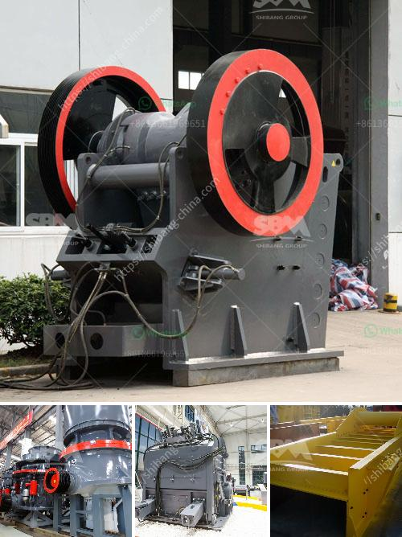

<h3>طحن الرمل السيليكا</h3>
تعتبر عملية طحن الرمل السيليكا أحد العمليات الهامة في صناعة الزجاج والسيراميك والصناعات الأخرى التي تستخدم الرمل السيليكا كمادة خام. يتم طحن الرمل السيليكا للحصول على حبيبات صغيرة ومتناسقة الحجم، مما يعزز استخدامها في عمليات التصنيع المختلفة.

تأتي أهمية طحن الرمل السيليكا من قدرته على توفير الخصائص المثلى للمنتجات النهائية. فعندما يتم طحن الرمل السيليكا لتكون حجم الحبيبات أصغر، يصبح من السهل إضافتها إلى الخليط الأساسي للمنتج وتوزيعها بشكل متساوٍ. وهذا يمكنها من تحسين خواص المنتج النهائي، مثل قوتها ومتانتها والتحكم في توصيل الحرارة.

يتم تحقيق عملية طحن الرمل السيليكا عن طريق استخدام مطاحن الكرة أو الطواحين الأخرى. وفي هذه العملية، يتم وضع الرمل السيليكا داخل المطحنة وإضافة بعض المواد الأخرى التي تعين على طحنها، مثل الكرات المعدنية. تبدأ المطحنة في الدوران بسرعة، وعندما تحدث الاحتكاك بين الرمل السيليكا والكرات المعدنية، يتم طحنها لتصبح في حجم الحبيبات المطلوبة.

عملية طحن الرمل السيليكا بطريقة صحيحة وبالحجم المطلوب يلعب دورًا مهمًا في تطبيقاتها في الصناعات المختلفة. فعلى سبيل المثال، في صناعة الزجاج، يلعب الرمل السيليكا دورًا مهمًا في تحسين خواص الزجاج، مثل شفافيته ومقاومته للتأكل والحرارة. ومن خلال طحن الرمل السيليكا، يمكننا الحصول على جزيئات صغيرة يصعب رؤيتها بالعين المجردة، مما يزيد من جودة الزجاج النهائي.

بالإضافة إلى صناعة الزجاج، تستخدم الرمل السيليكا المطحون في العديد من الصناعات الأخرى، مثل صناعة السيراميك والدهانات والمصاغ والمواد الأخرى. ويمكن أن تلعب حبيبات الرمل السيليكا المطحونة دورًا في تحقيق خواص محددة مطلوبة للمنتج، مثل اللمعان أو المتانة أو الألوان.

في الختام، يمكن القول إن طحن الرمل السيليكا بطريقة صحيحة وفقًا للحجم المطلوب للحبيبات يسهم في تحسين جودة المنتج النهائي في العديد من الصناعات المختلفة. بفضل القدرة على الحصول على حبيبات صغيرة ومتناسقة الحجم، يصبح الرمل السيليكا قادرًا على تحقيق الخواص المطلوبة للمنتج النهائي وتحسين أداءه في التطبيقات المختلفة.
<h3>Contact us</h3><ul><li><strong>Whatsapp:&nbsp;<a href="https://wa.me/8613661969651">+8613661969651</a></strong></li><li><a href="https://swt.shibang-china.com/?git&amp;zhl&amp;طحن الرمل السيليكا"><strong>Online Service(chat now)</strong></a></li></ul><h3>Related</h3><ul><li><a href='مطحنة هامر للأسمنت.md'>مطحنة هامر للأسمنت</a></li><li><a href='سعر مصنع كسارة الحجر بسعة 200 طن في الساعة.md'>سعر مصنع كسارة الحجر بسعة 200 طن في الساعة</a></li><li><a href='بيع كسارة الحجر للبيع.md'>بيع كسارة الحجر للبيع</a></li><li><a href='بيع كسارة الفك في كينيا.md'>بيع كسارة الفك في كينيا</a></li><li><a href='كسارات حجر محمولة أوغندا للبيع.md'>كسارات حجر محمولة أوغندا للبيع</a></li></ul>