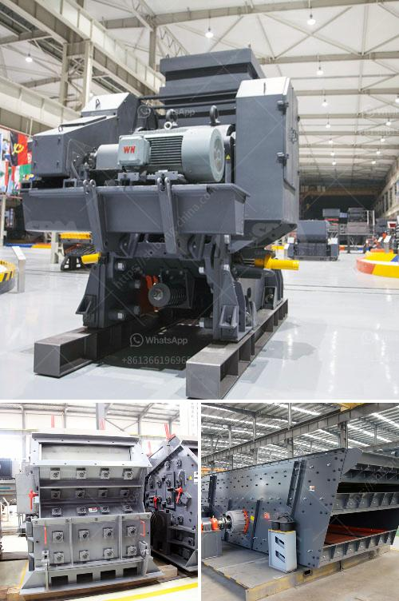

<h3>طحن الفلدسبار بواسطة مطحنة الكرة في الفلبين</h3>
تعد عملية طحن الفلدسبار باستخدام مطحنة الكرة أحد العمليات الأساسية التي تستخدم في صناعة تكسير المواد الصلبة. الفلدسبار عبارة عن معدن يتم استخراجه من الصخور النارية وغالبًا ما يستخدم في صناعة الخزف والألعاب الزجاجية والسيراميك. يكون الفلدسبار عادة صلبًا وصعبًا ولذلك تكون عملية طحنه ضرورية للحصول على حبيبات صغيرة من الحبيبات.

تعتبر مطاحن الكرة أحد أنواع المطاحن المستخدمة في صناعة طحن المواد الصلبة، وتستخدم على نطاق واسع في عملية طحن الفلدسبار في الفلبين. تتكون مطاحن الكرة من أسطوانة مليئة بالكرات المعدنية الثقيلة المصنوعة من الصلب، وتدور الأسطوانة على محورها الطولي. عند ملء الأسطوانة بالفلدسبار المراد طحنه وبدء تشغيل مطحنة الكرة، تدور الكرات المعدنية في الأسطوانة وتصطدم بالفلدسبار، مما يؤدي إلى تكسير المواد وتقليل حجمها.

يعتبر طحن الفلدسبار باستخدام مطحنة الكرة مفيدًا بعدة طرق. فقد أثبتت الدراسات أن طحن الفلدسبار بواسطة مطحنة الكرة يحسن من توزيع الحجم للحبيبات ويقلل من وجود الشوائب والشذوذ في الحجم. كما أن هذه الطريقة تعتبر أكثر اقتصادية بالمقارنة مع طرق طحن أخرى مثل طحن الفلدسبار باستخدام المطاحن الكروية أو المطاحن الحركية. توفر مطاحن الكرة كفاءة استهلاك الطاقة وتكون سهلة التشغيل والصيانة، مما يجعلها اختيارًا شائعًا في الصناعة.

في الختام، يعد طحن الفلدسبار باستخدام مطحنة الكرة طريقة فعالة واقتصادية للحصول على حبيبات الفلدسبار المطلوبة في صناعة الخزف والزجاج والسيراميك في الفلبين. تساعد عملية الطحن بواسطة مطحنة الكرة في تحسين جودة المنتج النهائي وتحسين توزيع الحجم وتقليل الشوائب وتوفير الطاقة. بفضل فعالية هذه العملية، يمكن للصناعات في الفلبين الاستفادة من الفلدسبار بأقصى قدر ممكن وتكون أكثر تنافسية في السوق.
<h3>Contact us</h3><ul><li><strong>Whatsapp:&nbsp;<a href="https://wa.me/8613661969651">+8613661969651</a></strong></li><li><a href="https://swt.shibang-china.com/?git&amp;zhl&amp;طحن الفلدسبار بواسطة مطحنة الكرة في الفلبين"><strong>Online Service(chat now)</strong></a></li></ul><h3>Related</h3><ul><li><a href='تكلفة طاحونة الكوارتز.md'>تكلفة طاحونة الكوارتز</a></li><li><a href='علامات مصنع كسارة المحجر مطحنة الكرة.md'>علامات مصنع كسارة المحجر مطحنة الكرة</a></li><li><a href='آلة سحق الكالسيت.md'>آلة سحق الكالسيت</a></li><li><a href='لكن كسارات الخرسانة نيجيريا.md'>لكن كسارات الخرسانة نيجيريا</a></li><li><a href='آلات معالجة الكاولين للبيع.md'>آلات معالجة الكاولين للبيع</a></li></ul>