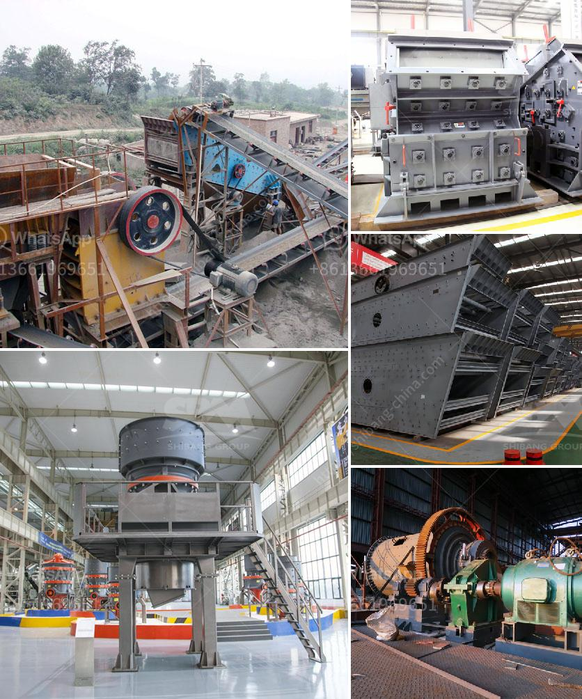

<h3>طحن الفلدسبار للغراز</h3>
يُعد الفلدسبار واحدًا من أهم المعادن الموجودة في قشرة الأرض، ويتم استخدامه بشكل واسع في الصناعات المختلفة مثل صناعة الزجاج، والسيراميك، والأسمدة، والدهانات، والمواد العازلة، وغيرها الكثير. وبما أن استخدام الفلدسبار يتطلب تحويله إلى شكل ناعم وصغير الحجم، فإن طحنه أمر ضروري وحاسم.

يتم طحن الفلدسبار للغراز بهدف تحويل الكتل الكبيرة منه إلى جسيمات أصغر، ما يزيد من سهولة خلطه مع المواد الأخرى وزيادة قابليته للتفاعل في الصناعات المختلفة. تتم عملية طحن الفلدسبار عادة باستخدام مطاحن خاصة تعمل بواسطة الكهرباء. يتم إدخال الفلدسبار إلى المطحنة حيث يتم سحقه وطحنه بواسطة الصواريخ الدوارة ذات السرعة العالية. يتم الحصول على الفلدسبار المطحون من خلال فتحات الشاشة الموجودة في المطحنة حيث يتم تحديد حجم الجسيمات المراد الحصول عليها. يتم استخدام الفلدسبار المطحون في العديد من تطبيقات الصناعات المختلفة.

توجد عدة فوائد لطحن الفلدسبار للغراز. أحد أهم هذه الفوائد هو زيادة قدرة الفلدسبار على الاختلاط مع المواد الأخرى. حيث يؤدي طحن الفلدسبار إلى تفتيته إلى جسيمات صغيرة، وبالتالي يصبح أسهل في الاختلاط مع المواد الأخرى وضمان مزجه بشكل متجانس. هذا يؤدي إلى تحسين خصائص المنتج النهائي وجودته. 

كما يساعد طحن الفلدسبار في زيادة سطحه، وهو ما يسهم في تحسين قدرته على التفاعل الكيميائي مع المواد الأخرى. فبتجزيء الفلدسبار وتقسيمه إلى جسيمات صغيرة يتم زيادة منطقة تعرضه لتفاعلات كيميائية، مما يسهم في تعزيز خصائص المنتج النهائي وتحقيق متطلبات الصناعة.

أخيرًا، يتم تقديم الفلدسبار المطحون في شكل هلامي أو مسحوقي، ما يسهل استخدامه في العمليات الصناعية المختلفة. فالشكل الناعم والصغير للجسيمات يجعل من السهل خلطه وتفاعله مع المواد الأخرى في عملية الإنتاج.

باختصار، طحن الفلدسبار للغراز يعتبر عملية ضرورية لتحويله إلى شكل صغير الحجم يتوافق مع متطلبات الصناعات المختلفة. يتم تحقيق هذا بواسطة مطاحن خاصة تقوم بسحق وطحن الفلدسبار بواسطة الصواريخ الدوارة. يساعد طحن الفلدسبار على زيادة قدرته على الاختلاط والتفاعل الكيميائي مع المواد الأخرى، ما يحسن جودة المنتج النهائي ويوفر قابلية استخدامه في الصناعات المختلفة.
<h3>Contact us</h3><ul><li><strong>Whatsapp:&nbsp;<a href="https://wa.me/8613661969651">+8613661969651</a></strong></li><li><a href="https://swt.shibang-china.com/?git&amp;zhl&amp;طحن الفلدسبار للغراز"><strong>Online Service(chat now)</strong></a></li></ul><h3>Related</h3><ul><li><a href='مصنع تكسير صخور متنقل وثابت جديد.md'>مصنع تكسير صخور متنقل وثابت جديد</a></li><li><a href='آلة صنع الرمل في جنوب أفريقيا.md'>آلة صنع الرمل في جنوب أفريقيا</a></li><li><a href='كسارة الفك الخرسانية.md'>كسارة الفك الخرسانية</a></li><li><a href='مطحنة الكرة في التعدين.md'>مطحنة الكرة في التعدين</a></li><li><a href='أكبر كسارة صخور.md'>أكبر كسارة صخور</a></li></ul>