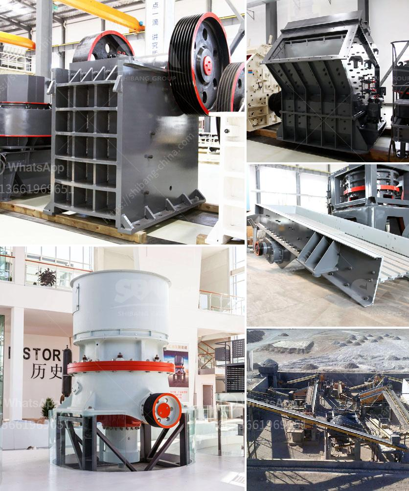

<h3>طحن الكرة الرطبة مقابل الطحن الجاف</h3>
طحن الكرة الرطبة والطحن الجاف هما عمليتان حاسمتان في تحضير المواد الخام قبل استخدامها في صناعة المواد الجاهزة. وتهدف هاتان الطريقتان إلى زيادة سطح المسحوق وتحسين توزيع حجم الجسيمات وتقليل حجم الحبيبات. في هذه المقالة، سنقوم بمقارنة الطحن الكرة الرطبة والطحن الجاف ومعرفة أيهما أفضل.

يستخدم الطحن الكرة الرطبة ماء أو سوائل أخرى كوسيلة لتقديم التشحيم والتبريد خلال العملية. يتم طحن المواد الخام في مطحنة الكرات المشابهة لمطحنة الكرات الجافة، ولكن الفرق الرئيسي هو أن هناك سائل داخل المطحنة يساعد على تخليل المواد وتقليل تكون الحبيبات الكبيرة والتكتلات. يؤدي استخدام السوائل إلى تقليل حجم الحبيبات النهائية وزيادة سطح المسحوق.

أما الطحن الجاف، فهو يعتمد على خلو العملية من أي سائل. يتم طحن المواد الخام في مطحنة الكرات أو مطحنة الأسطوانة دون أي اعتماد على السوائل. يتم تحقيق الطحن الجاف عن طريق تدوير المطحنة بسرعة عالية حيث يتم سحق المواد الخام بالكرات أو الأسطوانات الصلبة. الطحن الجاف هو عملية سريعة وبسيطة ولا تتطلب الكثير من التكلفة والصيانة.

لكلا النوعين من عملية الطحن، هناك فوائد محددة. يعتقد أن الطحن الجاف يوفر طحنًا أكثر فاعلية، حيث لا يوجد استهلاك للطاقة في تبخير السوائل أثناء العملية. ويمكن أن يؤدي الطحن الجاف إلى إنتاج مواد خام ذات خصائص محددة مثل النقاء والقدرة على الترشيح والسهولة في التعبئة والتعبئة.

من ناحية أخرى، يتمتع الطحن الكرة الرطبة بالقدرة على إنتاج المواد الخام بحجم جسيمات أصغر وبخصائص فريدة أكثر. تساعد السوائل في تقليل التلف أثناء العملية وتحافظ على حدوث ظروف الحماية للمواد الخام الحساسة إلى حد كبير. وبالإضافة إلى ذلك، يتم إجراء الطحن الكرة الرطبة عندما يتعلق الأمر بمواد خام ذات رطوبة عالية أو معادن لا تتوفر عادة بشكل جاف.

باختصار، يمكن القول إن الطحن الجاف هو الأكثر شيوعًا واقتصاديًا، بينما يمنح الطحن الكرة الرطبة نتائج أفضل في الحالات التي تكون فيها الرطوبة أو الحماية ضرورية. يجب أن يتم اختيار طريقة الطحن المناسبة وفقًا للمتطلبات المحددة لكل تطبيق.
<h3>Contact us</h3><ul><li><strong>Whatsapp:&nbsp;<a href="https://wa.me/8613661969651">+8613661969651</a></strong></li><li><a href="https://swt.shibang-china.com/?git&amp;zhl&amp;طحن الكرة الرطبة مقابل الطحن الجاف"><strong>Online Service(chat now)</strong></a></li></ul><h3>Related</h3><ul><li><a href='كسارات تأجير.md'>كسارات تأجير</a></li><li><a href='آلة سحق في الفلبين.md'>آلة سحق في الفلبين</a></li><li><a href='تكلفة مشروع إنتاج الرمل في الهند.md'>تكلفة مشروع إنتاج الرمل في الهند</a></li><li><a href='طاحونة مطرقية صغيرة بقطر 10 مم.md'>طاحونة مطرقية صغيرة بقطر 10 مم</a></li><li><a href='شركات تكسير الحجر في بيرو.md'>شركات تكسير الحجر في بيرو</a></li></ul>