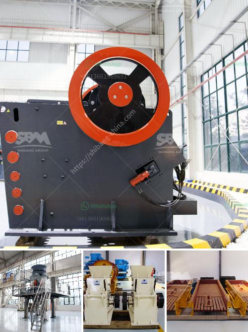

<h3>طحن الكرة الصين</h3>
تعتبر الكرة الصين من الالعاب التقليدية الشعبية في الصين، وقد تم تطويرها منذ أكثر من 2,000 عام، وهي تستخدم في العديد من المناسبات والاحتفالات الثقافية الصينية. تحظى بشعبية كبيرة بين الصينيين وتجذب أيضًا السياح الأجانب. إنها لعبة تستدعي المهارة والتناسق بين الجسد والعقل، وتعد من أجمل الترفيهات القديمة في الصين.

تطورت فكرة طحن الكرة الصين من قوانغزهو، وهي مدينة تقع في جنوب الصين، وراجعها الكثير من الشعب الصيني لتكون لعبتهم المفضلة. يتطلب اللعبة مهارات معينة لضرب الكرة الجانبية أو الكرة الأفقية وجعلها تدور بشكل سليم على الأرض. يتنافس اللاعبون لربح اللعبة وإظهار مهاراتهم الفريدة. إنها تعتبر عددًا من الحركات الصعبة والجريئة، مثل طحن الكرة باستخدام القدم أو اليد، أو تطوير استخدام الأقدام لرمي الكرة في الهواء لتدور سريعًا.

تعتبر الكرة الصين تحديًا كبيرًا للكثير من اللاعبين، فهي تعتمد على التناغم والتنسيق والقوة البدنية والاستراتيجية. يجب على اللاعبين ممارسة اللعبة بانتظام لتنمية قوة الساقين والحس الجيد للتوازن والتناسق، مما يعزز مهاراتهم في اللعبة. لا يُعد طحن الكرة الصين مجرد لعبة فحسب، بل هو أيضًا نوع من التمرين الجيد للصحة واللياقة البدنية، يساعد في تنشيط الدورة الدموية وتحسين اللياقة العامة.

تتطلب اللعبة الاهتمام والتركيز الكبير، حيث أنه يجب على اللاعب تحديد الوقت والقوة المثلى لضرب الكرة بشكل صحيح. قد يستغرق الأمر بعض الوقت لتطوير هذه المهارات، ومن ثم يمكن للمرء رؤية تحسينه مع تمارين الإعداد. إنها فرصة للتواصل والتفاعل الإيجابي بين اللاعبين، حيث يمكنهم المنافسة وتبادل الخبرات والاستفادة من بعضهم البعض.

للاختصار، يمكن القول إن طحن الكرة الصين هو نشاط ترفيهي رائع يشجع على تنمية المهارات الحركية، ويوفر الفرصة للاستمتاع بالتحدي وتحقيق الانجازات. تمثل اللعبة جزءًا مثيرًا من التراث الثقافي الصيني وتعد واحدة من أفضل وسائل الترفيه التقليدية. فإذا كنت تملك فرصة لتجربة هذه اللعبة الرائعة، فلا تتردد في ذلك.
<h3>Contact us</h3><ul><li><strong>Whatsapp:&nbsp;<a href="https://wa.me/8613661969651">+8613661969651</a></strong></li><li><a href="https://swt.shibang-china.com/?git&amp;zhl&amp;طحن الكرة الصين"><strong>Online Service(chat now)</strong></a></li></ul><h3>Related</h3><ul><li><a href='آلات تعدين الذهب مستعملة.md'>آلات تعدين الذهب مستعملة</a></li><li><a href='مطرقة صخرية.md'>مطرقة صخرية</a></li><li><a href='سعر كسارة الباريت.md'>سعر كسارة الباريت</a></li><li><a href='كم تكلف تراخيص التعدين على الذهب في نيجيريا.md'>كم تكلف تراخيص التعدين على الذهب في نيجيريا</a></li><li><a href='آلة كسارة الصخور في ماليزيا.md'>آلة كسارة الصخور في ماليزيا</a></li></ul>