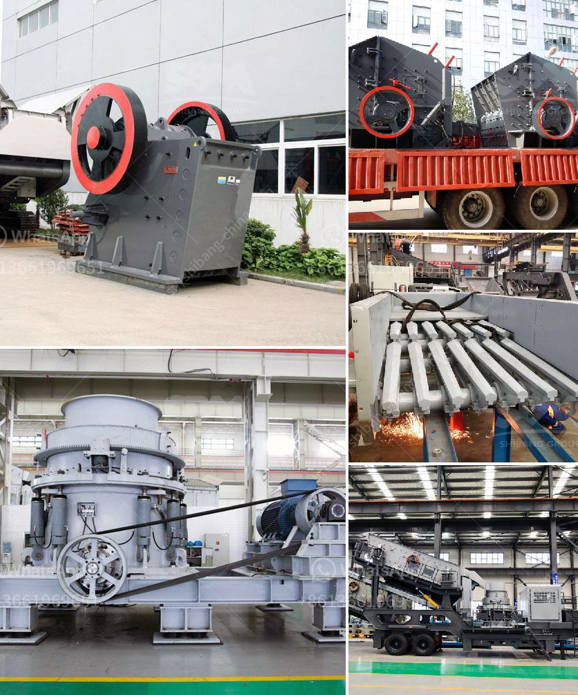

<h3>طحن الكرة للأدوية</h3>
تعتبر عملية طحن الكرة أحد الطرق الهامة التي تستخدم في صناعة الأدوية. تهدف هذه العملية إلى تحطيم وطحن المواد الخام لتحقيق حجم وتوزيع حبيبات معينة تمنح الدواء خواص فعالة ومستحبة.

يعتمد طحن الكرة على استخدام طاحونة تحتوي على كرات فولاذية أو زجاجية أو سيراميكية. يتم وضع المواد الخام داخل الطاحونة وبدء عملية الطحن بتحريك الكرات والمواد بواسطة قوة الاحتكاك والضغط. يتم طحن المواد الموضوعة بين الكرات إلى حجم أصغر وتفاوت حجم حبيبات ضمن النطاق المطلوب.

تعد طريقة طحن الكرة مناسبة للعديد من الأدوية المختلفة، وذلك لعدة أسباب. فبفضل عملية الطحن، يتم زيادة سطح المادة المراد تحويلها إلى مسحوق، مما يسمح بزيادة سرعة امتصاص الدواء عند تناوله. بالإضافة إلى ذلك، تتيح عملية الطحن توحيد توزيع الدواء ضمن الحبيبات المطحونة، مما يسهم في تحقيق تأثير دوائي قوي ومستقر.

تعتبر سمات الكرات المستخدمة في آلات الطحن مؤثرة على نتيجة العملية. فعلى سبيل المثال، كرات الزجاج تستخدم في الأغراض الاستخراجية، حيث تساعد في تسهيل تحطيم الأقذار والتلوث الموجودة في المواد الخام. بالمقابل، تستخدم كرات الفولاذ في طحن المواد الصلبة والقاسية. وبإمكان الصناعيين وفقًا لمتطلباتهم، اختيار نوعية الكرات التي تناسب مع الدواء المطلوب طحنه.

بشكل عام، يمكن القول أن طحن الكرة هو عملية أساسية في صناعة الأدوية. فإلى جانب تحقيق الحجم وتوزيع الحبيبات المثلى، يسمح طحن الكرة بزيادة الذوبانية وسرعة الامتصاص للدواء المطحون، مما يعني توفير نتائج أفضل وفعالية متزايدة للمرضى الذين يستعملون الأدوية.
<h3>Contact us</h3><ul><li><strong>Whatsapp:&nbsp;<a href="https://wa.me/8613661969651">+8613661969651</a></strong></li><li><a href="https://swt.shibang-china.com/?git&amp;zhl&amp;طحن الكرة للأدوية"><strong>Online Service(chat now)</strong></a></li></ul><h3>Related</h3><ul><li><a href='سعر كسارة الحجر في السوق.md'>سعر كسارة الحجر في السوق</a></li><li><a href='مطحنة أسطوانية ثنائية المرور.md'>مطحنة أسطوانية ثنائية المرور</a></li><li><a href='آلة صنع مسحوق الحجر الجيري في باكستان.md'>آلة صنع مسحوق الحجر الجيري في باكستان</a></li><li><a href='مطحنة مسحوق عالي الضغط في الهند.md'>مطحنة مسحوق عالي الضغط في الهند</a></li><li><a href='معدات تعدين الكروم للبيع في جنوب أفريقيا.md'>معدات تعدين الكروم للبيع في جنوب أفريقيا</a></li></ul>