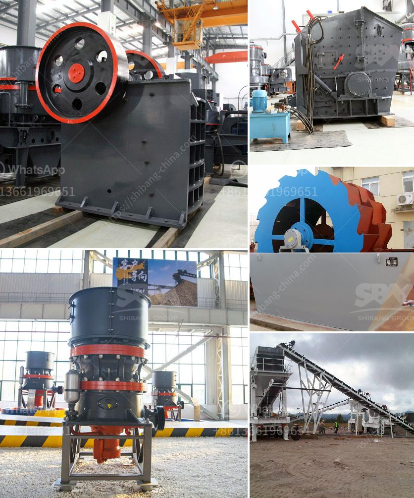

<h3>طحن المطاحن الصناعية</h3>
تُعد المطاحن الصناعية أداة حاسمة في عملية تحويل الحبوب إلى مسحوق ناعم يُعرف باسم الطحين. تمتلك المطاحن الصناعية القدرة على طحن الحبوب بكفاءة وسرعة عالية وبكميات ضخمة. تحويل الحبوب إلى طحين يتطلب مطاحن عالية الجودة تُعتبر أمرًا حيويًا لصناعة الخبز، والبسكويت، والكعك، والمعجنات، والعديد من المنتجات الأخرى التي تستخدم الطحين كمكون رئيسي.

يتكون نظام طحن المطاحن الصناعية من مجموعة من المعدات المتخصصة. يتم استخدام الآلات الكهربائية المتطورة والموازنات الدقيقة لضمان أقصى قدر من النتائج الجودة والدقة في الطحن. تتضمن هذه المعدات ماكينات الفرز والغربلة والتنظيف من الشوائب والحجارة والأجسام الغريبة غير المرغوب فيها. تعتمد درجة دقة الطحن على نوع الحبوب المطلوب طحنها واستخدام الطحن بالتساوي للحصول على جودة منتج ثابتة.

توجد العديد من أنواع المطاحن الصناعية، بما في ذلك المطاحن الأفقية والمطاحن العمودية. تعمل المطاحن الأفقية بتحريك الحبوب بين الأسطوانات المخروطية أو الدرفلة. توجد مجموعة متنوعة من هذه المطاحن، كل منها يتماشى مع تطبيقها المحدد. تُستخدم المطاحن العمودية عادة في طحن الحبوب الكبيرة بكميات كبيرة. إنها قادرة على طحن الحبوب بكفاءة عالية من خلال تعليق الحبوب من الأعلى واستخدام الجاذبية للسماح بدوران الحبوب وطحنها.

تتمتع المطاحن الصناعية بعدة مزايا. فهي تستخدم لمعالجة كميات كبيرة من الحبوب في وقت قصير، مما يجعلها مناسبة للاستخدام في مصانع الغذاء الكبيرة. بفضل تقنيات الطحن الحديثة، تعتبر المطاحن الصناعية قادرة على تحقيق مستويات عالية من الطحن بجودة عالية واستخلاص الأعلاف الغذائية من الحبوب. بالإضافة إلى ذلك، يتم تصميم المطاحن الصناعية بطريقة تسمح لها بالعمل بكفاءة بأدنى استهلاك للطاقة وتكاليف الصيانة المنخفضة.

في الختام، تعد المطاحن الصناعية أداة أساسية في عملية إنتاج الطحين. فهي تساهم في تحويل الحبوب إلى مسحوق ناعم يُستخدم في تحضير العديد من المنتجات الغذائية. إن استخدام المطاحن الصناعية عالية الجودة والقادرة على طحن الحبوب بكفاءة، يضمن الحصول على منتجات طحين متميزة من حيث الجودة والنقاء والقيمة الغذائية.
<h3>Contact us</h3><ul><li><strong>Whatsapp:&nbsp;<a href="https://wa.me/8613661969651">+8613661969651</a></strong></li><li><a href="https://swt.shibang-china.com/?git&amp;zhl&amp;طحن المطاحن الصناعية"><strong>Online Service(chat now)</strong></a></li></ul><h3>Related</h3><ul><li><a href='حجم منتج التغذية لكسارات المخروط.md'>حجم منتج التغذية لكسارات المخروط</a></li><li><a href='موردي آلة فحص الفحم.md'>موردي آلة فحص الفحم</a></li><li><a href='كل مصانع التكسير المحاجر.md'>كل مصانع التكسير المحاجر</a></li><li><a href='تكسير الحجر المصنوع في ألمانيا.md'>تكسير الحجر المصنوع في ألمانيا</a></li><li><a href='كسارة الحجر ساياجي.md'>كسارة الحجر ساياجي</a></li></ul>