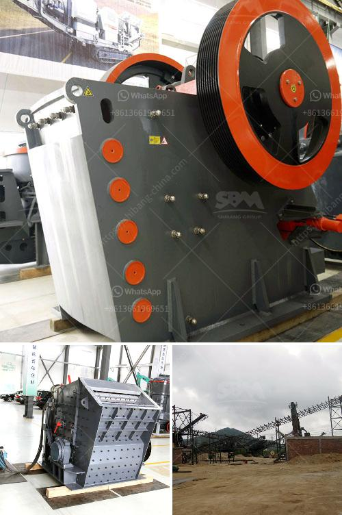

<h3>طحن خام بحجم يمر عبر الشبكة 200</h3>
طحن الخام يعتبر عملية مهمة في صناعة التعدين، حيث يتم خلالها تفتيت الصخور وتقليل حجم الخام إلى جسيمات أصغر. يهدف طحن الخام إلى زيادة سطح المادة، مما يتيح فرصة أكبر للاستفادة من المركبات القيمة فيها. في هذه المقالة، سنتناول طحن الخام بحجم يمر عبر الشبكة.

عندما يأتي الخام من المنجم، يكون في حجم كبير وغالبًا لا يمكن استغلاله مباشرة. ولذلك، يحتاج الخام إلى أن يُطحن لتقليل حجمه والتخلص من الجزء غير القيم فيه. ويستخدم التقنيون والمهندسون شبكة معينة لضبط حجم الخام أثناء الطحن.

تعتبر الشبكة أداة هامة في عمليات طحن الخام، وهي عبارة عن قطعة من الفولاذ المقاوم للصدأ تحتوي على ثقوب صغيرة متساوية الحجم. يتم تركيب الشبك على الجزء الأخير من الطاحونة، وتعمل على منع الجسيمات الكبيرة من المرور، بينما تسمح للجسيمات الصغيرة بالمرور.

عندما يتم طحن الخام، تمر الحبيبات الكبيرة عبر الشبكة، بينما يتم إعادة طحن الجسيمات الصغيرة لمرورها مرة أخرى عبر الطاحونة. هذه العملية متكررة حتى يتم الحصول على جسيمات صغيرة بالحجم المطلوب.

إذا كانت الشبكة تحتوي على ثقوب بقطر 200-400 ميكرون، فإن ذلك يعني أن الجسيمات التي يزيد حجمها على هذا الحجم ستكون قد تم طحنها. وهكذا، يمكن التأكد من أن الخام النهائي يحتوي على جسيمات بالحجم المطلوب للاستفادة الأمثل منها.

وفي الختام، يمكن القول إن طحن الخام بحجم يمر عبر الشبكة هو عملية أساسية في صناعة التعدين. تسمح الشبكة بضبط حجم الجسيمات وزيادة سطح الخام، مما يتيح الفرصة للاستفادة الكاملة من المركبات القيمة فيه. ومن المهم أن يتم اختيار حجم الشبكة المناسب بعناية، وفقًا للمتطلبات المحددة للمادة المراد طحنها.
<h3>Contact us</h3><ul><li><strong>Whatsapp:&nbsp;<a href="https://wa.me/8613661969651">+8613661969651</a></strong></li><li><a href="https://swt.shibang-china.com/?git&amp;zhl&amp;طحن خام بحجم يمر عبر الشبكة 200"><strong>Online Service(chat now)</strong></a></li></ul><h3>Related</h3><ul><li><a href='سعر آلة سحق خام النحاس.md'>سعر آلة سحق خام النحاس</a></li><li><a href='تحليل تكلفة سحق وفحص.md'>تحليل تكلفة سحق وفحص</a></li><li><a href='شركة تبيع كسارة الحجر في كينيا.md'>شركة تبيع كسارة الحجر في كينيا</a></li><li><a href='مطرقة إندونيسيا للبيع.md'>مطرقة إندونيسيا للبيع</a></li><li><a href='كسارة الصخور للبيع في الفلبين.md'>كسارة الصخور للبيع في الفلبين</a></li></ul>