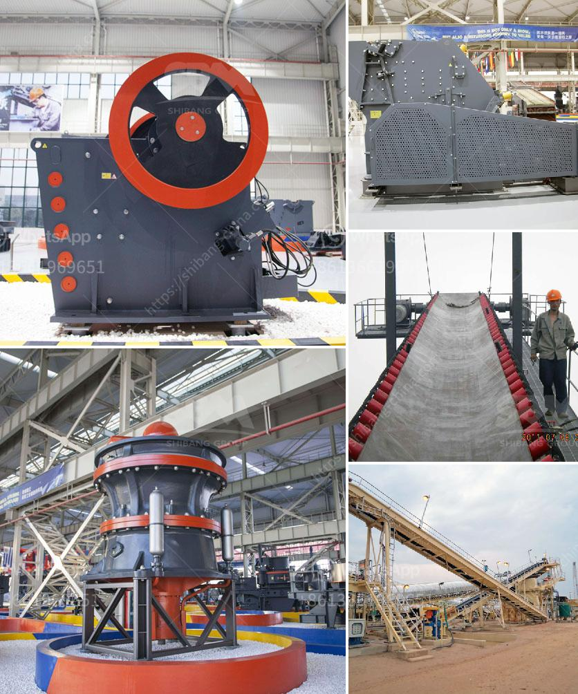

<h3>طحن مطحنة الاسمنت</h3>
مطحنة الأسمنت هي أحد المعدات الرئيسية في عملية تصنيع الأسمنت. يتم استخدامها لطحن وسحق المواد الخام للحصول على مسحوق الأسمنت النهائي. تعتبر مطاحن الأسمنت جزءًا حاسمًا في عملية إنتاج الأسمنت وتؤثر بشكل مباشر على جودة وكفاءة الأسمنت المنتج.

يتم طحن المواد الأساسية الخام في مطحنة الأسمنت باستخدام أسطوانة دوارة تحتوي على كرات صلبة. وهذه الكرات تسقط على المواد الخام وتكسرها بفعل القوة الصدمية. الهدف من هذا الطحن هو تقليل حجم المواد الخام وخلطها بالماء لتشكيل الخليط السائل الذي يعرف باسم الخرسانة.

جودة عملية الطحن في مطحنة الأسمنت تعتمد على عدة عوامل، مثل نوعية المواد الخام ونسبة الرطوبة فيها، حجم الكرات المستخدمة في الطحن، سرعة دوران المطحنة، ونسبة الشحنة الملء في المطحنة. إذا تم التحكم الجيد في هذه العوامل، فإنه يمكن تحقيق طحن فعّال ومنتج نهائي عالي الجودة.

تستخدم مطاحن الأسمنت عادةً في طحن أنواع مختلفة من المواد الخام، مثل الحجر الجيري والطين وخبث الفحم. وتعتبر الحجر الجيري المصدر الرئيسي لمادة الكلسيوم في صناعة الأسمنت. بعد طحن المواد الخام، يتم نقلها إلى فرن الأسمنت لإجراء عملية الحرق حيث تتم تفاعلات الكيمياء في المواد الخام ويتم تشكيل المادة المشابهة للكلنكر.

بالإضافة إلى طحن المواد الخام، يمكن استخدام مطاحن الأسمنت أيضًا لطحن الكلنكر الناتج من فرن الأسمنت. طحن الكلنكر يعزز قدرة الأسمنت على التفاعل مع الماء وتصلب بسرعة لتشكيل الخرسانة النهائية. من المهم أن تعمل مطاحن الأسمنت بكفاءة عالية للحصول على جودة أسمنت ممتازة وتحقيق الإنتاجية العالية.

في النهاية، تلعب طاحونة الأسمنت دورًا بارزًا في صناعة الأسمنت. تحقق بعثاتها من خلال جلب المواد الخام وطحنها بشكل فعال للحصول على مسحوق الأسمنت المطلوب، مما يؤثر بشكل عام على جودة وكفاءة الأسمنت النهائي.
<h3>Contact us</h3><ul><li><strong>Whatsapp:&nbsp;<a href="https://wa.me/8613661969651">+8613661969651</a></strong></li><li><a href="https://swt.shibang-china.com/?git&amp;zhl&amp;طحن مطحنة الاسمنت"><strong>Online Service(chat now)</strong></a></li></ul><h3>Related</h3><ul><li><a href='جزء من مطحنة الكرة ومبدأ عمله.md'>جزء من مطحنة الكرة ومبدأ عمله</a></li><li><a href='آلة صنع البليت الصغيرة للبيع في كينيا.md'>آلة صنع البليت الصغيرة للبيع في كينيا</a></li><li><a href='آلات سحق الحجر اليابانية.md'>آلات سحق الحجر اليابانية</a></li><li><a href='مصنع DMS للماس المستعمل للبيع في كيمبرلي.md'>مصنع DMS للماس المستعمل للبيع في كيمبرلي</a></li><li><a href='مصنعو آلات تكسير الحجر.md'>مصنعو آلات تكسير الحجر</a></li></ul>