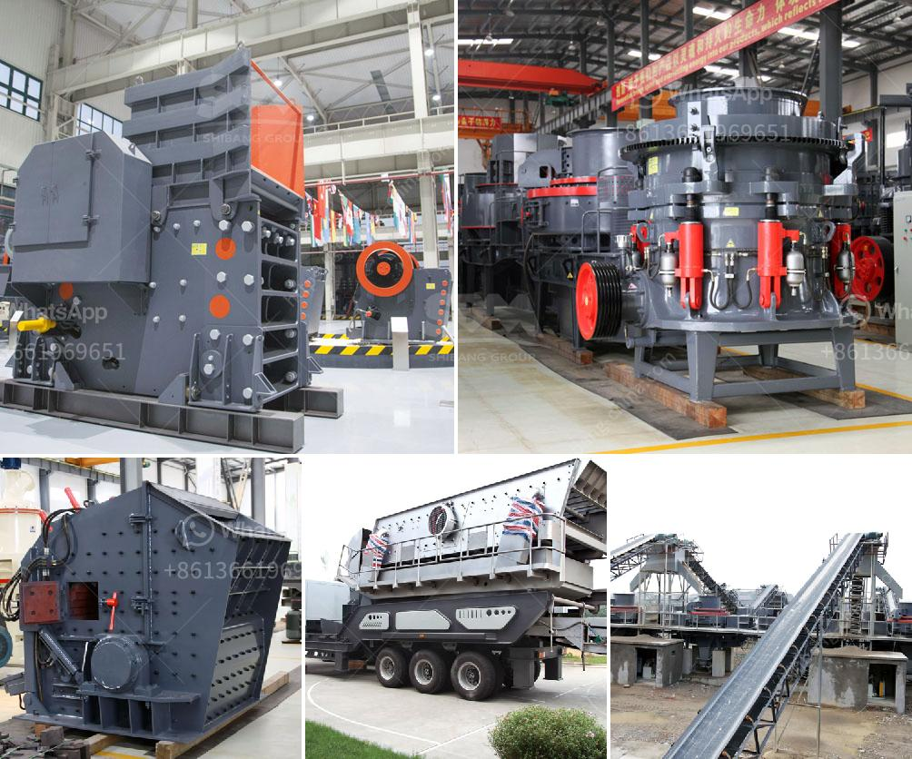

<h3>طحن مطحنة الكرة والجسيمات</h3>
مطحنة الكرة هي أداة تستخدم لطحن المواد المختلفة في العديد من الصناعات. تتكون المطحنة من جسم أسطواني يحتوي على جسيمات صلبة (الكرات) التي تستخدم لطحن المواد عن طريق الاحتكاك والتدحرج.

تعتبر مطحنة الكرة من أهم الأدوات في عملية التحبيب والطحن في صناعات مثل صناعة الأسمنت والمواد الكيميائية والصيدلانية والطلاء. تعتمد فعالية عمل المطحنة على عدة عوامل، بما في ذلك حجم الكرات وسرعة دوران المطحنة ونسبة الفراغ داخلها.

عملية طحن المواد في مطحنة الكرة تتم عن طريق وضع المادة داخل الجسم الأسطواني ثم تدور المطحنة بسرعة معينة. عندما تدور المطحنة، تبدأ الكرات في التوزع والاحتكاك ضد المادة الموجودة داخل المطحنة، مما يؤدي إلى طحنها. الحجم النهائي للمادة المطحونة يعتمد على حجم الكرات ومدة الطحن.

من أهم فوائد استخدام مطحنة الكرة هي قدرتها على طحن المواد إلى حجم جسيمات صغير، مما يزيد من مساحة السطح المتاحة لتفاعل هذه المواد. وبالتالي، يتم تحسين طريقة تفاعل المواد في صناعات الأسمنت والكيمياء والصيدلة. كما أن استخدام مطحنة الكرة يؤدي أيضًا إلى توفير الطاقة والوقت في عمليات الطحن.

وعلى الرغم من فوائدها، فإن مطحنة الكرة قد تواجه بعض التحديات. على سبيل المثال، قد تحتاج هذه المطاحن إلى صيانة دورية لتجنب التآكل والتلف، وقد تكون التكلفة المرتبطة بها مرتفعة. كما أن هناك بعض القيود في استخدام مطحنة الكرة في بعض الصناعات، حيث لا تكون مناسبة لبعض المواد الحساسة أو الهشة.

قد يكون لطحن مطحنة الكرة والجسيمات تأثير كبير على عمليات الصناعات المختلفة. إذا تم استخدامها بشكل صحيح، يمكن أن تساهم في تحسين جودة المنتج النهائي وزيادة كفاءة العمليات. ومع ذلك، يجب مراعاة المعايير الفنية المطلوبة وتوفر المواد المناسبة لضمان الأداء الأمثل لمطحنة الكرة.
<h3>Contact us</h3><ul><li><strong>Whatsapp:&nbsp;<a href="https://wa.me/8613661969651">+8613661969651</a></strong></li><li><a href="https://swt.shibang-china.com/?git&amp;zhl&amp;طحن مطحنة الكرة والجسيمات"><strong>Online Service(chat now)</strong></a></li></ul><h3>Related</h3><ul><li><a href='مصنع تكسير الدولوميت في بهاروتش.md'>مصنع تكسير الدولوميت في بهاروتش</a></li><li><a href='تنقية الجرافيت في معالجة المعادن.md'>تنقية الجرافيت في معالجة المعادن</a></li><li><a href='كسارة محرك ديزل صغيرة من تنزانيا.md'>كسارة محرك ديزل صغيرة من تنزانيا</a></li><li><a href='سعر كسارة الطين.md'>سعر كسارة الطين</a></li><li><a href='تكلفة ماكينات كسارة المحاجر.md'>تكلفة ماكينات كسارة المحاجر</a></li></ul>