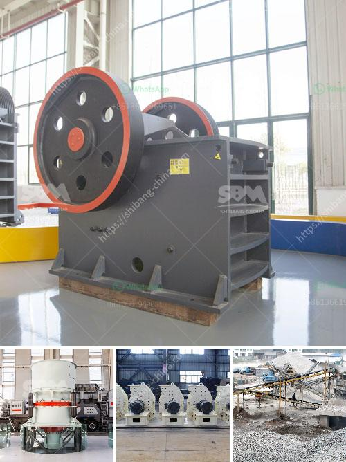

<h3>طحن معدات الطحن الطحن</h3>
تحتل طحن معدات الطحن مكانة هامة في عملية تصنيع العديد من المنتجات الغذائية والصناعية. فهي تساعد في تحويل المواد الخام إلى مسحوق ناعم يمكن استخدامه في عدة تطبيقات مختلفة. في هذه المقالة سنتحدث عن بعض فوائد واستخدامات طحن معدات الطحن وكيفية الاختيار الصحيح لها.

إحدى الفوائد الرئيسية لاستخدام معدات الطحن هي تحويل المواد الخام إلى حجم صغير وموحد. هذا يسهل عملية الخلط والدمج مع المكونات الأخرى للحصول على منتجات نهائية ذات جودة عالية. على سبيل المثال، في صناعة الأعلاف الحيوانية، تستخدم معدات الطحن لطحن الحبوب والمكونات الأخرى مثل الخضروات والفواكه للحصول على مزيج متجانس قبل خلطها مع الفيتامينات والمعادن الأخرى.

بالإضافة إلى ذلك، تسمح معدات الطحن بزيادة نوعية المنتج النهائي من حيث النعومة والقوام. فعند طحن مواد خام كبيرة الحجم إلى مسحوق ناعم، يمكن تحقيق توازن أفضل في التوزيع والتركيب الدقيق للمنتج. على سبيل المثال، في صناعة الأطعمة الجافة مثل البهارات والتوابل، يتطلب الحصول على مسحوق ناعم لضمان توزيع متساوٍ للنكهة في المنتج. وبالتالي، يلعب طحن معدات الطحن دورًا حاسمًا في تحقيق جودة المنتج النهائي.

عند اختيار معدات الطحن المناسبة، يجب مراعاة العديد من العوامل. أحد هذه العوامل هو نوع المواد الخام المراد طحنها. فبعض المواد الخام قد تكون هشة وسهل التفتيت، بينما قد تكون أخرى صعبة وتحتاج إلى جهود أكبر لطحنها. لذلك، يجب اختيار معدات الطحن التي تتناسب مع خواص المواد الخام.

كما يجب أيضًا أخذ الاحتياجات الإنتاجية في الاعتبار. معدات الطحن تأتي بمجموعة متنوعة من الأحجام والقدرات. يجب اختيار المعدات التي تتناسب مع حجم الإنتاج المطلوب والفترة الزمنية المتاحة.

باختصار، طحن معدات الطحن تلعب دورًا هامًا في صناعات مختلفة. تساعد في تحويل المواد الخام إلى مسحوق ناعم ومن خلال ذلك، يتم تحقيق جودة المنتج النهائي وتحسين قوامه. عند اختيار معدات الطحن، يجب مراعاة خواص المواد الخام المطلوب طحنها والاحتياجات الإنتاجية لضمان تلبية متطلبات الصناعة.
<h3>Contact us</h3><ul><li><strong>Whatsapp:&nbsp;<a href="https://wa.me/8613661969651">+8613661969651</a></strong></li><li><a href="https://swt.shibang-china.com/?git&amp;zhl&amp;طحن معدات الطحن الطحن"><strong>Online Service(chat now)</strong></a></li></ul><h3>Related</h3><ul><li><a href='بناء مطحنة الكرة.md'>بناء مطحنة الكرة</a></li><li><a href='عرض مصنع معالجة الجير.md'>عرض مصنع معالجة الجير</a></li><li><a href='مطحنة أسطوانية بسعة 15 طن.md'>مطحنة أسطوانية بسعة 15 طن</a></li><li><a href='مصنع تحسين خام الحديد الموردين.md'>مصنع تحسين خام الحديد الموردين</a></li><li><a href='سعر آلة تصنيع لوحات الجبس.md'>سعر آلة تصنيع لوحات الجبس</a></li></ul>