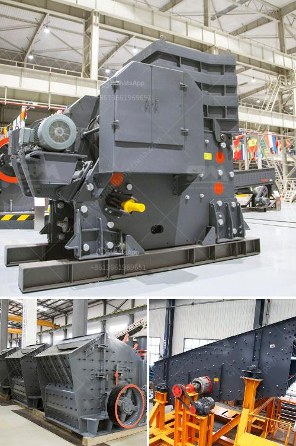

<h3>طرق التعدين على الذهب الطبيعي في زيمبابوي</h3>
تعد زيمبابوي من الدول الرائدة في إنتاج الذهب في العالم، حيث تحتوي على إمكانيات طبيعية هائلة في مجال التعدين على الذهب. تستخدم في زيمبابوي العديد من الطرق لاستخراج الذهب الطبيعي، وتشمل هذه الطرق التالية:

1- التعويم: تعد تقنية التعويم من أكثر الطرق شيوعًا في استخراج الذهب في زيمبابوي. تتم عملية التعويم عن طريق طحن الصخور المحتوية على الذهب إلى جزيئات أصغر، ثم تضاف مواد كيميائية خاصة تسمى المبيدات الهيدروفوبية، تساعد في فصل الجسيمات المعدنية عن الصخور الغير قيمة. وتتمثل هذه المبيدات في الفينول والكبريتات والسيانيد. يتم تشكيل رغاوي من الجسيمات المعدنية ورفعها إلى السطح لفصلها عن غيرها من المواد.

2- السحق والطحن: تتضمن هذه الطريقة سحق الصخور المحتوية على الذهب وطحنها بواسطة المطارق والطواحين الكبيرة، لتحويل الصخور إلى مسحوق دقيق. يتم ذلك قبل استخدام تقنية التعويم. تستخدم هذه الطريقة بشكل رئيسي في مناجم الذهب الصغيرة والمتوسطة.

3- الاستخراج بواسطة السيانيد: تُستَخدَم تقنية الاستخراج بواسطة السيانيد لتنفيذ أعمال التعدين على الذهب في زيمبابوي بشكل مكثف. يذوب الذهب الموجود في الصخور بواسطة محلول كيميائي يحتوي على السيانيد وذلك عند درجة حرارة مرتفعة وضغط عالٍ. يتسبب تفاعل السيانيد مع الذهب في تشكيل مركبات سيانيد الذهب المذابة، ومن ثم يتم فصل الماء المخفض من المحلول لاستخلاص الذهب المذاب.

4- تعدين الغرينستون: يستخدم هذا الأسلوب في التعدين على الذهب في زيمبابوي، ويتطلب طحن الصخور الذي تحتوي على الذهب إلى مسحوق ناعم، ثم يتم التعامل معها بواسطة محلول وحمض السيليكون لإزالة الذهب من الصخور. ويعتبر تعدين الغرينستون من أساليب التعدين الأكثر تقدمًا وكفاءة.

تعد طرق التعدين على الذهب في زيمبابوي متنوعة ومتطورة. ومع الإرادة والتكنولوجيا المناسبة، يمكن استغلال هذه الموارد الطبيعية الغنية وزيادة إنتاجية الذهب وتعزيز الاقتصاد المحلي في البلاد.
<h3>Contact us</h3><ul><li><strong>Whatsapp:&nbsp;<a href="https://wa.me/8613661969651">+8613661969651</a></strong></li><li><a href="https://swt.shibang-china.com/?git&amp;zhl&amp;طرق التعدين على الذهب الطبيعي في زيمبابوي"><strong>Online Service(chat now)</strong></a></li></ul><h3>Related</h3><ul><li><a href='سحق متنقل في دبي.md'>سحق متنقل في دبي</a></li><li><a href='كسارات محمولة للإيجار.md'>كسارات محمولة للإيجار</a></li><li><a href='كسارات الحجر المستعملة للبيع في ألمانيا.md'>كسارات الحجر المستعملة للبيع في ألمانيا</a></li><li><a href='أسعار آلة كسارة الحجر.md'>أسعار آلة كسارة الحجر</a></li><li><a href='تقنيات معالجة الطين.md'>تقنيات معالجة الطين</a></li></ul>