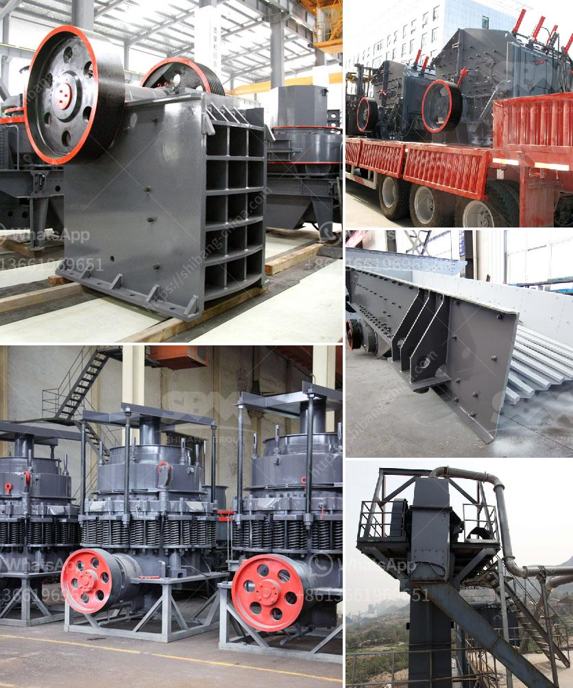

<h3>طريقة التعويم لتحليل رمل السيليكا</h3>
تعتبر تحليل رمل السيليكا أمرًا هامًا في مجال صناعة الزجاج والمواد الكيميائية الأخرى. ومن أجل تحليل السيليكا التي تكون بصورة مستقرة في الرمل، تستخدم عادة طريقة التعويم.

طريقة التعويم هي عملية فصل المعادن الصلبة غير المرغوب في استخلاصها من المعدن المستهدف، بالاستفادة من خواصها المختلفة في الطفو والغرق في المحاليل المختلفة. يتم تنفيذ هذه العملية بواسطة اختبار عينة رمل السيليكا بحيث يتم خفض حبيبات الرمل إلى حجم صغير جدًا بواسطة طحن العينة. بعد ذلك، يتم وضع العينة المطحونة في خلاط مع المذيبات المختلفة ذات الكثافة المختلفة.

بعد إضافة المذيب، يتم تشغيل الخلاط لفترة زمنية معينة بحيث يتم السماح لجميع المواد بالخلط جيدًا. في هذه المرحلة، ستتمكن المعادن القليلة المرغوب فيها في الراقية، مثل السيليكا، من الطفو على سطح المحلول المختلط، بينما ستغرق المعادن الأخرى غير المرغوب فيها.

ثم يتم توجيه المحلول لغرض فصل المواد الطافية عن المواد المغرقة. تستخدم معدات معينة لفصل السيليكا المطفوة ولتجفيفها في النهاية. يمكن بعد ذلك استخدام السيليكا المنتجة في أغراض مختلفة، بما في ذلك صناعة الزجاج والإلكترونيات والمواد الكيميائية.

يعد استخدام طريقة التعويم في تحليل رمل السيليكا من الطرق الفعالة لفصل المعادن المختلفة عن بعضها البعض. يتطلب الأمر خبرة ومهارات للتعامل مع المعدات والمذيبات المستخدمة، لضمان حصول عملية التعويم على أفضل النتائج الممكنة.

بالاستفادة من طريقة التعويم في تحليل رمل السيليكا، يمكن الحصول على سيليكا ذات نقاء عالي وجودة ممتازة، مما يضمن استخدامها في الصناعات المتنوعة. تعتبر هذه العملية حلا فعالًا واقتصاديًا لاستخلاص السيليكا من رمال السيليكا، وتؤدي إلى تحقيق منتج نهائي ذي جودة عالية وأداء ممتاز.
<h3>Contact us</h3><ul><li><strong>Whatsapp:&nbsp;<a href="https://wa.me/8613661969651">+8613661969651</a></strong></li><li><a href="https://swt.shibang-china.com/?git&amp;zhl&amp;طريقة التعويم لتحليل رمل السيليكا"><strong>Online Service(chat now)</strong></a></li></ul><h3>Related</h3><ul><li><a href='كسارة صخور الحجر الجيري.md'>كسارة صخور الحجر الجيري</a></li><li><a href='مصنع تكسير حجر الجرانيت في كينيا.md'>مصنع تكسير حجر الجرانيت في كينيا</a></li><li><a href='مطحنة الطحن.md'>مطحنة الطحن</a></li><li><a href='مطاحن الكرة الأرجنتينية.md'>مطاحن الكرة الأرجنتينية</a></li><li><a href='خط إنتاج مسحوق الجبس بمقياس صغير.md'>خط إنتاج مسحوق الجبس بمقياس صغير</a></li></ul>